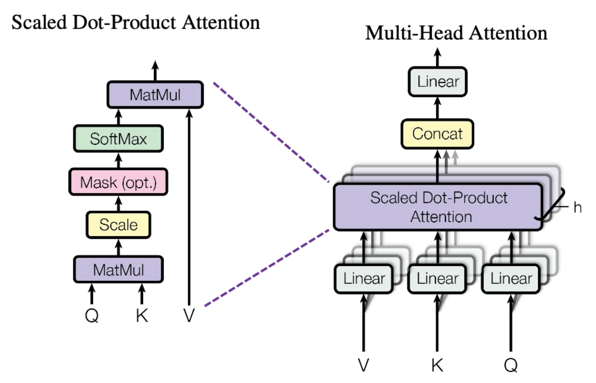

# CME 295 Lecture 1

## 1. 课程核心缩写分类（附类别）

课程涉及大量专业缩写，按**模型/策略/数据集/架构技术/任务/指标**六大类划分，无额外记忆负担，核心缩写如下：

1. **Transformer基模型**：BERT、T5、GPT、LLaMA

2. **训练策略**：SFT、PEFT、FLAN、RL、RM、RLHF、PPO、DPO

3. **经典数据集**：MNLI、WNLI、C4、SQuAD、GLUE、MRPC

4. **其他架构/技术**：LSTM、GRU、GloVe、BPE、CoT、ToT、SC、RAG

5. **NLP核心任务**：NER、PoS、MLM、NSP、MT、QA、NLG

6. **模型评估指标**：F1、PPL、ROUGE、BLEU、METEOR、LaaJ、WER

## 2. 自然语言处理（NLP）核心概述

### 2.1. 学习主线

分词（Tokenization）→词表示（Word representation）→RNNs→自注意力机制（Self-attention）→Transformer架构→端到端案例（End-to-end example）。

### 2.2. NLP三大核心任务

NLP任务分为**分类、多分类、生成**三类，覆盖文本处理主流场景，各任务均有专属数据集和评估指标，具体如下：

**（1）分类任务**
- 典型应用：**情感提取**、意图检测、语言检测、主题建模；
- 输入输出：输入文本→模型输出单一分类结果。

**（2）多分类任务**
- 典型应用：词性标注（PoS）、**命名实体识别（NER）**、依存句法分析、成分句法分析；
- 输入输出：输入文本→模型为每个token/成分标注对应类别标签。

**（3）生成任务**
- 典型应用：**机器翻译（MT）**、问答（QA）、文本摘要、**文本生成（NLG）**；
- 输入输出：输入文本→模型生成新的目标文本。

### 2.3. 典型NLP任务详解

**（1）情感提取（Sentiment Extraction）**

- 示例：输入「This teddy bear is SO CUTE!」→模型输出积极情感；
- 常用数据集：亚马逊评论、IMDB影评、推特文本数据；
- 评估指标：**准确率Accuracy**（正确预测数/总预测数）、**精确率Precision**（正确正预测数/所有正预测数）、**召回率Recall**（正确正预测数/所有实际正例数）、**F1分数F1_Socre**（精确率+召回率的综合指标）。

**（2）命名实体识别（NER）**

- 示例：输入「A cute teddy bear is reading...」→模型识别并标注文本中的实体；
- 常用数据集：标注的路透社新闻（CoNLL-2003、CoNLL++）；
- 评估指标：**词级别/实体**类型维度的准确率、精确率、召回率、F1分数。

**（3）机器翻译（MT）**

- 示例：输入英文「A cute teddy bear is reading」→模型输出法文「Un ours en peluche mignon lit」；
- 常用数据集：WMT’14英法数据集、WMT’14英德数据集；
- 评估指标：
    - **BLEU**：衡量翻译文本质量，类似“精确率”；
    - **ROUGE**：衡量生成文本质量，类似“召回率”；
    - **困惑度（PPL）**：量化模型对词汇组合的“意外程度”，值越低模型表现越好；

### 2.4. NLP关键技术发展时间线

NLP技术发展围绕**解决序列数据处理痛点**展开，核心节点与背景如下：

1. **1980s**：循环神经网络（RNNs）诞生，首次实现神经网络处理序列数据，奠定序列建模基础；
2. **1997**：长短期记忆网络（LSTM）提出，针对RNN的梯度消失问题做改进，增强长距离依赖捕捉能力；
3. **2013**：Word2vec提出，实现高效的词向量表示，让机器能“理解”词汇的语义关联；
4. **2017**：Transformer提出（论文《Attention is All You Need》），基于自注意力机制，抛弃序列计算，实现并行处理，成为NLP里程碑；
5. **2020s**：大语言模型（LLMs）爆发，依托海量数据、算力提升、算法快速迭代，成为AI核心发展方向。

## 3. NLP核心技术模块详解

### 3.1. 分词（Tokenization）

（1）定义：将完整文本拆分为模型可处理的最小单位（token），是NLP的**第一步预处理**，直接影响模型输入质量。

（2）三种核心分词方法（附示例/优劣）

以句子「A cute teddy bear is reading.」为例，各方法拆分效果、优点、缺点如下表：

|分词方法|拆分示例|优点|缺点|
|---|---|---|---|
|词级别（Word-level）|A / cute / teddy / bear / is / reading|逻辑简单、结果易解释|易出现未登录词（OOV）；无法利用词根/词缀知识|
|**子词级别**（Subword-level，如WordPiece、BPE）|A / cute / ted / ##dy / bear / is / read / ##ing|利用常见词缀/前缀；从数据中学习拆分规则；OOV概率远低于词级别|仍存在少量OOV可能|
|字符级别（Character-level）|A / c / u / t / e / t / e / d / d / y / ...|几乎无OOV；对大小写、拼写错误鲁棒性强|计算速度慢；词嵌入结果无解释性|

###### 注意：OOV（Out of Vocabulary）：未登录词，指模型词汇表中没有的词，是分词任务的核心痛点；**子词级别是目前主流分词方法**，平衡效果与效率。

### 3.2. 词表示（Token/Word Representation）

（1）核心动机：原始**独热编码（One-hot）** 无法表示词汇的语义关联（如「teddy bear」和「soft」的独热编码内积为0，模型无法识别二者语义相关），因此需要**学习型词嵌入**，将词汇映射为低维稠密向量。

（2）两种表示方法对比

|表示方法|形式特点|核心问题|
|---|---|---|
|独热编码--Naive（one-hot） encoding|向量中仅一个位置为1，其余为0，高维稀疏|无语义信息；存在维度灾难；无法衡量词汇相似度|
|**学习型嵌入--Learned Embedding**|低维稠密向量（如「soft」→[0.95, 0.32, 0.01]）|可通过**向量内积**衡量语义相似度，内积越接近1，语义越相似|

（3）经典模型：**Word2vec**

- 核心原理：基于数十亿文本训练的简单神经网络，通过**代理任务**学习一个嵌入层，实现词汇的语义表示；

- 两种代理任务：
    1. CBOW（连续词袋）：通过**上下文词汇**预测**中心词**；
    2. Skip-gram：通过**中心词**预测**上下文词汇**；

- 模型架构：输入层（词汇表大小V）→隐藏层（嵌入维度d）→输出层（词汇表大小V）；

- 核心缺点：**不考虑词序**、**嵌入结果无上下文感知**（同一个词在不同语境下嵌入向量完全相同）。

### 3.3. 循环神经网络（RNNs）与LSTM

**（1）循环神经网络（RNNs，1980s）**

- 核心突破：**首个能捕捉词序的神经网络**，连接形成时间序列，按文本顺序逐个输入token，隐藏状态随时间更新，保留前文信息；

- 核心问题：**梯度消失问题（无法有效捕捉长距离依赖）、顺序计算导致速度慢**；

- 适用场景：短序列文本的序列建模。

图1 不同场景下的RNN结构原理 

**（2）长短期记忆网络（LSTM，1997）**

- 核心改进：对RNN的隐藏状态做结构化设计，通过**门控机制**（输入门、遗忘门、输出门）控制信息的保留与丢弃，**缓解梯度消失问题**，增强长距离依赖捕捉能力；

- 核心局限：仍是**序列计算**，未解决计算速度慢的问题；

- 地位：成为RNN的主流改进版本，长期为NLP序列建模的SOTA方法。

图2 LSTM结构原理

**（3） Word2vec与RNN/LSTM对比**

|方法|核心优点|核心缺点|
|---|---|---|
|Word2vec（CBOW/Skip-gram）|模型简单、计算快；嵌入结果直观，易理解|不考虑词序；无上下文感知；无法处理序列依赖|
|RNN/LSTM|捕捉词序和序列依赖；长期为NLP SOTA方法|梯度消失（LSTM缓解但未解决）；顺序计算，速度慢；难以处理超长序列|

### 3.4. 注意力（Attention）机制与Transformer架构

（1）诞生背景：机器翻译任务中，传统Seq2seq（RNN+编码器-解码器）无法有效捕捉**长距离依赖**，例如翻译长句时，模型容易忘记前文的核心词汇，导致翻译错误。

（2）核心思想：让模型在生成输出文本时，**主动关注输入文本的相关部分**（如翻译法语时，模型关注英文原句的「teddy bear」），从根本上解决长距离依赖问题。

（3）核心突破：论文《Attention is All You Need》首次提出**纯注意力机制的Transformer**，抛弃序列计算，实现**并行处理**，解决了RNN/LSTM的效率问题，在机器翻译任务上达到SOTA，成为NLP领域的里程碑，也是LLMs的核心基础。

（4）核心特点：基于**自注意力机制（Self-attention）**；并行计算大幅提升训练/推理效率；支持捕捉超长序列的长距离依赖。

**（5）自注意力机制（Self-attention）**

 - 核心概念：**Query（Q，查询）、Key（K，键）、Value（V，值）**——将文本中的每个token通过线性变换，分别映射为Q、K、V三个向量，通过Q与K的相似度，为每个V分配权重，实现token间的关联建模。如下图所示例子：
  
    
    
图3 Q、K、V矩阵的含义与计算

 - 核心计算：缩放点积注意力——公式： $softmax\left(\frac{Q K^{T}}{\sqrt{d_{k}}}\right) V$

 - 核心步骤：Q与K的转置做矩阵乘法 → 除以 $\sqrt{d_k}$ （K的维度，缩放避免内积值过大导致softmax梯度消失） → 做softmax得到权重 → 与V做矩阵乘法得到最终注意力输出；

- 核心意义：通过权重分配，让每个token“关注”文本中其他相关的token。

**（6）多头注意力（Multi-Head Attention）**

- 核心思想：并行运行**多个自注意力层**，每个层学习不同的Q/K/V映射，捕捉**不同维度的注意力特征**；

- 计算步骤：将Q/K/V拆分为h个头部 → 各自计算缩放点积注意力 → 将h个头部的结果拼接→线性变换得到最终输出；

- 类比：类似计算机视觉中的**多卷积核**，从不同角度提取特征，提升模型表达能力。

图4 多头注意力机制

### 3.6. Transformer整体架构：编码器-解码器（Encoder-Decoder）

Transformer由**编码器（Encoder）和解码器（Decoder）两部分组成，均为堆叠N层**的结构，核心模块包括：注意力层、前馈神经网络（FFNN）、残差连接+层归一化（Add&Norm）、位置编码（PE），整体为端到端的序列建模架构。

图5 Transformer整体架构

（1）通用输入处理：所有输入需经过**三步处理**，即分词生成token序列 → 词嵌入（Learned Embedding） → 位置编码（Positional Encoding），最终得到**位置感知的嵌入向量**。

**（2）编码器（Encoder）**

  - 核心作用：对输入文本进行编码，生成**上下文感知的编码嵌入向量**，包含输入文本的全部语义信息；

  - 输入：位置感知的嵌入向量（源语言文本）；

  - 每层结构（堆叠N层）：**自注意力层**（Encoder-Encoder Self-attention，全局关注） → **Add&Norm**（残差连接+层归一化） → **前馈神经网络**（FFNN，全连接） → **Add&Norm**；

  - 核心参数：N（堆叠层数）、h（注意力头数）、d_model（嵌入维度）、d_FF/ d_key/ d_value（子层维度）、V（词汇表大小）。

**（3）解码器（Decoder）**

  - 核心作用：基于编码器的输出，生成目标文本，是自回归的生成过程；

  - 输入：位置感知的嵌入向量（目标语言文本，**右移一位**，以[BOS]开始）；

  - 每层结构（堆叠N层）：**掩码自注意力层**（Masked Decoder-Decoder Self-attention，防止看到未来token） → **Add&Norm** → **编码器-解码器注意力层**（关注编码器的输出） → **Add&Norm** → **前馈神经网络**（FFNN，全连接） → **Add&Norm**；

  - **掩码**（Mask）：为未生成的token分配无穷小的权重，确保模型生成时**只能看到前文，无法看到后文**；

  - 最终输出：经**线性层+softmax**后，得到目标语言token的概率分布，选择**概率最大的token**作为生成结果。

**（4）关键模块：位置编码（Positional Encoding，PE）**

  - 核心动机：Transformer是**并行计算**，无序列信息，无法识别token的位置，因此需要为token**添加位置信息**；

  - 实现方式：可**学习型**（由模型训练得到）或**硬编码**（按固定公式生成），将位置信息与词嵌入向量相加，不改变嵌入维度；

  - 核心目标：通过位置编码的向量内积，让模型识别token的**相对/绝对位置关系**。

**（5）核心辅助模块：Add&Norm**

- 组成：**残差连接**（将层输入与层输出相加）+**层归一化**（对向量做归一化处理）；

- 核心作用：解决深度网络的**梯度消失**问题，提升模型训练的稳定性和收敛速度。

**（6）Transformer的核心计算技巧**
  -  **多头注意力**：并行捕捉多维度注意力特征，提升模型对文本的理解能力；

  - **标签平滑（Label Smoothing）**：

      - 核心思想：在真实标签中加入噪声，避免模型过拟合和过度自信；
      - 公式： $q'(k | x)=(1-\epsilon ) \delta_{k, y}+\epsilon u(k)$ ；
      - 作用：提升模型的泛化能力，同时提高准确率和BLEU分数；

  - **并行计算**：抛弃RNN的序列计算，所有token同时处理，大幅提升训练/推理效率；

  - **共享嵌入层**：编码器和解码器的词嵌入层、最终输出的线性层共享参数，减少模型参数量。

### 3.6. Transformer端到端案例

以英文「A cute teddy bear is reading.」→法语「Un ours en peluche mignon lit.」为例，完整梳理Transformer的工作流程，核心为编码器编码+解码器自回归生成：

1. **英文输入处理**：添加[BOS]（句首）/[EOS]（句尾） → 分词 → 词嵌入（embedding） → 位置编码（PE） → 得到**位置感知的嵌入矩阵（position-aware embeddings matrix）**；

2. **编码器编码**：嵌入矩阵输入编码器，经N层自注意力 + FFNN + Add&Norm，生成**上下文感知的编码嵌入向量（context-aware encoded embeddings）**；

3. **解码器初始化**：法语输入以[BOS]为起始（右移一位），经词嵌入+位置编码得到初始向量；

4. **解码器第一次生成**：
    - 掩码自注意力层：关注[BOS]自身信息；
    - 编码器-解码器注意力层：关注编码器中英文原句的编码向量；
    - 经FFNN + Add&Norm + 线性层 + softmax，生成第一个法语token「Un」；

5. **解码器循环生成**：将「Un」作为下一个输入，重复步骤4，依次生成「ours」「en」「peluche」「mignon」「lit」；

6. **终止条件**：当模型生成[EOS]时，停止生成，拼接所有token得到完整法语文本「Un ours en peluche mignon lit.」。

> 核心总结
> 1. NLP技术的发展核心是解决序列数据处理的痛点：从无词序（Word2vec） → 有词序但效率低（RNN/LSTM） → 并行计算 + 长距离依赖（Transformer）；
> 2. Transformer的核心创新是**纯自注意力机制+并行计算**，抛弃了传统的序列计算，成为大语言模型的技术基础；
> 3. Transformer的核心架构是**编码器-解码器**，通过QKV自注意力实现token间的关联建模，位置编码弥补并行计算的词序缺失；
> 4. NLP的通用流程为：**分词→词表示→模型处理→生成/预测→指标评估**，每个环节均有经典方法和专属工具；
> 5. 自注意力机制是Transformer的核心，**缩放点积注意力公式**和**多头注意力**是理解后续LLMs的关键基础。