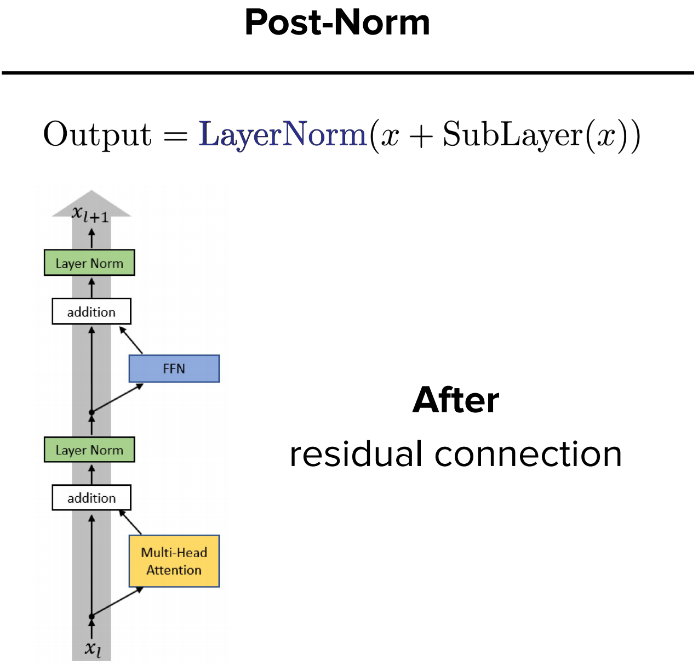
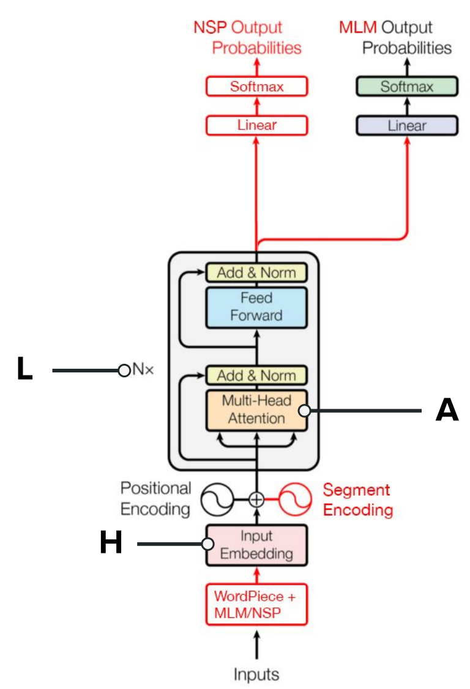
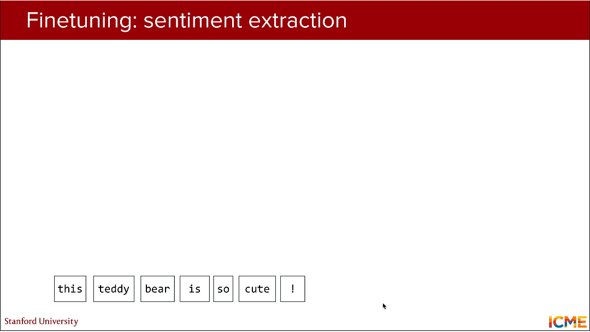

# CME 295 Lecture 2

## 1. Transformer核心注意力机制

本讲内容全部基于Transformer基础注意力机制展开，需先牢牢掌握**缩放点积注意力**和**多头注意力**的公式、原理及架构落地。

### 1.1. 缩放点积注意力（Scaled Dot-Product Attention）

（1）核心公式：$\text{Attention}(Q,K,V) = softmax\left(\frac{Q K^{T}}{\sqrt{d_{k}}}\right) V$ 

> $Q \in \mathbb{R}^{n \times d_k}$ ：查询矩阵， $n$ 为序列长度， $d_k$ 为Q/K的维度，代表当前token的特征表示；
> $K \in \mathbb{R}^{m \times d_k}$ ：键矩阵， $m$ 为键值序列长度（自注意力中 $m=n$ ），代表所有token的特征表示；
> $V \in \mathbb{R}^{m \times d_v}$ ：值矩阵， $d_v$ 为V的维度（通常 $d_k=d_v$ ），是注意力权重的加权对象；
> $\frac{1}{\sqrt{d_k}}$ ：**缩放因子**，解决 $d_k$ 过大时， $QK^T$ 内积值爆炸导致softmax输出趋近于one-hot、梯度消失的问题；
> $softmax(\cdot)$ ：对 $QK^T/\sqrt{d_k}$ 的**行向量**做归一化，将注意力得分转化为0-1的权重，保证所有token的注意力权重和为1；

（2）核心逻辑：**通过Q与K的相似度计算注意力权重，再用权重对V加权求和**，实现对上下文的自适应关注。

（3）注意力得分与注意力图：
- 中间结果 $\frac{Q K^{T}}{\sqrt{d_k}}$ 为**注意力得分矩阵**，其元素 $(i,j)$ 代表第 $i$ 个token对第 $j$ 个token的关注程度；
- 如指代消解案例所示：*The Law will never be perfect but its application should be just*中，**its**的注意力头会高度关注**Law**，注意力图中对应位置权重接近1，体现注意力机制捕捉长距离语义关联的能力。

### 1.2. 多头注意力（Multi-Head Attention, MHA）

（1）实现步骤与公式

- 对Q/K/V做**线性映射**：通过 $h$ 组独立的可学习权重矩阵 $W_i^Q \in \mathbb{R}^{d_{model} \times d_k}$ 、 $W_i^K \in \mathbb{R}^{d_{model} \times d_k}$ 、 $W_i^V \in \mathbb{R}^{d_{model} \times d_v}$ ，将原始特征（维度 $d_{model}$ ）映射为 $h$ 组低维Q/K/V：$Q_i = Q W_i^Q, \quad K_i = K W_i^K, \quad V_i = V W_i^V \quad (i=1,2,...,h)$ 

- 每组独立计算**缩放点积注意力**：$\text{head}_i = \text{Attention}(Q_i,K_i,V_i) = softmax\left(\frac{Q_i K_i^T}{\sqrt{d_k}}\right) V_i$ 

- **拼接所有头的结果**并做最终线性映射：$\text{MultiHead}(Q,K,V) = \text{Concat}(\text{head}_1,...,\text{head}_h) W^O$ 
  其中 $W^O \in \mathbb{R}^{h d_v \times d_{model}}$ 为输出映射矩阵，将拼接后的特征还原为 $d_{model}$ 维度。

（2）核心作用：将注意力机制拆分为 $h$ 个独立的**注意力头**，每个头捕捉**不同类型的上下文关联**（如局部语义、长距离依赖、词法关联），拼接后实现特征的多维度融合，提升模型表达能力。

### 1.3. 原始Transformer整体架构

由**编码器（Encoder）和解码器（Decoder）**组成，均为Nx层堆叠，核心组件为「多头注意力 + 前馈网络（FFN） + 残差连接 + Add&Norm」，解码器额外包含**掩码多头注意力（Masked MHA）**：

- **掩码多头注意力**：对注意力得分矩阵的**上三角部分置为-∞**，使softmax后权重为0，防止模型预测第 $i$ 个token时看到**第** $i+1$  **及之后的未来token**；
- **位置编码**（Positional Encoding）：与词嵌入相加后作为模型输入，解决Transformer并行计算导致的**位置信息丢失**问题（本讲核心重点）；
- **词嵌入**（Input Embedding/Output Embedding）：将离散token映射为连续的 $d_{model}$ 维特征向量；
- **前馈网络FFN**： $FFN(x) = \max(0, x W_1 + b_1) W_2 + b_2$ ，为单隐层全连接网络，实现特征的非线性变换。

## 2. 位置编码（Positional Encoding）

### 2.1. 核心原因

- Transformer的自注意力机制是**并行计算**，对序列中token的处理无先后顺序，仅通过词嵌入无法区分token的**位置信息**（如*cute teddy bear*和*teddy bear cute*语义完全不同，但词嵌入的集合完全一致）。
- 以*a cute teddy bear is reading*为例：若仅用词嵌入 $V_{cute}、V_{teddy bear}、V_{reading}$ ，模型无法判断token的先后顺序，会出现*teddy bear I teddy bear*的错误关联，因此**必须为词嵌入添加位置信息**。

### 2.2. 绝对位置编码（第一代）

#### 2.2.1. 可学习的位置嵌入（Learned Position-Specific Embedding）

（1）实现思路：为每个位置 $m$（ $m=1,2,...,L$ ， $L$ 为训练时的最大序列长度）随机初始化一个位置嵌入向量 $PE_m \in \mathbb{R}^{d_{model}}$ ，与词嵌入 $E_t$ 相加作为模型输入：$x_m = E_t + PE_m$ 

（2）训练方式：**位置嵌入向量随模型一起参与端到端训练**，通过反向传播优化；

（3）核心局限性：**无法扩展到训练时未见过的更长序列**，若测试时序列长度超过 $L$ ，无对应的位置嵌入，需重新训练，灵活性极差。

#### 2.2.2. 硬编码的位置嵌入（Hardcoded PE）

（1）特点：**无需训练，通过三角函数生成**，解决可学习嵌入的扩展问题，是最经典的绝对位置编码。

（2）核心公式：$PE_{m, 2i} = \sin\left(\frac{m}{10000^{\frac{2i}{d_{model}}}}\right), \quad PE_{m, 2i+1} = \cos\left(\frac{m}{10000^{\frac{2i}{d_{model}}}}\right)$ 
> $m$ ：token在序列中的**绝对位置**（从0或1开始计数）；
> $i$ ：位置嵌入向量的**维度索引**（ $i=0,1,...,\lfloor d_{model}/2 \rfloor -1$ ）；
> $d_{model}$ ：嵌入向量的总维度，通常为偶数（如512、768）；
> $10000$ ：超参数，控制三角函数的**周期范围**，使位置编码的周期随维度增加呈指数级增长，捕捉不同尺度的位置信息。

（3）公式简化表示：令 $\omega_i = \frac{1}{10000^{\frac{2i}{d_{model}}}}$ ，则公式可简化为：$PE_{m,2i} = \sin(\omega_i \cdot m), \quad PE_{m,2i+1} = \cos(\omega_i \cdot m)$ 

（4）优势：**捕捉相对位置信息（核心）**；可扩展到任意长度的序列，无需重新训练，解决可学习嵌入的核心问题；三角函数的周期性使模型能捕捉序列的**局部和全局位置规律**。

图1 硬编码优势

> 通过**三角函数差角公式**推导，可证明**两个位置嵌入的内积仅与相对位置有关**）：
> 1. 差角公式： $\cos(a-b) = \cos a \cos b + \sin a \sin b$ ；
> 2. 代入位置编码：令 $a=\omega_i \cdot m, b=\omega_i \cdot n$ ，则：$\cos(\omega_i (m-n)) = \cos(\omega_i m) \cos(\omega_i n) + \sin(\omega_i m) \sin(\omega_i n)$ 
> 3. 内积推导：位置嵌入 $PE_m$ 和 $PE_n$ 的内积为各维度乘积之和，每一对 $(2i,2i+1)$ 维度的乘积和为 $\cos(\omega_i (m-n))$ ，因此 $\langle PE_m, PE_n \rangle = \sum_{i=0}^{\lfloor d_{model}/2 \rfloor -1} \cos(\omega_i (m-n)) = f(m-n)$ 
> 即**内积结果仅为相对位置 $m-n$ 的函数**，模型可通过内积感知token间的相对距离。

### 2.3. 相对位置编码（第二代）

硬编码嵌入本质是绝对位置编码，而自然语言中**相对位置比绝对位置更重要**。因此后续研究**直接修改注意力层，让模型显式捕捉相对位置**。

#### 2.3.1. 注意力层的线性偏置（Linear Bias）

（1）核心思路：在缩放点积注意力的**Q-K相似度得分**中，添加一个**仅与相对位置有关的偏置项**，让注意力权重直接受相对位置影响。

（2）改进后注意力公式：$\text{Attention}(Q,K,V) = softmax\left(\frac{\langle q_m, k_n \rangle}{\sqrt{d_k}} + bias(m,n)\right) V$ 

> 其中 $q_m$ 为 $Q$ 的第 $m$ 行（第 $m$ 个token的查询向量）， $k_n$ 为 $K$ 的第 $n$ 行（第 $n$ 个token的键向量）， $bias(m,n)$ 为位置 $m$ 和 $n$ 的偏置，**仅由相对位置** $m-n$  **决定**。

（3）两种经典偏置实现:
  1. **T5 Bias**：为每个注意力头学习**分桶的偏置参数**，将相对位置 $m-n$ 划分为若干桶，同一桶内的相对位置共享一个偏置：$bias(m,n) = \beta_{\text{bucket}(m-n)}$ 
     > 其中 $\beta$ 为可学习参数，分桶策略可压缩参数数量，适配长序列。
   
  2. **ALiBi（Attention with Linear Biases）**：偏置为**线性、确定性函数**，无需学习，无边界限制，支持长序列外推：$bias(m,n) = \mu \times (n-m)$ 
     > 其中 $\mu$ 为注意力头专属的超参数（每个头一个 $\mu$ ），核心逻辑是让**距离越近的token偏置越大**，注意力权重越高，符合人类语言认知。

#### 2.3.2. 旋转位置编码（RoPE - Rotary Position Embeddings）

当前大语言模型（如LLaMA、GPT-4）的标配位置编码，**无需添加嵌入向量，直接通过旋转矩阵将位置信息融入Q/K向量**，完美捕捉相对位置。

图2 RoPE思想

（1）核心思路：对 $Q/K$ 的**每一对二维特征**，用**与位置相关的旋转矩阵**进行旋转，位置不同，旋转角度不同，最终让 $Q-K$ 的内积仅与**相对位置**有关。

（2）二维旋转矩阵：对位置 $m$ 的token，其二维Q/K向量的旋转矩阵为：$R_{\theta,m} = \begin{pmatrix} \cos(m\theta) & -\sin(m\theta) \\ \sin(m\theta) & \cos(m\theta) \end{pmatrix}$

> 其中 $\theta$ 为**旋转角度**，与特征维度相关， $\theta = \frac{1}{10000^{\frac{2i}{d_k}}}$ （与硬编码嵌入的 $\omega_i$ 一致）。

（3）高维扩展（ $d_k>2$ ）：将 $d_k$ 维的Q/K向量按**2维为一个块**进行划分，每个块用独立的旋转矩阵 $R_{\theta_i,m}$ 旋转，最终形成**块对角旋转矩阵**：$R_{\theta,m} = \begin{pmatrix} R_{\theta_1,m} & 0 & \cdots & 0 \\ 0 & R_{\theta_2,m} & \ddots & \vdots \\ \vdots & \ddots & \ddots & 0 \\ 0 & \cdots & 0 & R_{\theta_{d_k/2},m} \end{pmatrix}$ 

> 其中每个块的旋转矩阵为：$R_{\theta_i,m} = \begin{pmatrix} \cos(m\theta_i) & -\sin(m\theta_i) \\ \sin(m\theta_i) & \cos(m\theta_i) \end{pmatrix}, \quad \theta_i = \frac{1}{10000^{\frac{2(i-1)}{d_k}}}$ 

（4）核心性质：$Q-K$ 的相似度仅由**相对位置** $n-m$ 决定，与绝对位置无关，完美实现相对位置编码。
- 将位置 $m$ 的查询向量 $q_m$ 和位置 $n$ 的键向量 $k_n$ 分别旋转后，其内积为：$\langle R_{\theta,m} q_m, R_{\theta,n} k_n \rangle = \langle q_m, R_{\theta,n-m} k_n \rangle$ 
- 最终可推导出**RoPE注意力的核心公式**：$q_m k_n^T = x_m W_q R_{\theta,n-m} W_k^T x_n^T$ 
     > 其中 $x_m/x_n$ 为原始token特征， $W_q/W_k$ 为Q/K的线性映射矩阵。

（5）优势：注意力权重随**相对距离** $|m-n|$  **增加自然衰减**，符合人类语言的长距离依赖衰减规律；无需额外参数，计算效率高；支持任意长度的序列外推，无训练长度限制。

## 3. 层归一化（Layer Normalization, LN）

**层归一化**是Transformer训练的**核心组件**，解决**内部协变量偏移**（Internal Covariate Shift）问题，让模型训练更稳定、收敛更快。

### 3.1. 基础概念

（1）**计算过程**：给定一个 $d$ 维特征向量 $x = [x_1, x_2, ..., x_d]^T$ ，层归一化的计算过程为：

- 计算特征向量的**均值**： $\mu = \frac{1}{d} \sum_{i=1}^d x_i$ 
- 计算特征向量的**方差**： $\sigma^2 = \frac{1}{d} \sum_{i=1}^d (x_i - \mu)^2$ 
- **标准化**： $\hat{x} = \frac{x - \mu}{\sqrt{\sigma^2 + \epsilon}}$ ，其中 $\epsilon \approx 10^{-5}$ 为极小值，防止分母为0；
- **缩放和平移**： $LN(x) = \gamma \hat{x} + \beta$ ，其中 $\gamma \in \mathbb{R}^d$ 、 $\beta \in \mathbb{R}^d$ 为**可学习的参数**，保留模型的表达能力。

（2）**特点**：与批归一化（BN）不同，LN**对每个样本的特征维度做归一化**，而非对批次内的所有样本做归一化，因此不受批次大小影响，适配小批次训练；适用于NLP的序列数据，解决BN在序列任务中的局限性。

（3）**作用**：让每一层的输入分布**保持稳定**，避免因网络深度增加导致的特征分布漂移；**缓解梯度消失/爆炸问题**，加速模型收敛；提升模型的泛化能力。

### 3.2. 核心类型

Transformer中所有层都包含**残差连接**： $x + \text{SubLayer}(x)$ （SubLayer为多头注意力或FFN），**LN的位置**决定了归一化的类型，**按残差连接位置**可划分为Post-Norm和Pre-Norm两种方案。

> Pre-Norm解决了Post-Norm的深层训练问题，是目前所有Transformer类模型的**默认选择**。

（1）**Post-Norm**（后归一化）
- 位于残差连接**之后**，输出结果为$\text{Output} = \text{LayerNorm}(x + \text{SubLayer}(x))$。
- 作为原始Transformer使用，缺点是深层模型训练不稳定，易梯度消失；需要精心调参（如学习率、初始化），只能应用于早期Transformer、小模型。

图3 后归一化流程图

（2）**Pre-Norm**（前归一化）
- 位于残差连接**之前**，输出结果为$\text{Output} = x + \text{SubLayer}(\text{LayerNorm}(x))$。
- 作为**目前主流方案**，优点是训练稳定性极强，适配深层模型；无需精细调参；收敛速度更快，广泛应用于大语言模型（GPT、LLaMA）、BERT变体。

图4 前归一化流程图

### 3.3. 轻量化优化：RMSNorm

由《Root Mean Square Layer Normalization》提出，是Pre-Norm的**轻量化改进版**，移除了**均值归一化**，仅保留**方差归一化**，大幅减少计算量。

（1）**核心公式**：
- 将LN的 $\gamma \hat{x} + \beta$ 简化为：$\text{RMSNorm}(x) = \gamma \cdot \frac{x}{\text{RMS}(x)}$
- 其中均方根（RMS）的计算为：$\text{RMS}(x) = \sqrt{\frac{1}{d} \sum_{i=1}^d x_i^2}$ 

（2）**优势**：移除均值计算，**减少约50%的计算量**，提升推理速度；保留LN的训练稳定性和收敛速度；无额外参数，仅保留缩放参数 $\gamma$ 。

（3）应用：GPT-3、LLaMA、Mistral等大语言模型均使用RMSNorm，是工业界的**主流优化方案**。

## 4. 注意力近似方法（Attention Approximation）

原始多头注意力为**稠密注意力**，计算复杂度为 $O(n^2 d_{model})$ （ $n$ 为序列长度），当 $n$ 很大时，计算量和显存占用会**呈平方级爆炸**，无法训练和推理。因此采用两类**注意力近似方法**，核心是**降低计算复杂度**，适配长序列处理。

### 4.1. 稀疏注意力：局部注意力+全局注意力

（1）**核心思路**：将稠密的全注意力矩阵改为**稀疏矩阵**，让每个token仅关注**局部窗口内的token**（局部注意力），同时为特殊token（如 [CLS] ）保留**全局注意力**，兼顾局部语义和全局信息，计算复杂度降至 $O(n d_{model} \cdot w)$ （ $w$ 为窗口大小，远小于 $n$ ）。

（2）**滑动窗口注意力（SWA, Sliding Window Attention）**

- **核心逻辑**：为每个token设置一个**固定大小的局部窗口** $w$ ，每个token仅关注**自身前后** $w/2$  **个token**，形成滑动窗口式的局部注意力；
- 类比：类似计算机视觉中的**卷积感受野（Receptive Field）**，每个token只能看到局部范围内的上下文，窗口大小对应感受野大小；
- 应用：Longformer（长文档Transformer）、Mistral 7B（窗口大小8192）、GPT-4（滑动窗口扩展）。

（3）**Longformer的稀疏注意力设计**

- 对普通token：使用**滑动窗口局部注意力**；
- 对特殊token [CLS] ：使用**全局注意力**，可关注整个序列的所有token，用于序列级分类任务；
- 支持**局部-全局注意力层交错堆叠**，进一步提升模型的长距离捕捉能力。

### 4.2. 注意力头共享：MQA/GQA

（1）**核心思路**：在多头注意力中，**共享Key/Value头**，减少K/V的参数数量和计算量，仅保留Query头的多样性，是效率与效果的折中方案。

（2）**原始多头注意力（MHA, Multi-Head Attention）**
- 设计： $h$ 个Query头 → 对应 $h$ 个Key头 +  $h$ 个Value头，无共享；
- 参数：K/V的参数数量为 $2 \times h \times d_{model} \times d_k$ ；
- 特点：效果最好，参数最多，计算量最大。

（3）**多查询注意力（MQA, Multi-Query Attention）**
- 设计： $h$ 个Query头 → **共享1个Key头 + 1个Value头**（ $G=1$ ， $G$ 为分组数）；
- 参数：K/V的参数数量为 $2 \times 1 \times d_{model} \times d_k$ ，参数量降至MHA的 $1/h$ ；
- 特点：效率最高，计算量最小，效果略有下降。

**（4）分组查询注意力（GQA, Group-Query Attention）**
- 设计：将 $h$ 个Query头分为 $G$ 组，**每组共享1个Key头 + 1个Value头**（ $1<G<h$ ， $G$ 为分组数）；
- 参数：K/V的参数数量为 $2 \times G \times d_{model} \times d_k$ ，介于MHA和MQA之间；
- 特点：**目前主流方案**，在效率和效果之间取得最优平衡，如GPT-3、PaLM均使用GQA。

图5 注意力头共享

###### 核心对比表
|方案|分组数 $G$ |K/V头数|计算复杂度|效果|应用|
|---|---|---|---|---|---|
|MHA| $G=h$ | $h$ | $O(n^2 d)$ |★★★★★|小序列模型、追求效果|
|GQA| $1<G<h$ | $G$ | $O(n^2 d \cdot G/h)$ |★★★★☆|大语言模型（GPT-3、LLaMA）|
|MQA| $G=1$ | $1$ | $O(n^2 d \cdot 1/h)$ |★★★☆☆|低延迟推理、边缘设备|

## 5. Transformer三大衍生模型

Transformer衍生模型可按**编码器/解码器的组合方式**分为三大类，分别适配不同的NLP任务，是理解所有大语言模型的基础框架，**目前Decoder-only模型为绝对主流**。

###### 三大分类核心对比表

|架构类型|核心组件|注意力类型|核心任务|代表模型|流行阶段|核心特点|
|---|---|---|---|---|---|---|
|**Encoder-Decoder**（编解码器）|编码器+解码器|编码器：**双向自注意力**；解码器：**掩码自注意力+交叉注意力**|文本到文本转换（机器翻译、摘要、改写、问答）|T5、mT5、ByT5、BART|2017-2020|端到端文本转换，适配跨文本任务|
|**Encoder-only**（仅编码器）|仅编码器|**双向自注意力**|文本理解/分类（情感分析、命名实体识别、文本匹配）|BERT、DistilBERT、RoBERTa、ALBERT|2018-2022|双向上下文理解，适合分类/识别任务，无生成能力|
|**Decoder-only**（仅解码器）|仅解码器|**掩码自注意力**|文本生成（续写、对话、创作、代码生成）|GPT系列、LLaMA、Mistral、Falcon|2020-至今|自回归生成，适配所有生成任务，目前大语言模型主流|

> 核心概念：交叉注意力（Cross-Attention）——仅存在于Encoder-Decoder架构中，解码器的交叉注意力层**以解码器的Q为查询，以编码器的K/V为键值**，让解码器关注源文本的上下文信息，是机器翻译、摘要等任务的核心。

## 6. BERT（Encoder-only模型代表）

图6 BERT整体架构

BERT（Bidirectional Encoder Representations from Transformers）是NLP发展的**里程碑模型**，开启了**预训练+微调**的范式。

### 6.1. 核心定义与特点

（1）**定义**：BERT——Bidirectional Encoder Representations from Transformers（基于Transformer的双向编码器表示）；

（2）**架构**：**仅使用Transformer的编码器部分，堆叠多层双向自注意力**；

（3）**特点**：**真正的双向上下文理解**，与Decoder-only模型的**单向注意力**形成本质区别（Decoder-only仅能关注前文，BERT可同时关注前文和后文）；

（4）**对比ELMo**：ELMo（2018.2）是基于RNN的双向语言模型，属于**特征基方法**；BERT（2018.10）是基于Transformer的双向模型，属于**微调基方法**，性能远超ELMo，实现NLP任务的全面SOTA。

### 6.2. 核心训练范式：预训练（Pretraining）+ 微调（Finetuning）

（1）核心逻辑：
- **预训练**：在**大规模无标注文本语料**（如维基百科、BookCorpus）上，通过**代理任务**训练模型，让模型学习通用的语言知识（词汇、语法、语义、上下文关联），得到预训练模型权重；
- **微调**：在**小批量有标注任务数据**上，**冻结预训练模型的大部分权重，**仅微调顶层的任务专属分类层，快速适配具体的下游任务。

（2）范式优势：
- 微调仅需**少量标注数据**，解决NLP任务标注数据稀缺的问题；
- 预训练的通用语言知识可迁移到不同的下游任务，提升模型的泛化能力；
- 实现**端到端的任务适配**，无需手动设计特征。

### 6.3. 预训练：两大核心代理任务

预训练的核心是**无监督学习**，通过**代理任务**让模型学习语言规律，BERT有两个核心代理任务：**掩码语言模型（MLM）和下一句预测（NSP）**。

#### 6.3.1. 掩码语言模型（Masked Language Modeling, MLM）—— 核心任务

（1）**核心思路**：随机遮蔽输入序列中**15%的token**，让模型根据上下文预测被遮蔽的token，强制模型学习双向上下文关联。

（2）**遮蔽规则**（关键设计，避免模型过拟合 $[MASK]$ 标记）：对选中的15%token，按以下概率处理：
- 80%的概率：用**特殊标记** $[MASK]$ 替换（如*a [MASK] teddy bear is reading*）；
- 10%的概率：**用随机token替换**（如*a cat teddy bear is reading*）；
- 10%的概率：**保持原token不变**（如*a cute teddy bear is reading*）。

（3）**核心优势**：让模型学习**基于双向上下文的语义预测**，而非简单的词袋模型；随机替换和不变的规则引入**正则化**，让模型更贴合真实语言场景，避免过度依赖 $[MASK]$ 标记；覆盖词汇、语法、语义等多维度的语言知识。

#### 6.3.2. 下一句预测（Next Sentence Prediction, NSP）—— 辅助任务

（1）**核心思路**：从语料中选取两个句子A和B，构建**句子对**，让模型预测B是否为A的**真实下一句**，强制模型学习**句子之间的语义关联**。

（2）**构建规则**：
- 50%的概率：B是A的**真实下一句**（正样本）；
- 50%的概率：B是从语料中**随机选取**的句子（负样本）。

（3）**核心优势**：让模型学习**句间的逻辑关系**，适配问答、摘要、文本匹配等需要句间关联的任务；**无监督任务**，无需额外的人工标注；提升模型对**长文本**的理解能力。

### 6.4. 输入处理：分词+特殊标记

BERT的输入需要经过**严格的预处理**，包括**分词和特殊标记添加**，是模型能处理各种任务的基础。

（1）**分词算法：WordPiece**

- 核心：**子词分词**，将单词拆分为子词（如*unhappiness*→*un+happiness*），兼顾词汇的完整性和未登录词（OOV）的处理；
- **预训练：在大规模语料上预先训练分词器，词汇量约30000**；
- 优势：擅长识别常见语素/粒子，解决未登录词问题，减少词汇量，提升模型的泛化能力。

 （2）**输入序列的特殊标记**：为适配MLM和NSP任务，BERT为输入序列添加4种特殊标记，规则固定：

-  $[CLS]$ ：**分类标记**，添加在序列**最开头**，其对应的隐藏层表示作为整个序列的**聚合特征**，用于序列级分类任务（如情感分析）；
-  $[SEP]$ ：**分隔标记**，添加在**两个句子之间/序列末尾**，用于分隔不同的句子段（适配**NSP**任务）；
-  $[MASK]$ ：**掩码标记**，用于**MLM**任务，标记被遮蔽的token；
-  $[PAD]$ ：**补全标记**，用于将不同长度的序列补全到**固定长度**（如512），适配批量计算，补全部分的注意力权重会被置为0。

> 输入序列示例:
> - 单句输入（情感分析）： $[CLS]$  this teddy bear is so cute  $[SEP]$   $[PAD]$  ...  $[PAD]$ 
> - 句子对输入（NSP/问答）： $[CLS]$  what is a teddy bear  $[SEP]$  it is a cute toy  $[SEP]$   $[PAD]$  ...  $[PAD]$ 

### 6.5. 输入嵌入层：三嵌入相加

BERT的输入嵌入由**三部分向量相加**组成，最终得到**位置和段感知的嵌入向量**，维度均为 $d_{model}=768$ （BERT-Base），是模型的输入层核心。

$\text{Input Embedding} = \text{Word Embedding} + \text{Positional Encoding} + \text{Segment Encoding}$ 

(1) **词嵌入（Word Embedding）**
- 类型：可学习的查找表（Lookup Table）；
- 维度： $V \times d_{model}$ （ $V≈30000$ 为词汇量）；
- 作用：将离散的token映射为连续的 $d_{model}$ 维特征向量，捕捉词汇的语义信息。

（2）**位置编码（Positional Encoding）**
- 类型：硬编码的三角函数位置嵌入；
- 作用：捕捉token在序列中的**位置信息**，解决Transformer的位置丢失问题。

（3）**段嵌入（Segment Encoding）**
- 类型：可学习的嵌入向量，仅包含**两个向量**（对应句子A和句子B）；
- 作用：区分不同的句子段，适配**NSP任务**（单句输入时，所有token均使用同一个段嵌入）。

（4）核心特点：三嵌入**逐元素相加**，而非拼接，保证嵌入维度不变，同时融合**词汇、位置、段**三种信息，为后续的编码器提供丰富的输入特征。

### 6.6. 模型规模与超参数

BERT的模型规模由**三层超参数**决定：**编码器层数** $L$  **、隐藏层维度** $H$  **、注意力头数** $A$ 。6种不同规模的BERT模型，参数数量从4M到340M不等，**BERT-Base**和**BERT-Large**为实际应用中的主流版本。

###### BERT模型规模详细表

|模型版本|编码器层数 $L$ |隐藏层维度 $H$ |注意力头数 $A$ |总参数数量|适用场景|
|---|---|---|---|---|---|
|BERT-Tiny|2|128|2|4M|边缘设备、低延迟推理|
|BERT-Mini|4|256|4|11M|轻量级任务、快速验证|
|BERT-Small|4|512|8|30M|中等规模任务、平衡效率与效果|
|BERT-Medium|8|512|8|42M|中等规模任务、提升效果|
|BERT-Base|12|768|12|110M|工业界主流、大部分NLP任务|
|BERT-Large|24|1024|16|340M|追求SOTA效果、大算力场景|

> 超参数设计规律
> - 注意力头数 $A$ 与隐藏层维度 $H$ 满足： $H/A = d_k$ （ $d_k$ 为每个注意力头的维度，通常为64），如BERT-Base中 $768/12=64$ ；
> - 模型参数主要集中在**嵌入层**和**编码器的线性层/注意力层**，层数越多、维度越大，模型的表达能力越强，但计算量和显存占用呈指数级增长。

### 6.7. 微调：以情感分析为例

**微调**是BERT适配下游任务的核心步骤，以情感分析（积极/消极分类）为例阐述BERT微调的全流程，该流程可通用到所有序列分类任务（如文本分类、情感分析、文本匹配）。

（1）**核心步骤**（共6步）

图7 BERT微调流程

1. **输入构造**：在情感分析句子前添加 $[CLS]$ ，末尾添加 $[SEP]$ ，用 $[PAD]$ 补全到固定长度（如512），得到标准输入序列：

     $[CLS] \text{this teddy bear is so cute} [SEP] [PAD] ... [PAD]$ 

2. **嵌入层计算**：计算**词嵌入+位置编码+段嵌入**，得到三嵌入相加的输入特征向量，维度为 $n \times 768$ （ $n$ 为序列长度）；

3. **编码器编码**：将输入特征向量送入**预训练的BERT编码器**，经过12层（BERT-Base）双向自注意力和FFN的处理，得到所有token的隐藏层表示，维度为 $n \times 768$ ；

4. **聚合序列特征**：取 $[CLS]$ **标记对应的隐藏层表示** $h_{[CLS]} \in \mathbb{R}^{768}$ ，作为整个序列的**聚合特征**，该特征融合了整个句子的双向上下文信息；

5. **分类层设计**：在 $h_{[CLS]}$ 后添加一个**简单的前馈网络（FFN）**，作为任务专属的分类层：$\hat{y} = \text{softmax}(h_{[CLS]} W_c + b_c)$ 

    > 其中 $W_c \in \mathbb{R}^{768 \times 2}$ 、 $b_c \in \mathbb{R}^2$ 为分类层的可学习参数，2为情感分析的类别数（积极/消极）；

6. **微调训练**：冻结BERT编码器的**大部分权重**（可选择冻结前 $L-2$ 层，仅微调后2层）；仅训练**分类层**和编码器顶层的少量权重；使用**交叉熵损失**作为损失函数，用小批量有标注数据进行端到端训练。

（2）**核心技巧**
- **冻结早期层**：早期层捕捉通用的语言知识（如词汇、语法），冻结后可减少计算量，提升训练速度，同时避免过拟合；
- **学习率调整**：预训练模型的学习率远小于分类层的学习率（如编码器学习率 $2e-5$ ，分类层学习率 $1e-3$ ），避免破坏预训练的通用知识；
- **批量大小**：使用小批量（如16/32）训练，提升模型的泛化能力。

### 6.8. 优势与局限性

（1）**核心优势**
1. 实现了**所有NLP理解类任务的SOTA性能**，开启了NLP的预训练时代；
2. 生成**真正的双向上下文相关词表示**，解决了传统词嵌入（如Word2Vec、GloVe）的**一词多义**问题；
3. **预训练+微调**的范式可**通用到所有NLP理解类任务**，无需手动设计特征；
4. **微调仅需少量标注数据**，数据效率极高，解决了NLP任务标注数据稀缺的问题。

（2）**主要局限性**
1. **无文本生成能力**：仅编码器架构，双向自注意力无法实现**自回归生成**，不适合文本续写、对话等生成类任务；
2. **上下文窗口有限**：原始BERT的最大序列长度为**512**，无法处理长文档（如论文、书籍）；
3. **计算成本高**：稠密双向自注意力的计算复杂度为 $O(n^2 d)$ ，推理速度慢，不适合低延迟/高并发的工业场景；
4. **训练范式复杂**：需要先进行MLM/NSP预训练，再进行下游任务微调，流程繁琐，且NSP任务后续被证明对性能提升有限。

### 6.9. BERT的经典变体

为解决原始BERT的局限性，研究者提出了多种BERT变体，如**高效型变体DistilBERT**和**性能型变体RoBERTa**，分别从**效率**和**性能**两个维度优化BERT。

#### 6.9.1. DistilBERT：蒸馏版BERT（高效型）

（1）**核心思路**：基于**知识蒸馏（Knowledge Distillation）**，将**大模型（教师模型，BERT-Base）的知识迁移到小模型（学生模型，DistilBERT）**，在保证性能的前提下，大幅减少模型参数量和计算量。

（2）**核心损失**：蒸馏损失由**硬损失**和**软损失**两部分组成，总损失为：$\mathcal{L} = \alpha \mathcal{L}_{CE}(\hat{y}_S, y) + (1-\alpha) \mathcal{L}_{KL}(\hat{y}_T, \hat{y}_S)$ 
> $\mathcal{L}_{CE}$ ：交叉熵损失，学生模型的预测 $\hat{y}_S$ 与真实标签 $y$ 的损失（硬损失）；
> $\mathcal{L}_{KL}$ ：KL散度损失，学生模型的预测 $\hat{y}_S$ 与教师模型的预测 $\hat{y}_T$ 的损失（软损失），核心公式：$KL\left(\hat{y}_T \| \hat{y}_S\right) = \sum_{i} \hat{y}_T^{(i)} \log\left(\frac{\hat{y}_T^{(i)}}{\hat{y}_S^{(i)}}\right)$ 
> $\alpha$ ：超参数，平衡硬损失和软损失（通常取0.5）。

（3）**模型设计**：
- **编码器层数**：从BERT-Base的12层**减少为6层**；
- **注意力机制**：保留双向自注意力，移除NSP任务；
- **嵌入层**：与BERT-Base共享词嵌入权重。

（4）**性能效率**：参数量从110M减少为66M，减少约40%；推理速度提升**约1.6倍**；保留BERT-Base**约97%的下游任务性能**。

#### 6.9.2. RoBERTa：优化版BERT（性能型）

（1）**核心思路**：**不改变BERT的模型架构**，仅对**预训练过程进行全面优化**，提升模型的性能，是目前**最常用的BERT变体**，性能远超原始BERT。

（2）**核心优化点**
1. **移除NSP任务和段嵌入**：实验证明NSP任务对模型性能**无显著提升**，甚至会引入噪声，移除后模型性能略有提升；
2. **静态掩码→动态掩码**：原始BERT使用**静态掩码**（训练前固定掩码位置，所有epoch均使用同一掩码），RoBERTa使用**动态掩码**（每个epoch对token进行**不同的掩码**），增加数据多样性，提升模型的泛化能力；
3. **扩大预训练语料**：预训练语料从**16GB**（维基百科+BookCorpus）增加到**160GB**（添加CC-100、OpenWebText等），丰富模型的语言知识；
4. **增加训练步数+调整批次大小**：训练步数从**500k步（批次8k）增加到1M步（批次256）**，让模型训练更充分。

（3）**性能效率**：在所有NLP基准数据集（GLUE、SQuAD、MNLI）上，RoBERTa相比原始BERT**性能提升4%以上**，且模型架构完全一致，仅通过预训练优化实现。

（4）**核心结论**：BERT的性能瓶颈并非架构，而是**预训练数据量、训练策略和掩码方式**，这为后续大语言模型的预训练优化提供了重要思路。

> 核心总结
> 1. **位置编码**是Transformer的核心组件，从**绝对位置编码**（可学习/硬编码）发展到**相对位置编码**（RoPE为主流），实现了模型对相对位置的显式捕捉，是长序列模型的基础；
> 2. **层归一化**的发展趋势为**Post-Norm→Pre-Norm→RMSNorm**，核心是提升训练稳定性和计算效率，RMSNorm成为大语言模型的标配；
> 3. **注意力近似方法**（稀疏注意力+注意力头共享）是长序列处理的关键，通过降低计算复杂度，让Transformer能处理万级以上的长序列；
> 4. Transformer模型分为**Encoder-Decoder、Encoder-only、Decoder-only**三类，Decoder-only模型因**自回归生成能力**成为目前大语言模型的绝对主流；
> 5. BERT是**Encoder-only模型的代表**，开启了NLP的**预训练+微调**范式，其变体DistilBERT（效率）和RoBERTa（性能）分别从不同维度优化了BERT，成为工业界的主流模型；
> 6. 大语言模型的核心优化方向为**预训练数据量、训练策略、注意力机制和位置编码**，架构上的创新远不如训练策略的优化带来的性能提升显著。