# CME 295 Lecture 3

## 1. 大语言模型（LLM）基础概述

### 1.1. 核心术语

- **LLM**：Large Language Model，大语言模型；

- 定义："A language model is a statistical or machine learning model that assigns probabilities to sequences of tokens."（一种为**token序列**分配概率的统计/机器学习模型）；

- 功能：基于**当前上下文C**，预测下一个token的条件概率  $P(w_{t+1}=w|C)$ ，是自回归生成的基础。

### 1.2. 核心特征

LLM与普通语言模型的本质区别在于**规模**，三个维度的量化特征为：

- **模型规模**：**数十亿及以上**的可训练参数；

- **训练数据**：**数千亿及以上**的token级文本数据；

- **计算资源**：训练与推理需要**大量GPU集群**支撑，是算力密集型模型。

### 1.3. 核心架构与代表模型

- 主流架构：**纯解码器（Decoder-only）的Transformer架构**，核心模块为**Masked Multi-Head Attention + Add&Norm + Feed Forward**的N层堆叠，完全适配自回归生成；

- 代表模型：GPT系列、LLaMA、Gemma、DeepSeek、Mistral、通义千问（Qwen）等，均基于该架构实现。

## 2. 混合专家模型MoE（Mixture of Experts）

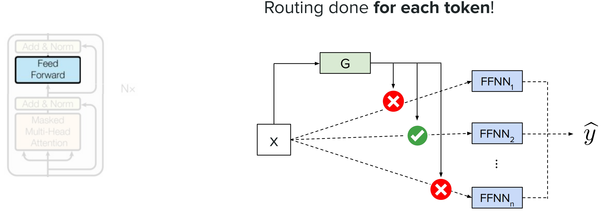
<p align="center">图1 MoE架构

MoE是解决**大模型参数量过大、前向传播计算效率低、显存占用高**的核心架构，核心思想是“**分而治之**”，将一个超大模型拆分为多个小型子模型（专家），仅激活部分专家完成计算。

### 2.1. 设计原因

超大模型的所有权重并非在每次前向传播中都有用，若**每次前向传播仅使用模型的一个子集**，可大幅降低计算量和显存占用，同时保留大模型的表达能力。

### 2.2. 核心组成

（1）**门控网络（G）**：输入为x，输出为每个专家的**权重系数**，负责判断每个专家对当前输入的重要性，是MoE的“**调度中心**”；

（2）**专家网络（E₁, E₂, ..., Eₙ）**：相互独立的小型子模型（如FFNN），各自负责处理不同类型的输入特征，是MoE的“**计算单元**”；

（3）**输出层**：对专家的输出进行**加权求和**，得到最终输出 $\hat{y}$ 。

### 2.3. 核心类型

#### 2.3.1. 稠密MoE（Dense MoE）

（1）核心逻辑：**激活所有专家**，输出为所有专家结果的加权平均；

（2）数学公式： $\hat{y}=\sum_{i=1}^{n} G(x)_{i} E_{i}(x)$ 
> 其中 $G(x)_{i}$ 为门控网络为第i个专家分配的权重， $E_{i}(x)$ 为第i个专家的输出；

（3）特点：计算量仍较大，未充分发挥“拆分模型”的效率优势，实际应用较少。

#### 2.3.2. 稀疏MoE（Sparse MoE）

（1）核心逻辑：通过**Top-k选择**仅激活**k个权重最高的专家**，输出为选中专家的加权平均；

（2）数学公式： $\hat{y}=\sum_{i \in \mathcal{I}_{k}} G(x)_{i} E_{i}(x)$ 
> 其中 $\mathcal{I}_{k}$ 为**Top-k**选中的专家索引集合，仅对该集合内的专家进行计算；

（3）特点：大幅降低计算量（仅计算k/n的模型参数），是工业界主流的MoE形式。

### 2.4. 集成方式

将Transformer**解码器的前馈网络（FFNN）** 直接替换为MoE层，且**对每个token单独进行路由（routing）**——即每个token会通过门控网络分配到不同的专家组合，实现对不同token的**精细化特征处理**，其余模块（掩码多头注意力、Add&Norm）保持不变。

### 2.5. 训练挑战：路由坍缩（Routing Collapse）

（1）问题现象：训练过程中，**同一个/少数几个专家被绝大多数token选中**，其余专家长期闲置，模型失去“多专家拆分”的意义，最终退化为普通单模型。

（2）解决方法：引入**辅助损失（Auxiliary Loss）**——通过辅助损失**强制均衡所有专家的使用频率**，让每个专家都参与训练，核心公式：$loss=\alpha \cdot N \cdot \sum_{i=1}^{N} f_{i} \cdot P_{i}$ 

> 参数定义：
> - $\alpha$ ：超参数，用于调节辅助损失的权重；
> -  $N$ ：专家的总数量；
> -  $f_{i}$ ：分配到第i个专家的token占总token的**比例**；
> -  $P_{i}$ ：第i个专家的**平均路由概率**（门控网络为其分配的权重均值）；

（3）核心逻辑：若某个专家被使用的频率过低（ $f_i$ 小），辅助损失会增大，迫使模型为该专家分配更多token。

### 2.6. 代码实现

```Python

class MoeLayer(nn.Module):
    def __init__(self, experts: List[nn.Module], gate, moe_args):
        super().__init__()
        assert len(experts) > 0  # 确保专家数量大于0
        self.experts = nn.ModuleList(experts)  # 封装专家网络为ModuleList
        self.gate = gate  # 门控网络
        self.args = moe_args  # MoE超参数（如num_experts_per_token：每个token选中的专家数）
    
    def forward(self, inputs: torch.Tensor):
        # 1. 展平输入：将[batch, seq_len, d_model]展平为[batch*seq_len, d_model]，为每个token单独路由
        inputs_squashed = inputs.view(-1, inputs.size(-1))
        # 2. 门控网络计算对数概率：为每个token计算所有专家的logits
        gate_logits = self.gate(inputs_squashed)
        # 3. Top-k选择专家：得到每个token选中的专家权重+索引
        weights, selected_experts = torch.topk(gate_logits, self.args.num_experts_per_token)
        # 4. Softmax归一化权重：将logits转换为0~1的权重，保证加权和的合理性
        weights = nn.functional.softmax(weights, dim=1).type_as(inputs)
        # 5. 初始化结果张量：与展平后的输入形状一致，初始值为0
        results = torch.zeros_like(inputs_squashed, dtype=torch.float)
        # 6. 遍历每个专家，分配token并计算输出
        for i, expert in enumerate(self.experts):
            # 找到选中当前专家的所有token的索引
            batch_idx, nth_expert = torch.where(selected_experts == i)
            # 加权累加当前专家的输出：权重 * 专家输出
            results[batch_idx] += weights[batch_idx, nth_expert, None] * expert(inputs_squashed[batch_idx])
        # 7. 恢复输入形状：从[batch*seq_len, d_model]恢复为[batch, seq_len, d_model]
        return results.view_as(inputs)
```

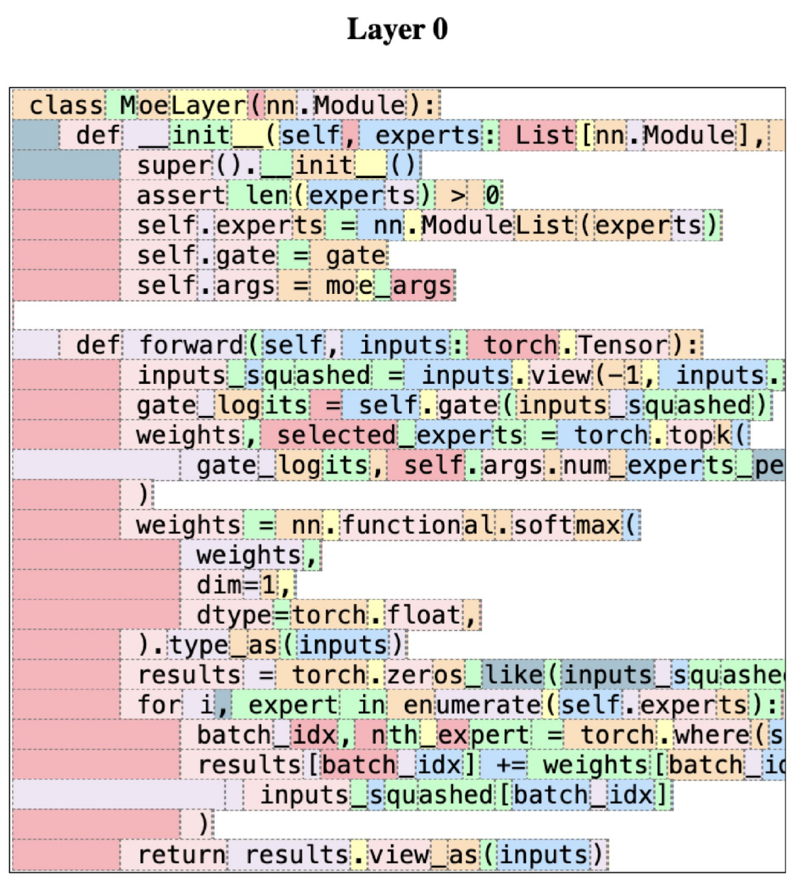
<p align="center">图2 分Token路由逻辑

- 可视化：用**不同颜色代表不同专家**，每个token会被分配到对应颜色的专家区域进行计算，直观体现“分token路由”的逻辑。

## 3. 响应生成：下一个Token预测（Next Token Prediction）

LLM的核心生成逻辑是**自回归生成**：从起始符 $[BOS]$ 开始，不断基于当前上下文预测下一个token，将预测结果加入上下文后继续预测，直至生成终止符$[EOS]$。本部分核心是**解码策略**——如何从模型输出的token概率分布中选择下一个token。

### 3.1. 完整流程

- 输入token → **Embedding（词嵌入）** → **Positional Encoding（位置编码）** → Masked Multi-Head Attention → Add&Norm → Feed Forward → Add&Norm → **Linear（线性层）** → **Softmax** → **token概率分布** → 解码策略选择下一个token

- 关键模块：
    - 位置编码：为token加入位置信息，解决Transformer无法捕捉序列顺序的问题；
    - 线性层+Softmax：将模型输出的特征向量（维度 $d_{model}$ ）映射到**词汇表维度**，并转换为0~1的概率分布。

### 3.2. 解码策略

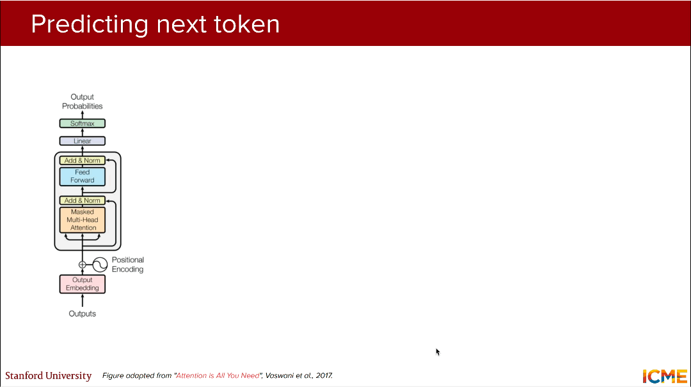
<p align="center">图3 三种解码策略流程示意图

#### 3.2.1. 贪心解码（Greedy Decoding）

（1）**核心思路**：**每次选择概率最高的token**，是最简单的解码方式；

（2）数学表达： $w_{t+1} = \arg\max_{w} P(w_{t+1}=w|C)$ ；

（3）优点：计算简单、速度快、显存占用低；缺点：仅考虑**局部最优**，全局结果未必最优，**输出缺乏多样性**，易生成重复、生硬的文本。

#### 3.2.2. 束搜索（Beam Search）

（1）**核心思路**：设置**束宽k**，每次保留**概率最高的k个生成路径**，最终从k个路径中选择**全局概率最高**的结果（全局最优）；

（2）实现逻辑：
1. 从[BOS]开始，生成前k个概率最高的token，形成k个初始路径；
2. 对每个路径，继续生成k个概率最高的token，得到 $k \times k$ 个候选路径；
3. 计算所有候选路径的**联合概率**，保留前k个概率最高的路径；
4. 重复步骤2-3，直至生成[EOS]；

（3）优点：相比贪心解码，生成结果更流畅、全局最优性更好；缺点：计算量随k增大**线性增加**，仍缺乏多样性和创造性，适合**精准度要求高、多样性要求低**的任务（如机器翻译、摘要）。

#### 3.2.3. 采样（Sampling）

（1）**核心思路**：从模型输出的**概率分布中随机采样**下一个token，而非选择固定最高概率的token：

（2）数学表达：$\hat{w}_{t+1} \sim P\left(w_{t+1} | C\right)$ 

（3）优点：生成结果**多样性高、更具创造性**，适合文本创作、对话等任务；缺点：可能采样到低概率的无意义token，导致输出偏离上下文，因此衍生出**约束性采样策略**。

#### 3.2.4. 改进的约束性采样

为解决基础采样的“无意义”问题，通过**限制采样的候选token范围**，平衡**多样性**和**合理性**，是工业界主流的解码方式。

**（1）Top-k采样**
- **核心逻辑**：仅在**概率最高的k个token**中采样，过滤掉低概率的无意义token；
- 特点：k为**固定超参数**（如k=4），灵活性较低，若k过小易导致生成重复，k过大则失去约束意义。

**（2）Top-p采样（核采样，Nucleus Sampling）**
- **核心逻辑**：选择**累积概率 ≥ p**的**最小token集合**（核），仅在该集合中采样，p通常设为**90%**；
- 计算步骤：
    1. 将token按概率从高到低排序；
    2. 依次**累加**token概率，直至累加和≥p，停止并选择该部分token为候选集；
    3. 在候选集中重新归一化概率，进行**随机采样**；
- 特点：候选token数量随**概率分布自适应调整**，比Top-k更灵活，能有效避免无意义token，是目前最常用的采样策略。

### 3.3. 温度系数（Temperature，T）：调节生成的随机性

（1）作用：温度系数用于**修改token概率分布的平滑度**，进而控制生成的**确定性/随机性**。

（2）调整公式：$P_{adj }\left(w_{t+1}=w_{i} | C\right)=\frac{exp \left(\frac{x_{i}}{T}\right)}{\sum_{j=1}^{n} exp \left(\frac{x_{j}}{T}\right)}$ 
> 其中 $x_i$ 为**线性层输出的原始得分（logits）**，未经过Softmax；

（3）调整结果：温度系数$T$通过**缩放logits的差值**，改变Softmax概率分布的陡峭程度。

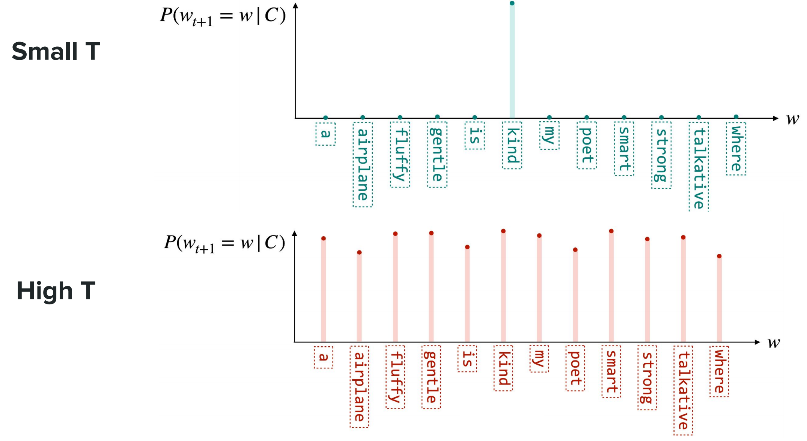
<p align="center">图4 温度系数对调整结果的影响

- **$T→0^+$**：退化为贪心解码。
- **$0<T<1$**：logits被放大，概率分布**更陡峭**，高概率token的占比进一步提升→生成**更确定、保守、重复**；
- **$T>1$**：logits被缩小，概率分布**更平缓**，token概率更平均→生成**更随机、有创造性、易偏离上下文**；
- **$T=1$**：无调整，使用模型原始的概率分布。

> 数学推导：
> 一般情况下，设任意两个token为$i$和$j$，其原始logits为$x_i$和$x_j$，定义**概率比**$R_{ij} = \frac{P_{adj}(w_i)}{P_{adj}(w_j)}$，代表token$i$的概率相对token$j$的倍数，将Softmax公式代入得：
> $$R_{ij} = \frac{exp\left(\frac{x_i}{T}\right)/\sum_{k=1}^n exp\left(\frac{x_k}{T}\right)}{exp\left(\frac{x_j}{T}\right)/\sum_{k=1}^n exp\left(\frac{x_k}{T}\right)} = exp\left(\frac{x_i - x_j}{T}\right)$$
> 令$\Delta_{ij} = x_i - x_j$（logits差值），则$R_{ij} = exp\left(\frac{\Delta_{ij}}{T}\right)$，分两种情况分析：

> **情况1：$0<T<1$（低温度，压缩随机性）**
> 若$x_i > x_j$，则$\Delta_{ij} > 0$，当$0<T<1$时，$\frac{\Delta_{ij}}{T} > \Delta_{ij}$，因此：
> $$R_{ij} = exp\left(\frac{\Delta_{ij}}{T}\right) > exp(\Delta_{ij}) = R_{ij}(T=1)$$
> 含义：低温度下，**高logits token的概率相对低logits token的比值会被放大**，高概率token的占比进一步提升，低概率token的占比进一步降低，**概率分布变得更“陡峭”**，模型生成更确定、保守，多样性降低。

> **情况2：$T>1$（高温度，提升随机性）**
> 若$x_i > x_j$，则$\Delta_{ij} > 0$，当$T>1$时，$\frac{\Delta_{ij}}{T} < \Delta_{ij}$，因此：
> $$R_{ij} = exp\left(\frac{\Delta_{ij}}{T}\right) < exp(\Delta_{ij}) = R_{ij}(T=1)$$
> 含义：高温度下，**高logits token的概率相对低logits token的比值会被缩小**，高概率token的占比被稀释，低概率token的占比被提升，**概率分布变得更“平缓”**，模型生成更随机、有创造性，但若$T$过大，会导致低概率无意义token被采样，输出偏离上下文。

> **情况3：$T→0^+$（温度趋近于0，极小值）**
> 设存在一个token $k$，其原始logits $x_k = \max\{x_1, x_2, ..., x_n\}$（即原始得分最高的token），对任意$i≠k$，有$x_k - x_i = \Delta > 0$。
> 对任意token$i$，其缩放后logits为$\frac{x_i}{T}$，分两种情况分析：
> - 对于最优token$k$：$\lim\limits_{T→0^+} \frac{x_k}{T} → +∞$，因此$\lim\limits_{T→0^+} exp\left(\frac{x_k}{T}\right) → +∞$；
> - 对于其他token$i≠k$：$\lim\limits_{T→0^+} \frac{x_i}{T} = \lim\limits_{T→0^+} \frac{x_k - \Delta}{T} → -∞$，因此$\lim\limits_{T→0^+} exp\left(\frac{x_i}{T}\right) → 0$。
> 
> 将其代入Softmax公式，可得：
$$\lim\limits_{T→0^+} P_{adj}(w_k) = \frac{+∞}{+∞ + \sum_{i≠k}0} = 1$$
$$\lim\limits_{T→0^+} P_{adj}(w_i) = \frac{0}{+∞ + \sum_{i≠k}0} = 0 \quad (i≠k)$$
> 含义：当$T$趋近于0时，**模型会将100%的概率分配给原始logits最高的token**，退化为**贪心解码**，输出完全确定，无任何多样性。

### 3.4. 引导解码（Guided Decoding）：约束输出格式

（1）核心动机：让LLM生成**符合特定格式**的输出（如JSON、表格、代码、XML），解决自由生成的格式混乱问题；

（2）核心思路：在预测下一个token时，**仅允许选择符合格式要求的“有效token”**，过滤所有无效token，强制模型按格式生成；例如要求生成JSON格式时，仅允许模型选择`{`、`"`、`first_name`、`:`、`,`等有效token，过滤掉“the”、“a”、“road”等无关词汇；

（3）实现关键：需提前定义**格式对应的有效token集合**，在解码阶段动态过滤无效token的概率（置为0）。

## 4. 提示工程策略（Prompting Strategies）

提示工程是**让LLM高效完成任务的核心技巧**，核心是通过**合理的提示设计**，引导LLM输出符合预期的结果。本部分是LLM**实际应用**的关键，核心包括上下文长度、提示结构、上下文学习等。

### 4.1. 核心术语

（1）**上下文长度（Context Length）**：也叫**上下文大小/窗口大小（Context Size/Window Size）**，指LLM能处理的**最大输入token数**，是LLM的核心超参数；

（2）关键问题：**上下文衰减（Context Rot）**——输入token数越多，LLM对**远距离上下文**的理解能力越差，模型性能会显著下降；

（3）实际建议：使用LLM时，需精简输入，去除无关信息，避免占用上下文窗口。

### 4.2. 高效提示结构

一个完整、高效的提示必须包含以下四部分，缺一不可，各部分相互配合，明确任务的背景、要求、输入和约束：

|组成部分|核心作用|示例|
|---|---|---|
|**上下文（Context）**|提供任务的背景信息|My teddy bear had a long day and needs a bedtime story.|
|**指令（Instructions）**|明确模型需要完成的任务|Generate a bedtime story that takes place in a specific location.|
|**输入（Input）**|任务的具体输入信息|Location: Country of teddy bears|
|**约束（Constraints）**|对输出的格式/内容限制|The story needs to be suitable for teddy bears that are tired.|

### 4.3. 上下文学习（ICL，In-Context Learning）

**上下文学习（ICL）**指**模型无需微调**，仅通过在提示中加入**任务示例**，就能完成从未训练过的新任务，是LLM“少样本学习”的基础，也是LLM的核心能力之一。

**（1）两种类型**

|类型|核心特点|性能特点|适用场景|
|---|---|---|---|
|**零样本学习（Zero-shot）**|提示中**无任何任务示例**，直接提问|性能高度依赖模型基础能力，效果较差|简单、通用的任务（如简单问答、情感判断）|
|**少样本学习（Few-shot）**|提示中加入**少量（1~5个）输入-输出示例**|性能远优于零样本，是实际应用的主流方式|复杂、小众的任务（如专业领域问答、格式生成）|

**（2）Few-shot的Trade-off（权衡）**
加入示例能显著提升模型性能，但存在三个问题：设计示例需要**人工成本**；示例会增加输入token数，**提升计算复杂度和推理成本**；示例会**增加推理延迟**，降低响应速度。

### 4.4. 思维链（CoT，Chain of Thought）

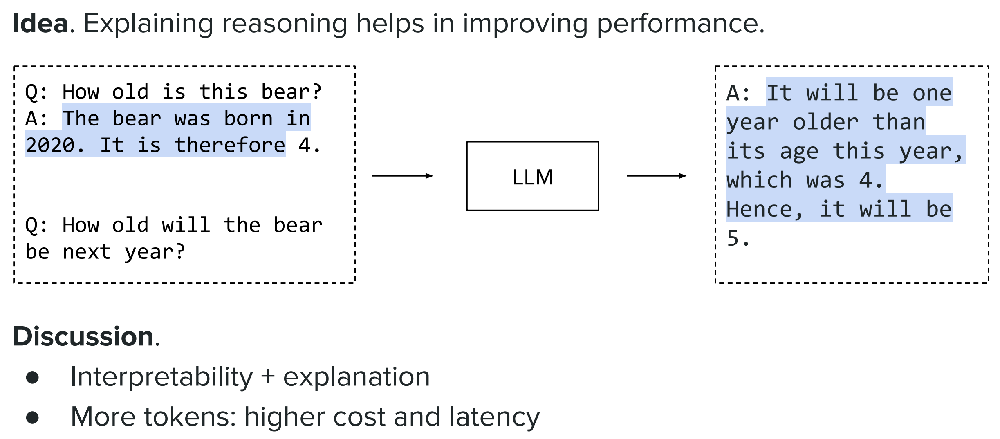
<p align="center">图5 思维链示例图

（1）**核心思路**：在提示中让模型**分步解释推理过程**，而非直接给出答案，通过“推理步骤”提升**复杂任务**的性能；

（2）核心原理：将复杂问题**拆解为多个简单子问题**，模型通过分步推理得到答案，贴合人类的思考逻辑；

（3）优点：提升**逻辑推理、数学计算、复杂问答**等任务的性能，同时增强结果的**可解释性**；缺点：生成更多token，**增加计算成本和推理延迟**。

### 4.5. 自一致性（Self-Consistency）

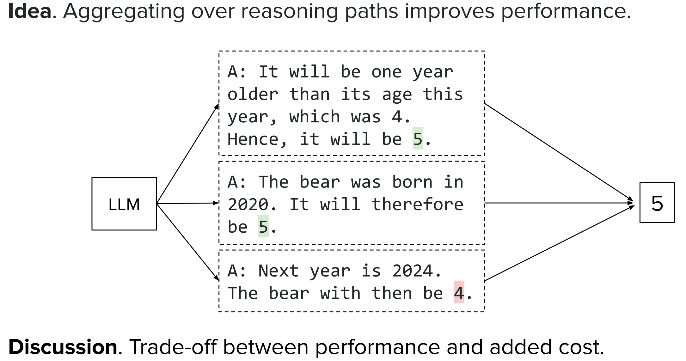
<p align="center">图6 自一致性示例图

（1）**核心思路**：让模型生成**多条不同的推理路径**，通过**投票/聚合**得到最终答案，进一步提升CoT的推理性能；

（2）核心原理：通过**多路径推理**降低单一路径的偶然性，提升答案的准确性；

（3）缺点：生成多条推理路径会**大幅增加计算成本**，是**性能与成本的典型权衡**，仅适用于对精度要求极高的任务。

## 5. LLM的推理优化（Inference Optimizations）

LLM推理的核心痛点：**计算成本高、显存占用大、推理延迟高**，优化的核心目标是**在尽可能保证模型性能的前提下，降低计算量和显存占用**。LLM的优化分为**两大维度**，涵盖**注意力机制、内存管理、Token生成**等多个方面的技巧，是工业界LLM**落地部署**的核心技术。

### 5.1. 优化维度

|优化维度|核心思路|性能特点|优化目标|
|---|---|---|---|
|**精确效率（Exact efficiency）**|不改变模型结构，通过**避免冗余计算、优化内存管理、重构数学公式**提升效率|无模型性能损失|小幅提升效率，保证精度|
|**近似优化（Approximations）**|通过**修改模型架构、调整嵌入表示、优化Token预测**提升效率|存在轻微的性能损失|大幅提升效率，牺牲少量精度|

### 5.2. 基于注意力机制的优化技巧

注意力机制是LLM推理中**计算量和显存占用的核心模块**（时间复杂度 $O(n^2d)$ ，n为序列长度，d为特征维度），也是优化的重点。

#### 5.2.1. KV缓存（KV Caching，Key-Value Caching）

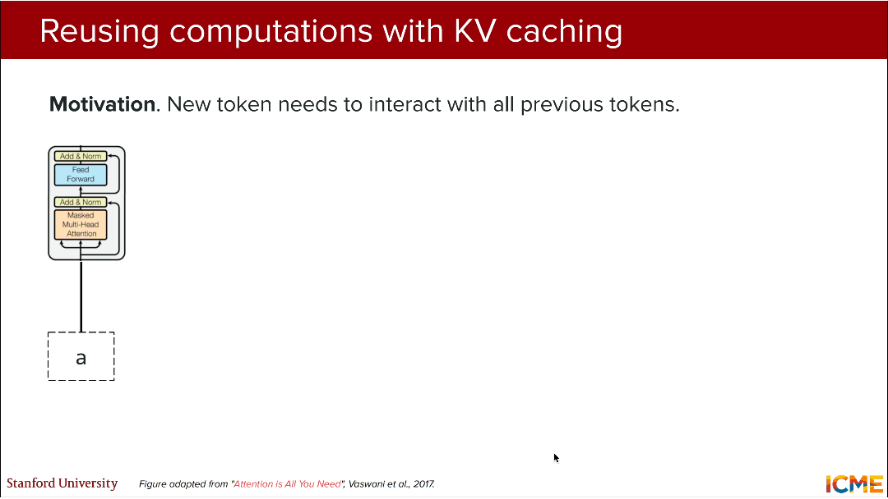
<p align="center">图7 KV缓存机制原理流程图

（1）核心动机：自回归生成中，新token需要与**所有历史token**计算注意力，若每次都重新计算历史token的Key（K）和Value（V），会产生**大量冗余计算**；

（2）核心思路：将**历史token的K和V向量**缓存到显存中，新token仅计算自身的Query（Q），与缓存的KV进行注意力计算，无需重新计算历史KV；

（3）核心原理：注意力计算的公式为  $Attention(Q,K,V) = Softmax(\frac{QK^T}{\sqrt{d_k}})V$ ，历史token的K、V固定，仅需缓存即可重复使用；

（4）特点：**无任何性能损失**，大幅减少注意力层的计算量（时间复杂度从 $O(n^2d)$ 降至 $O(nd)$ ），是LLM推理的**基础优化手段**，所有工业界框架均默认开启。

#### 5.2.2. 注意力头共享（MQA/GQA）

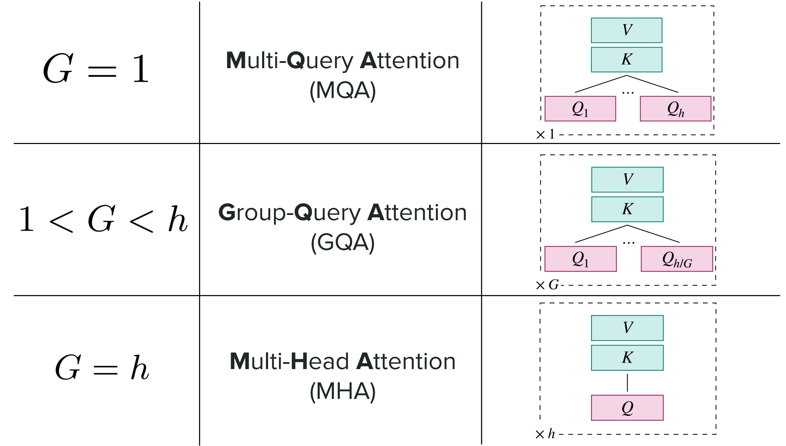
<p align="center">图8 注意力头共享示意图

（1）在**原生多头注意力（MHA，Multi-Head Attention）** 中，**查询头（Q）、键头（K）、值头（V）的数量完全相等**（均为h），公式为：

 $In \ vanilla \ MHA , \begin{gathered} Number of \\ query heads \end{gathered}=\begin{gathered} Number of \\ key heads \end{gathered}=\begin{gathered} Number of \\ value heads \end{gathered}=h$ 

（2）注意力头共享通过**减少K/V头的数量**，降低计算量和显存占用，衍生出两种方式：
1. **多查询注意力（MQA，Multi-Query Attention）**：所有Q头共享**1个K头和1个V头**，效率最高，性能损失略大；
2. **分组查询注意力（GQA，Grouped-Query Attention）**：将h个Q头分为G组，每组共享**1个K头和1个V头**，是MHA和MQA的**折中方案**；
   - 核心公式： K头数 = V头数 = G < Q头数h ；
   - 特点：GQA兼顾**效率和性能**，是目前工业界的主流选择（如GPT-3.5/4均使用GQA）。

#### 5.2.3. 分页注意力（PagedAttention）

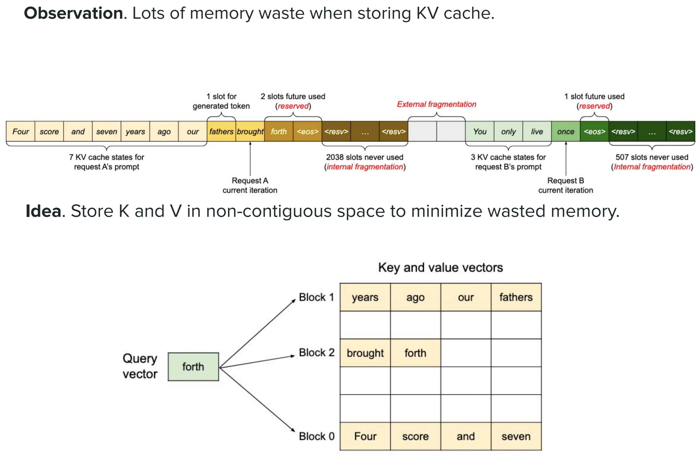
<p align="center">图9 分页注意力机制原理示意图

（1）核心问题：传统KV缓存为**每个推理请求分配连续的显存空间**，会产生大量**内部/外部碎片**（如请求仅需10个slot，却分配了20个，剩余10个无法被其他请求使用），导致显存严重浪费；

（2）核心思路：将KV缓存拆分为**固定大小的显存块（Block）**，**非连续存储**KV向量，根据请求需求**动态分配/释放**显存块，最小化显存碎片；

（3）特点：大幅提升**显存利用率**（提升3~5倍），支持更多的并发推理请求，是大模型**分布式部署**的核心优化技巧。

#### 5.2.4. 潜在注意力（Latent Attention）

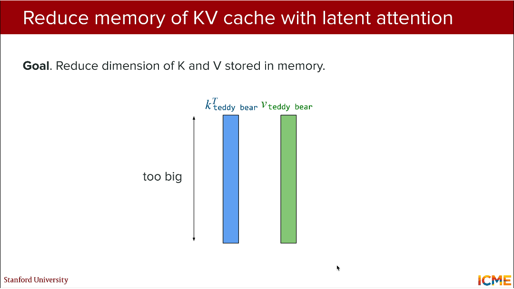
<p align="center">图10 潜在注意力机制原理流程图

（1）核心问题：即使开启KV缓存，K/V向量的**特征维度仍较高**（如d_k=128），长序列下显存占用仍较大；

（2）核心思路：对K和V进行**特征压缩**，将高维的K/V向量转换为**低维的潜在表示（Latent Representation）** 后再缓存，推理时根据需要解压缩；

（3）核心原理：通过一个**共享的压缩层**将K/V从高维空间映射到低维空间，缓存低维向量，大幅降低显存占用；

（4）特点：**近似优化**，显著降低KV缓存的显存占用（降低50%以上），存在轻微的性能损失。

### 5.3. 基于Token生成的优化技巧

#### 5.3.1. 推测解码（Speculative Decoding）

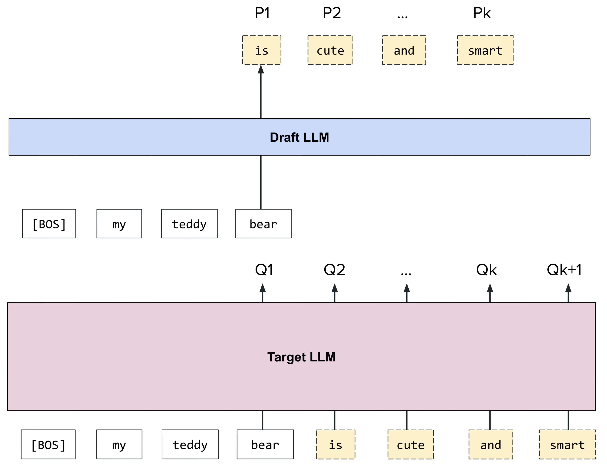
<p align="center">图11 推测解码机制原理示意图

（1）核心思路：用**小模型（草稿模型，Draft LLM）** 快速生成k个候选token，再用**大模型（目标模型，Target LLM）** **一次性验证**这k个token的合理性，验证通过则直接生成，不通过则重新采样；

（2）核心优势：小模型的生成速度远快于大模型，大模型仅需一次前向传播即可验证k个token，大幅提升解码速度（提升2~3倍）；

（3）采样验证规则：
1. 若目标模型对token的概率  $Q_i(token) \geq$  草稿模型的概率  $P_i(token)$ ，**直接保留**该token；
2. 若  $Q_i(token) < P_i(token)$ ，以  $\frac{Q_i(token)}{P_i(token)}$  的概率**保留**，以  $1-\frac{Q_i(token)}{P_i(token)}$  的概率**拒绝**；
3. 若某个token被拒绝，从分布  $[Q_i - P_i]_+$  中重新采样下一个token，并**终止本次验证**；

（4）特点：**无显著性能损失**，是目前提升解码速度的**最优技巧之一**。

#### 5.3.2. 多Token预测（MTP，Multi-Token Prediction）

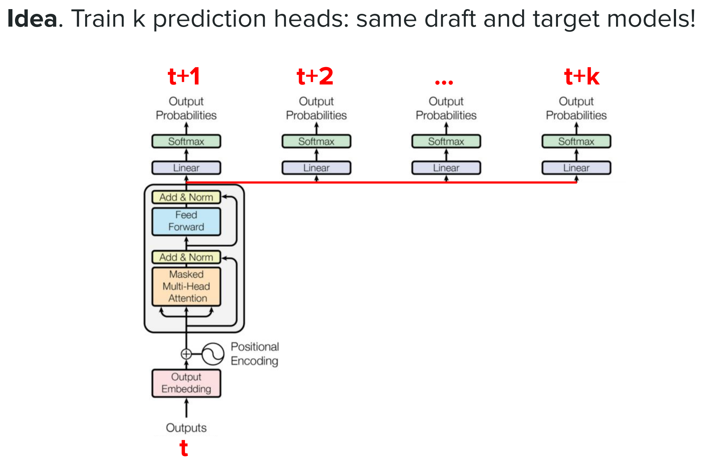
<p align="center">图12 多Token预测机制原理示意图

（1）核心思路：训练模型的**k个预测头**，让模型**一次生成k个token**，而非逐个生成，提升解码速度；

（2）核心特点：草稿模型和目标模型为**同一个模型**，仅在输出层增加k个独立的预测头，分别预测 $t+1、t+2、…、t+k$ 时刻的token；

（3）实现逻辑：在Transformer的输出层，为每个时间步分别训练线性层+Softmax，实现多token的并行预测；

（4）特点：**近似优化**，k不宜过大（否则会降低生成质量），适合对速度要求高、对质量要求适中的任务（如对话机器人）。

###### 推理优化技巧完整汇总表

|优化维度|具体优化方向|核心优化技巧|性能损失|核心作用|
|---|---|---|---|---|
|精确效率|避免冗余计算|KV缓存、推测解码|无/轻微|减少计算量，提升解码速度|
|精确效率|内存管理|分页注意力（PagedAttention）|无|提升显存利用率，支持高并发|
|近似优化|模型架构修改|分组查询注意力（GQA）/MQA|轻微|减少注意力层计算量和显存占用|
|近似优化|嵌入表示优化|潜在注意力（Latent Attention）|轻微|压缩KV向量，降低显存占用|
|近似优化|Token预测优化|多Token预测（MTP）|轻微|并行生成多token，提升解码速度|

> 核心总结
> 1. **大语言模型（LLM）** 核心特征为数十亿级参数、千亿级token训练数据，本质是为token序列分配概率的模型，核心能力是**自回归的下一个Token预测**；
> 2. **MoE混合专家模型** 是大模型效率优化的核心架构，通过**门控网络选Top-k专家**计算，解决大模型计算量过高问题，**路由坍缩**是其核心训练挑战，需通过辅助损失均衡专家使用频率；
> 3. **LLM解码策略** 分为**贪心解码、束搜索、采样**三类，贪心解码和束搜索追求确定性但缺乏多样性，**Top-k/Top-p采样**结合温度系数成为平衡多样性与合理性的主流方式，引导解码可实现结构化格式输出；
> 4. **提示工程** 是LLM落地的关键，高效提示包含**上下文、指令、输入、约束**四部分，**上下文学习（ICL）** 是LLM核心能力，思维链（CoT）和自一致性通过推理路径优化进一步提升复杂任务性能；**上下文衰减（Context Rot）** 是LLM的固有问题，输入token数增加会导致模型对远距离上下文的理解能力下降，需合理控制上下文窗口长度；
> 5. **LLM推理优化** 分为**精确效率和近似优化**两大维度，**KV缓存**是基础优化手段，**分页注意力、注意力头共享（GQA/MQA）优化内存与计算，推测解码和MTP**是提升Token生成速度的核心技巧；
> 6. **注意力机制** 是LLM推理优化的核心对象，通过**KV缓存、头共享、分页存储、特征压缩**等方式，可在保证性能的前提下大幅降低注意力层的计算量和显存占用。