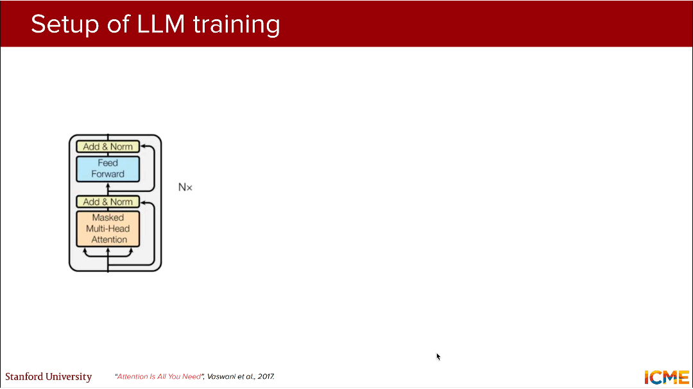
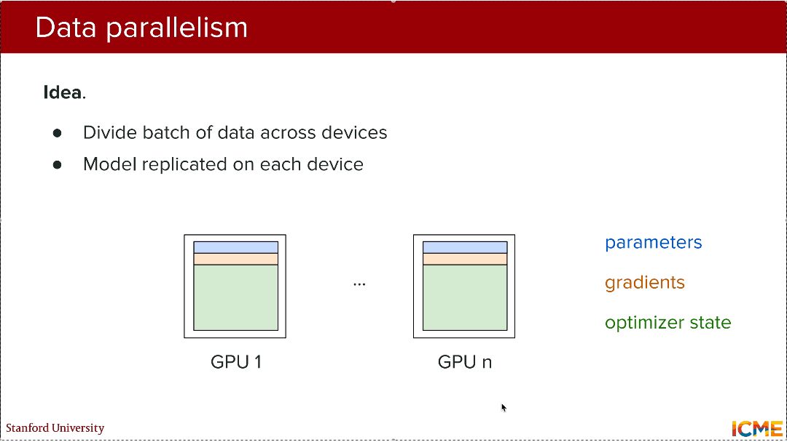
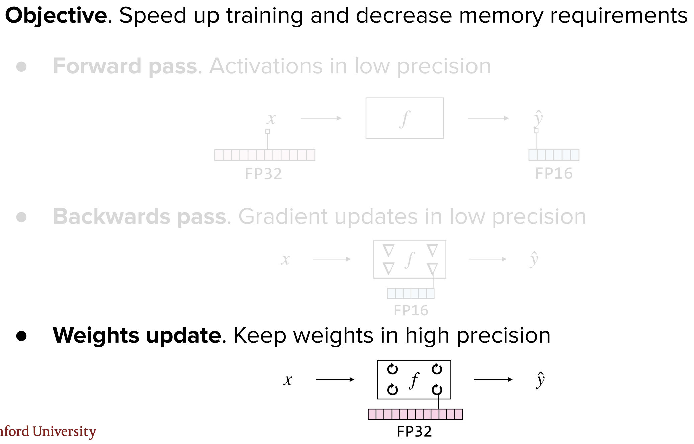
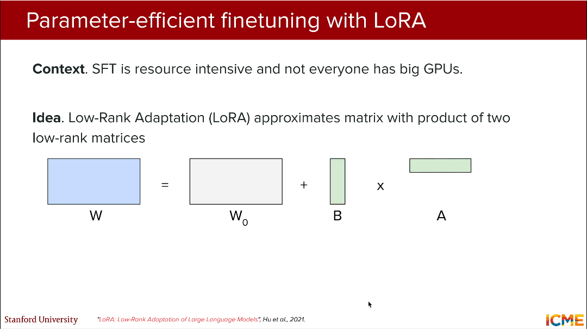
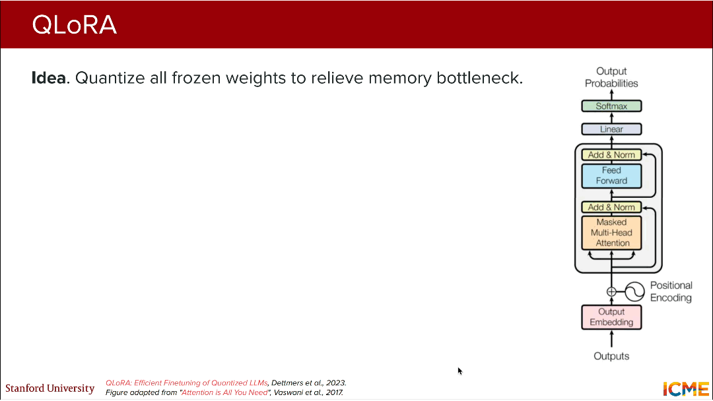
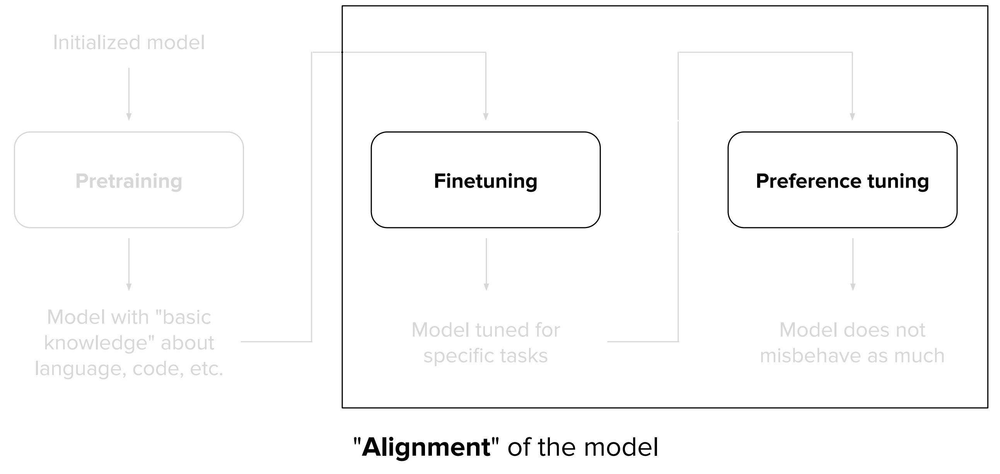

# CME 295 Lecture 4

## 1. LLM训练范式转变
**（1）传统机器学习**
- 逻辑：**给定具体任务 → 从头训练专属模型**
- 案例：垃圾邮件检测、情感提取、机器翻译模型相互独立，无参数/特征复用
- 问题：计算资源浪费、泛化能力极差、跨任务迁移无可能

**（2）迁移学习**
- 逻辑：**预训练通用模型 → 微调适配新任务**（部分复用已训练模型的参数/特征）
- 改进：实现一定程度的资源复用，但预训练目标并非“通用语言理解”，跨任务能力有限

**（3）LLM核心训练范式**
- 逻辑：**预训练（学通用规律）+ 微调（适配端任务）**
- **预训练**：无具体任务约束，训练LLM理解自然语言/代码的底层模式、语法、语义、逻辑
- **微调**：基于预训练模型，针对具体任务（如翻译、问答）做轻量化调优，无需从头训练
- 核心优势：实现**通用语言能力**，单模型可适配多任务，资源复用率最大化

## 2. 预训练

### 2.1. 核心目标

**Learn pattern of language and code**（学习自然语言与代码的底层模式）

- **自然语言**：支持多语种（英、法、波斯语等），学习语法、语义、上下文关联、常识
- **代码**：支持多编程语言（Python、Go等），学习语法、逻辑、函数调用、工程规范
- 最终结果：让模型具备**无任务约束的通用语言/代码理解与生成能力**

### 2.2. 目标函数

**Predict next token（下一个令牌预测）**

- 输入：以BOS（Begin of Sentence）为起始的令牌序列，如 $[BOS]$  A teddy bear is ... 
- 输出：下一个令牌的概率分布，模型通过最小化“**预测令牌与真实令牌的交叉熵损失**”完成训练
- 本质：**自回归训练**，基于前文预测后文，是所有自回归LLM的核心预训练任务

### 2.3. 数据来源与规模

（1）数据混合（Data mixtures）

两类核心数据源：
- Web-scraped（网络爬取）：Common Crawl（通用网络数据）、Wikipedia（维基百科，结构化知识）
- Code（代码数据）：GitHub（开源代码库）、Stack Overflow（代码问答）

（2）数据规模

**万亿级令牌（Approx. trillions of tokens）**，典型模型对比：

|模型|预训练令牌量（# tokens）|
|---|---|
|GPT-3|300 billion（3000亿）|
|LLaMA 3|15 trillion（15万亿）|

### 2.4. 核心计算指标（PPT标注定义/公式/量级对比）

 （1）**$FLOPs$（$FL$oating-point $OP$eration$s$，浮点运算总次数）**

- 定义：衡量模型训练的**总计算量**，与令牌数、模型参数数正相关

- 公式：$f(tokens, parameters)$ （无具体解析式，为定性关联）

- 量级对比：小神经网络 ~  $10^{7}$  → 大RNN ~  $10^{14}$  → LLM ~  $10^{25}$

（2）**$FLOPS or FLOP/s$（$FL$oating-point $OP$erations per $S$econd，每秒浮点运算次数）**

- 定义：衡量硬件的**计算性能**，即单位时间内可完成的浮点运算次数
- 量级对比：智能手机 ~  $10^{12}$  → 普通电脑 ~  $10^{14}$  → 超级计算机 ~  $10^{18}$ （硬件性能差距决定LLM训练需高性能集群）

### 2.5. 核心规律

（1）**缩放规律（scaling）**

- 核心结论：模型**测试损失 L 随计算量、数据集大小、模型参数数**的增加而单调下降，三者存在明确的幂律关系：
  - 与数据集大小(tokens) $D$ ： $L=(D/5.4*10^{13})^{-0.095}$ 
  - 与模型参数数(non-embedding) $N$ ： $L=(N/8.8*10^{13})^{-0.076}$ 
  - 与最小计算量(PF-days,non-embedding) $C_{min}$ ： $L=(C_{min}/2.3*10^8)^{-0.050}$ 

- 本质：**更大的模型、更多的数据、更高的计算量**，必然带来模型性能的提升。

（2）**样本效率（Sample efficiency）**

- 核心结论：**模型参数数越多，样本效率越高**（即达到相同测试损失，大模型需要的训练令牌数更少）
- 图表验证：10⁹参数模型的测试损失远低于10³参数模型，且随令牌数增加，损失下降速度更快。

（3）**Chinchilla定律（Chinchilla law）**

- 核心前提：缩放规律未考虑**计算量最优**，仅增大参数数/数据量会导致资源浪费

- 核心结论：**模型参数数** $N$  **与训练令牌数** $T$  **必须按比例缩放**，才能实现训练计算量的最优利用，避免“参数多数据少”或“数据多参数少”

- 表格数据（计算量与参数/令牌的对应关系，Gopher为基准单位，FLOPs为计算量）：

|参数数|FLOPs|FLOPs（Gopher单位）|训练令牌数|
|---|---|---|---|
|400 Million|1.92e+19|1/29,968|8.0 Billion|
|1 Billion|1.21e+20|1/4,761|20.2 Billion|
|10 Billion|1.23e+22|1/46|205.1 Billion|
|67 Billion|5.76e+23|1（基准）|1.5 Trillion|
|175 Billion|3.85e+24|6.7|3.7 Trillion|
|1 Trillion|1.27e+26|221.3|21.2 Trillion|

- 关键结论：670亿参数模型的**最优训练令牌数为1.5万亿**，是工业界大模型设计的经典参考。

## 3. LLM训练与应用的核心挑战

（1）**成本问题（Cost）**

- **经济**成本：训练一次大模型**至少数百万美元**（含硬件、算力、人力）
- **时间**成本：**训练周期长**（数周/数月），需7×24小时高性能集群运行
- **环境**成本：**消耗巨量电力**（单模型训练耗电可达数万度），带来能源与环境负担

（2）**知识学习问题（Learned knowledge）**

- **Knowledge cutoff（知识截止）**——模型仅能学习**训练数据截止时间前**的知识，无法掌握实时信息

- **Hard to edit knowledge（知识编辑困难）**——LLM的知识**分布式存储在模型参数中**，无明确的“知识节点”，修改单个知识点会牵一发而动全身，甚至导致模型性能下降

- **Plagiarism（抄袭风险）**——训练数据包含大量有版权的文本/代码，模型生成结果可能与训练数据高度相似，存在版权侵权风险

## 4. LLM的训练流程

图1 LLM训练流程

**（1）初始化（Initialization）**

- 操作：随机初始化模型所有参数 $\theta_0$ ，参数规模为**十亿到数百亿级**
- 影响：作为训练起点，初始化方式直接影响模型收敛速度

**（2）前向传播（Forward pass）**

- 操作：输入训练数据，通过Transformer解码器计算模型输出，得到**损失值** $L$ 
- 关键变量：**Activations（激活值）**——各层网络的输出，是计算损失的核心依据
- 损失值影响因素： $L = f(model\_size, batch\_size, context\_length)$

**（3）反向传播（Backwards pass）**

- 操作：基于损失值 $L$ ，通过**链式法则**计算**损失对模型参数的梯度**
- 核心公式： $\nabla \mathscr{L}\left(\theta_{t}\right)$ （ $t$ 为训练步数， $\theta_t$ 为第 $t$ 步的模型参数）
- 关键变量：**Gradients（梯度）**——是模型参数更新的唯一依据，梯度消失/爆炸会导致训练失败

**（4）参数更新（Weights update，PPT核心公式，Adam优化器）**

- 优化器：**Adam（Adaptive Moment Estimation）**，为LLM训练的标配优化器

- 核心更新公式：$\theta_{t+1} \leftarrow \theta_{t}-\alpha \frac{m_{t}}{\sqrt{v_{t}}+\epsilon}$ 
> 其中：
> -  $\alpha$ ：学习率（超参数，控制参数更新步长）
> -  $m_t$ ：梯度的**一阶矩估计**（动量，平滑梯度更新），公式： $m_{t+1} \leftarrow \beta_{1} m_{t}+\left(1-\beta_{1}\right) \nabla \mathscr{L}\left(\theta_{t}\right)$ 
> -  $v_t$ ：梯度的**二阶矩估计**（自适应学习率，对不同参数设置不同步长），公式： $v_{t+1} \leftarrow \beta_{2} v_{t}+\left(1-\beta_{2}\right)\left(\nabla \mathscr{L}\left(\theta_{t}\right)\right)^{2}$ 
> -  $\epsilon$ ：极小值（防止分母为0，一般取 $10^{-8}$ ）
> -  $\beta_1, \beta_2$ ：矩估计的衰减系数（超参数，一般取0.9和0.999）

- 关键变量：**Optimizer state（优化器状态）**——存储 $m_t$ 和 $v_t$ ，是Adam优化器的核心，会占用大量显存。

## 5. LLM训练核心瓶颈：内存

### 5.1. 硬件限制：NVIDIA H100 GPU参数

（1）核心结论
- **显存容量有限**：H100 SXM（80GB）、H100 NVL（94GB），无法直接承载百亿级参数的LLM训练
- **低精度计算速度远高于高精度**：FP8（8位浮点）速度是FP64（64位浮点）的100倍以上，为“混合精度训练”提供硬件基础

（2）H100核心性能参数（单位：teraFLOPS/TOPS）

|精度类型|H100 SXM|H100 NVL|
|---|---|---|
|FP64|34|30|
|FP64 Tensor Core|67|60|
|FP32|67|60|
|TF32 Tensor Core|989|835|
|BFLOAT16 Tensor Core|1979|1671|
|FP16 Tensor Core|1979|1671|
|FP8 Tensor Core|3958|3341|
|INT8 Tensor Core|3958 TOPS|3341 TOPS|

### 5.2. 内存优化：并行训练

#### 5.2.1. 数据并行（Data Parallelism）

（1）核心思路：将**训练批次数据**均匀拆分到多个GPU；每个GPU**完整复制模型参数/梯度/优化器状态**；各GPU独立计算梯度后，通过通信同步梯度，再统一更新参数

（2）问题：参数/梯度/优化器状态在多GPU间**完全冗余**，显存利用率极低（如8GPU数据并行，显存浪费7/8）

#### 5.2.2. ZeRO优化（Zero Redundancy Optimization）

图2 ZeRO优化

（1）核心目标：消除数据并行中的**冗余信息**，提升显存利用率

（2）优化版本：
- ZeRO-1：仅共享**优化器状态**（$m_t, v_t$），参数和梯度仍冗余
- ZeRO-2：共享**优化器状态 + 梯度**，仅参数冗余
- ZeRO-3：共享**优化器状态 + 梯度 + 参数**，无冗余信息，显存利用率最高

（3）本质：将冗余的**参数/梯度/优化器状态**拆分到多个GPU，而非复制，是大模型训练的标配优化。

#### 5.2.3. 模型并行（Model parallelism）

（1）核心思路：将**模型的计算逻辑/参数**拆分到多个GPU，而非复制完整模型，适用于超大规模模型（万亿参数）

（2）具体类型：
- **张量并行（TP）**：将单个层的权重矩阵拆分到多个GPU，并行计算
- **流水线并行（PP）**：将模型的不同层拆分到多个GPU，按流水线方式计算
- **序列并行（SP）/上下文并行（CP）/专家并行（EP）**：针对序列长度/上下文/专家层的拆分方式

### 5.3. 内存优化：Flash Attention

图3 传统自注意力与Flash Attention的计算思路

#### 5.3.1. 传统自注意力的问题

（1）自注意力核心公式：$Attention(Q,K,V) = softmax\left(\frac{Q K^{T}}{\sqrt{d_{k}}}\right) V$ 
> 其中 $d_k$ 为Q/K的维度， $\sqrt{d_k}$ 为防止内积过大导致softmax饱和。

（2）传统计算流程：从**HBM**（低速大显存）加载 $Q / K$ 分块 → 计算 $S=QK^T$  → 将$S$写入**HBM** → 从**HBM**读取$S$ → 计算 $P=softmax(S)$  → 将$P$写入**HBM** → 从**HBM**加载 $P / V$ 分块 → 计算 $O=PV$  → 将$O$写入**HBM**

（3）核心问题：**多次读写HBM**，中间结果（S/P）占用大量显存，且HBM读写速度慢，导致注意力计算耗时/显存占用高。

#### 5.3.2. 核心优化思路

Flash Attention的核心是**利用GPU的SRAM（高速小显存）减少HBM读写**，实现**精确注意力**（无性能损失，区别于近似注意力），包括两大核心思想：

（1）**思想1：Tiling（分块）——最小化HBM读写**

- 操作：将$Q / K / V$**按固定大小分块**，逐块加载到SRAM（高速显存），在SRAM内完成注意力计算，计算完成后仅将最终结果$O$写入HBM，**无需存储中间结果$S / P$**

- 本质：用**SRAM的高速读写**替代HBM的低速读写，减少数据交互耗时

（2）**思想2：分块Softmax + 反向传播重计算**

- **分块Softmax**：无需计算完整的 $S=QK^T$ ，对SRAM内的分块$S$单独计算softmax，通过**归一化因子累加**得到最终的$P$，保证结果与传统注意力一致

- **反向传播重计算**：不存储前向传播的中间结果（S/P/激活值），**在反向传播时重新从HBM加载$Q / K / V$分块**，在SRAM内重计算中间结果，以**少量FLOPs增加**换取**大量显存节省**——More FLOPs, but less runtime!!（计算量略有增加，但运行时间大幅减少）

（3）优化效果：**精确注意力**前提下，性能提升显著：
|指标|传统自注意力|Flash Attention|提升幅度|
|---|---|---|---|
|GFLOPs（计算量）|66.6|75.2|增加13%|
|HBM R/W（GB）|40.3|4.4|减少90%|
|Runtime（ms）|41.7|7.3|速度提升5.7倍|

#### 5.3.3. 具体数学推导
FlashAttention的核心是**分块softmax累加的等价性证明**和**数值稳定化处理**，证明分块计算与全局计算结果完全一致（精确注意力）。

（1）步骤1：**softmax的数值稳定化变换**

- 传统softmax（行内公式示例）：$softmax(a)_i = \frac{\exp(a_i)}{\sum_{j=1}^N \exp(a_j)}$，存在数值溢出/下溢问题。
- **引入全局最大值** $m = \max_{j=1}^N a_j$，恒等变换后得到**数值稳定化**公式（显示型公式，带编号）：$$softmax(a)_i = \frac{\exp(a_i - m)}{\sum_{j=1}^N \exp(a_j - m)} \tag{1}$$
- 推导说明：$a_j - m \leq 0$，$\exp(a_j - m) \in (0, 1]$，避免溢出；分母 $\sum_{j=1}^N \exp(a_j - m) \geq 1$，避免分母趋近于0；变换后结果与原公式完全一致。

（2）步骤2：**softmax分块累加的等价性推导**

- 将**键值矩阵按列分块**为 $K = [K_1, K_2, ..., K_T]$、$V = [V_1, V_2, ..., V_T]$，**单查询行** $q_i$ 的相似度向量分块为 $a_i = [a_{i1}, a_{i2}, ..., a_{iT}]$。
- 定义**局部变量**：对每个分块 $a_{it}$，定义**局部最大值**：$m_t = \max(a_{it})$；**局部归一化和**：$s_t = \sum_{j \in \text{block } t} \exp(a_{ij} - m_t)$
- **全局变量**计算：**全局最大值**：$m = \max_{t=1}^T m_t$；**全局归一化和**：$s = \sum_{t=1}^T s_t \cdot \exp(m_t - m)$
- **等价性证明**：
    - 全局softmax值：$$softmax(a_i)_j = \frac{\exp(a_{ij} - m)}{\sum_{t=1}^T \sum_{j' \in \text{block } t} \exp(a_{ij'} - m)} = \frac{\exp(a_{ij} - m_t) \cdot \exp(m_t - m)}{s} \tag{2}$$
    - 局部softmax值：$$softmax(a_{it})_j = \frac{\exp(a_{ij} - m_t)}{s_t} \tag{3}$$
    - 联立得等价关系：$$softmax(a_i)_j = softmax(a_{it})_j \cdot \frac{s_t \cdot \exp(m_t - m)}{s} \tag{4}$$
- **核心结论**：跟踪 $m_t$、$s_t$ 即可实现分块softmax到全局softmax的等价转换，无精度损失。

（3）步骤3：**分块注意力输出的推导**
- 全局注意力输出（单查询行）：$$o_i = softmax(a_i) V = \sum_{t=1}^T softmax(a_i)_{:,t} V_t \tag{5}$$
- 代入公式(5)，定义局部输出 $o_{it} = softmax(a_{it}) V_t$，得：$$o_i = \frac{1}{s} \sum_{t=1}^T o_{it} \cdot s_t \cdot \exp(m_t - m) \tag{6}$$
- 推导说明：局部输出 $o_{it}$ 在SRAM内计算，仅需跟踪 $o_{it}$、$m_t$、$s_t$；最终通过**全局变量累加**得到与传统注意力一致的输出。

### 5.3.4. 分块计算流程

（1）**分块方式**
- **Q按行分块**：$Q = [Q_1, Q_2, ..., Q_R]$，每行块 $Q_r \in \mathbb{R}^{B_r \times d_k}$；
- **K/V按列分块**：$K = [K_1, ..., K_C]$、$V = [V_1, ..., V_C]$，每列块 $K_c \in \mathbb{R}^{B_c \times d_k}$；
- 约束：**单分块Q+K+局部变量总字节数 ≤ SRAM容量**（如FP16下 $B_r=B_c=64$ 适配H100）。

（2）**分块计算**
1. **初始化全局变量（HBM存储）**
    输出矩阵：$O \in \mathbb{R}^{N \times d_v}$（初始0）；全局最大值：$m \in \mathbb{R}^N$（初始 $-\infty$）；全局归一化和：$s \in \mathbb{R}^N$（初始0）。

2. **遍历K/V列块（加载到SRAM）**
   循环遍历每个K/V列块$K_c$、$V_c$，将其从HBM加载到SRAM（仅加载1个列块）；同时，为每个列块初始化局部最大值$m_c$和局部归一化和$s_c$（临时变量，仅存储在SRAM，不写回HBM）

3. **遍历Q行块（SRAM内计算+累加）**
   - 加载$Q$行块$Q_r$从HBM到SRAM，与已加载的$K_c$计算局部注意力得分矩阵$S_{rc} = Q_r K_c^T / \sqrt{d_k}$（无需存储，直接用于后续计算）；
   - 对$S_{rc}$按行计算局部最大值$m_{rc}$（每行的最大值，对应分块内的$m_t$）和局部归一化和$s_{rc} = \sum_{j \in c} \exp(S_{rc}(i,j) - m_{rc}(i))$（$i$为Q行块内的索引）；
   - 计算局部注意力权重：$A_{rc} = \exp(S_{rc} - m_{rc}) / s_{rc}$；
   - 计算局部注意力输出：$O_{rc} = A_{rc} V_c$；
   - 更新全局变量（仅写回HBM对应行）：
     - 更新全局最大值 $ m(r,:) = \max(m(r,:), m_{rc}) $
     - 更新全局归一化和 $ s(r,:) = s(r,:) \cdot \exp(m(r,:)_{\text{old}} - m(r,:)_{\text{new}}) + s_{rc} \cdot \exp(m_{rc} - m(r,:)_{\text{new}})$
     - 更新全局输出 $ O(r,:) = O(r,:) \cdot \exp(m(r,:)_{\text{old}} - m(r,:)_{\text{new}}) + O_{rc} \cdot \exp(m_{rc} - m(r,:)_{\text{new}})$
    - 释放当前Q行块$Q_r$的SRAM空间，加载下一个Q行块，重复上述步骤，直至所有Q行块与当前K/V列块计算完成；

4. **全局归一化**：所有K/V列块和Q行块遍历完成后，对全局输出$O$进行全局归一化（结合全局归一化和$s$），得到最终注意力输出：$ O = O/s $

5. **反向传播重计算**：前向传播仅存储$Q$、$K$、$V$、$O$、$m$、$s$（$O(Nd)$ 内存）；反向传播时重新加载分块到SRAM，**重计算中间结果后求梯度**；代价：增加~13% FLOPs；收益：显存节省~50%，整体速度提升。

### 5.4. 内存/速度优化：混合精度训练

（1）浮点精度的二进制构成

- **符号位（Sign）**：控制正负（1位，0=正，1=负）
- **指数位（Exponent/Range）**：控制数值的量级（范围）
- **尾数位（Mantissa/Significand/Fraction）**：控制数值的精细度（小数点后部分）
- **尾数位越少，精度越低、显存占用越小、计算速度越快**（尾数位决定数值的精细度）：

|精度类型|符号位（Sign）|指数位（Exponent）|尾数位（Mantissa）|总位数|
|---|---|---|---|---|
|FP16|1|5|10|16|
|FP32|1|8|23|32|
|FP64|1|11|52|64|
|BFLOAT16|1|8|7|16|

图4 混合精度训练

（2）混合精度训练**目标**：**Speed up training and decrease memory requirements**（提升训练速度，降低显存需求）；核心原则是**低精度计算，高精度保存**（利用低精度的速度优势，同时用高精度避免训练过程中的精度损失）

（3）混合精度训练**流程**：
- **前向传播**：模型**激活值**用**低精度**（FP16/BFLOAT16）计算，减少显存占用
- **反向传播**：**梯度计算/更新**用**低精度**（FP16/BFLOAT16）计算，提升运算速度
- **参数更新**：**模型权重** $\theta_t$ 用**高精度（FP32）**保存并更新，避免梯度累积的精度损失导致模型收敛失败

## 6. 有监督微调（Supervised Finetuning,SFT）

### 6.1. SFT简介

（1）定义：Supervised FineTuning（SFT、有监督微调），基于**人工标注的输入-输出配对数据**微调预训练模型

（2）核心思路：**收集SFT数据**（输入=任务指令，输出=期望结果）；以**下一词预测**为目标，微调模型权重；**改变模型行为**，使其适配具体任务

（3）本质：仍为**自回归训练**，与预训练的唯一区别是**数据为任务专属的标注数据**，而非通用无标注数据

### 6.2. 特殊场景：指令调优（Instruction tuning）

（1）核心目标：**Graduate the model to being a helpful assistant**（让模型成为遵循自然语言指令的有用助手）

（2）任务类型：故事写作、诗歌创作、清单生成、问题解释等通用自然语言任务

（3）数据特点：以**人工编写+合成数据**作为数据来源；主要内容涵盖助手对话、合成指令、数学推理、代码、安全对齐；不同模型的SFT规模（样本量）如下：
|模型|SFT样本量（# examples）|
|---|---|
|GPT-3|13 thousands（1.3万）|
|LLaMA 3|10 million（1000万）|

### 6.3. 微调效果对比

以问题Can I put my teddy bear in the washer?（泰迪熊能机洗吗？）为例：

- 预训练模型：**仅陈述事实** → Teddy bears are often made of materials like polyester and cotton, with plastic eyes and sometimes small accessories.（仅介绍泰迪熊的材质，未回答问题）

- 预训练+指令调优模型：**直接响应指令** → No, it might get damaged. Try hand washing instead.（明确回答不能，并给出建议，符合人类需求）

### 6.4. 核心挑战

（1）需要**极高质量**的输入-输出配对数据，标注成本高
（2）对**提示词（Prompt）的分布**高度敏感，未见过的提示词格式会导致性能下降
（3）**泛化能力有限**，难以适配训练数据中未覆盖的任务
（4）**缺乏统一、客观的评估标准**，难以量化模型的“指令遵循能力”
（5）全量微调仍需**大量计算/显存资源**，中小GPU无法支撑

### 6.5. 模型评估

（1）**标准化基准（Benchmarks，量化指标）**

- 四个维度：**通用知识**：MMLU（多任务语言理解）；**基础推理**：ARC-Challenge（人工智能推理挑战）；**数学推理**：GSM8K（小学数学应用题）；**代码生成**：HumanEval（代码生成任务）

- 核心建议：Recommended to train on the test task to compare across models（为跨模型对比，建议**在测试任务上做少量训练**）

（2）**“Real-life” feeling评估（如Chatbot Arena，主观体验）**

- 核心思路：通过用户对不同模型的**A/B盲测**，为模型的“使用体验”打分，将主观感受量化
- 优势：Puts a number on "vibes"（将难以量化的“使用感受”转化为**具体分数**）
- 挑战：模型曝光不均/冷启动问题；易作弊（模型可通过特定策略提升用户评分）；用户无法准确评估事实性；个人偏好偏见；安全惩罚导致分数失真

## 7.参数高效微调（Parameter-efficient finetuning）

全量SFT需要微调模型**所有参数**，计算/显存资源需求极高，参数高效微调仅微调**少量参数**（<1%），即可达到与全量SFT相近的性能，是中小GPU微调大模型的主流方案，如$LoRA$和$QLoRA$为本次课的工程核心。

### 7.1. $LoRA$（$Lo$w-$R$ank $A$daptation）

图5 LoRA微调原理

（1）核心背景：全量SFT资源密集，中小GPU无法支撑，LoRA通过**低秩矩阵近似**减少需要微调的参数数量，实现高效微调。

（2）**核心原理**
- 原始权重矩阵：预训练模型的权重矩阵 ${W_0} \in \mathbb{R}^{d \times k}$ （ $d$ 为输入维度， $k$ 为输出维度，通常为大矩阵）
- LoRA分解公式： ${W = W_0 + B·A}$ 
> 其中：
> -  $W_0$ ：预训练权重矩阵，**冻结不更新**（占模型参数的99%以上）
> -  $A \in \mathbb{R}^{d \times r}$ ：低秩**投影**矩阵，随机初始化，**需微调**
> -  $B \in \mathbb{R}^{r \times k}$ ：低秩**还原**矩阵，初始化为0，**需微调**
> -  $r$ ：**低秩维度**（超参数，通常取**4/8/16**，远小于 $d/k$ ），决定LoRA的参数量
- 结论：$LoRA$的参数量为 $r×(d+k)$ ，远小于原始矩阵 $d×k$ ，实现**以少量参数微调达到全量SFT性能**。

（3）**核心优势**
- **参数量极少**：仅微调低秩矩阵A和B，显存/计算需求大幅降低
- **任务切换灵活**：**更换A/B矩阵即可适配不同任务**（如垃圾邮件检测→情感提取→翻译），无需重新训练，实现“一个模型适配多任务”
- **训练速度快**：微调参数量少，训练周期大幅缩短
- **性能无损**：在合理的低秩维度 $r$ 下，性能与全量SFT基本一致

（4）**适用位置**：原始方案仅应用于**Masked Multi-Head Attention**（掩码多头注意力）模块；而当前最优实践是应用于：**Forward Feed**（前馈网络）

（5）**训练动力学**：LoRA与全量微调的训练规律存在显著差异，为实验验证的**经验结论**：LoRA需要**更高的学习率**（比全量微调高10~100倍）；LoRA在**大批次大小**下性能表现较差（适合小批次训练）

### 7.2. $QLoRA$（$Q$uantized $LoRA$，量化低秩适配）

图6 QLoRA微调原理

（1）核心背景：LoRA仍需以**高精度（FP32/FP16）**存储冻结的权重矩阵 $W_0$ ，**显存占用仍较高**；QLoRA通过**量化冻结权重**进一步释放显存瓶颈，实现**中小GPU微调千亿参数大模型**。

（2）核心原理：在LoRA的基础上，增加**权重量化**。
- **冻结权重矩阵** ${W_0}$ ：量化为**4位低精度**（$NF4$）存储，大幅节省显存
- **低秩矩阵** ${B·A}$ ：以**高精度**（$FP16/FP32$）存储并微调，保证训练精度
- 计算过程：**所有前向/反向传播计算均在高精度（$FP16$）下完成**，避免量化导致的精度损失
- 核心公式：仍为 ${W = W_0 + BA}$ ，仅 $W_0$ 的存储精度发生变化，计算逻辑不变

（3）量化技巧
1. **4位NormalFloat（NF4）量化**
    - 背景：LLM的权重服从**正态分布**，传统的均匀量化（INT8）会导致严重的精度损失
    - 核心：NF4基于**正态分布的分位数**进行量化，更适配LLM权重的分布，量化后精度损失极小
    - 对比：INT8（均匀量化）→ 精度损失大；NF4（正态量化）→ 精度损失小，性能基本无损
  
2. **Double quantization（双重量化）**
   - 核心：对**量化的常数**（如量化**缩放因子、偏移量**）再进行一次量化（FP8），而非以FP32存储
   - 效果：**额外节省~6%的显存**，是无性能损失的显存优化手段

（4）核心优势
- **极致显存节省**：对LLaMA 65B模型，微调时**VRAM节省约16倍**
- **硬件门槛低**：让消费级GPU（如24GB/32GB显存）也能微调千亿参数大模型
- **性能无损**：低精度存储+高精度计算，模型性能与LoRA/全量SFT基本一致
- **训练速度快**：显存占用降低，数据读写效率提升，训练速度快于LoRA

### 7.3. LLM的全生命周期

图7 LLM完整生命周期与对齐原则

**模型初始化** → **预训练** → **有监督微调（SFT/指令调优）** → **偏好调优**
- **预训练**：学习语言/代码的通用规律，形成**基础通用知识**
- **SFT/指令调优**：适配具体任务，实现**指令遵循能力**
- **偏好调优**：减少模型的不良行为，让模型行为**贴合人类偏好/安全准则**
- 全生命周期核心目标：**Model Alignment（模型对齐）**——让模型的能力、行为、价值观与人类需求一致

> 核心总结
> 1. LLM的核心训练范式为**预训练+微调**，预训练目标是下一词预测（${P(W_{+1}=w|C)}$ ），数据为万亿级令牌，缩放规律/**Chinchilla定律**是模型设计的理论依据；
> 2. LLM训练的核心流程为**初始化 → 前向传播 → 反向传播 → Adam优化器参数更新**，Adam核心公式为 ${\theta_{t+1} \leftarrow \theta_{t}-\alpha \frac{m_{t}}{\sqrt{v_{t}}+\epsilon}}$ ；
> 3. LLM训练的最大瓶颈为**GPU显存有限**，核心优化手段为：**ZeRO并行**（消除冗余）、**Flash Attention**（采用**分块**方法优化注意力计算）、**混合精度训练**（低精度计算，高精度保存）；
> 4. **有监督微调**（SFT）是模型从“通用”到“专用”的关键，指令调优是其核心场景，模型评估是行业难题；
> 5. **参数高效微调**的主流方案为$LoRA$（${W = W_0 + BA}$）和$QLoRA$ ，通过低秩矩阵+权重量化，实现以少量参数微调达到全量SFT性能，大幅降低硬件门槛；
> 6. LLM的全生命周期围绕**模型对齐**（Alignment）展开，最终目标是让模型具备通用能力的同时，安全、贴合人类需求。