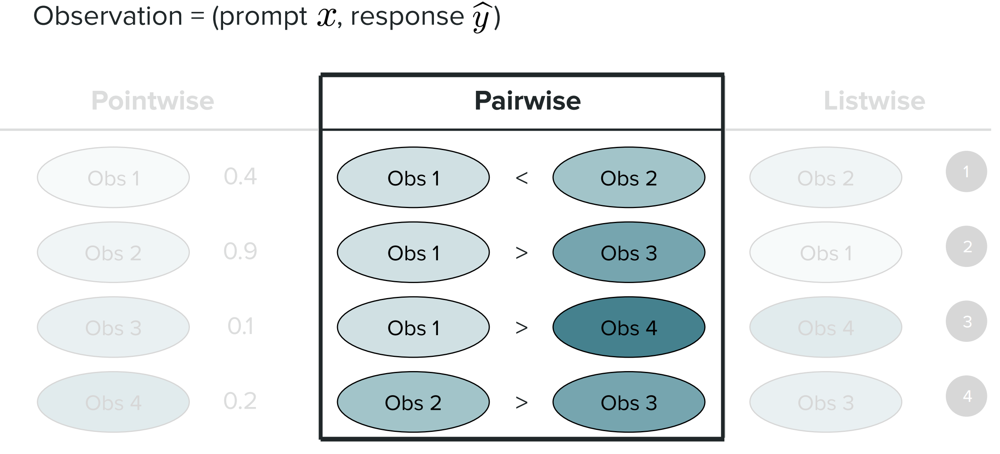
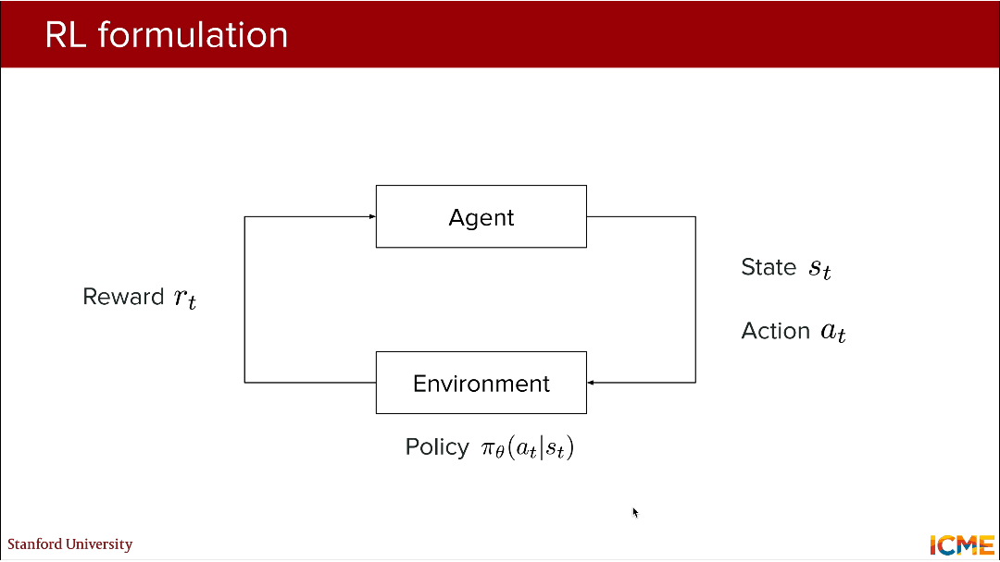
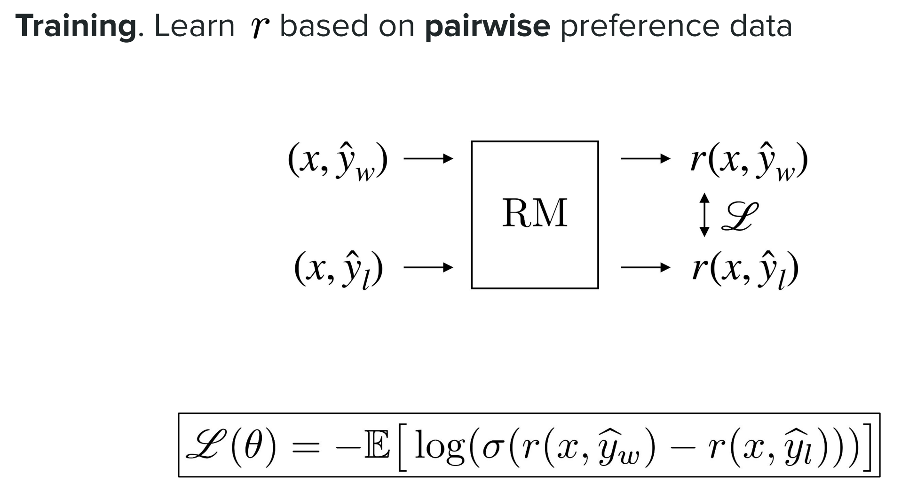
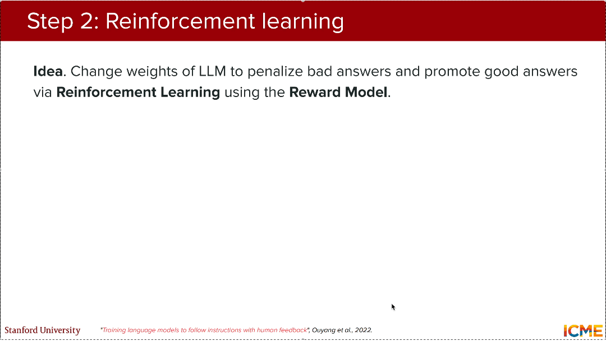
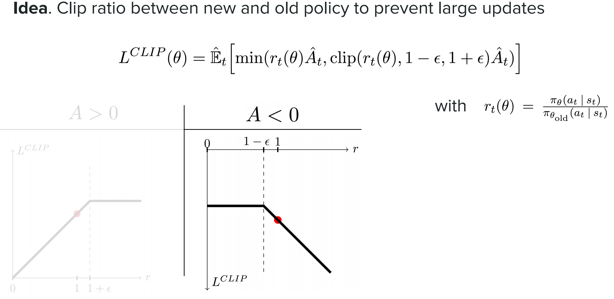
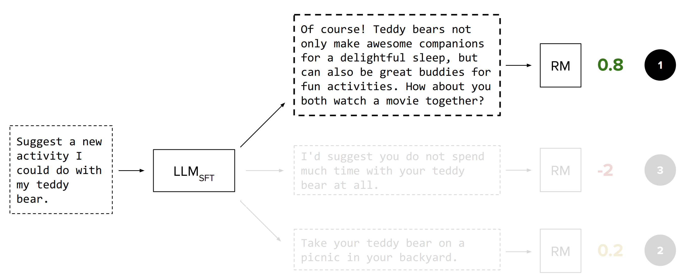

# CME 295 Lecture 5

## 1. LLM完整训练流程

LLM的训练是**四阶段递进式优化**，最终实现从“具备基础能力”到“对齐人类偏好”的升级。
1. **初始化模型（Initialized model）**：仅定义模型架构与随机参数，无任何语言/任务知识
2. **预训练（Pretraining）**：通过海量文本学习语言、代码、知识等通用能力，形成基础模型
3. **微调（Finetuning）**：针对特定任务/指令调优，适配具体应用场景（如SFT有监督微调）
4. **偏好调优（Preference tuning）**：注入人类偏好信号，修正模型失范行为，实现**意图与偏好双对齐**

## 2. 偏好调优（Preference tuning）基础原理

### 2.1. 核心背景

（1）产生原因：经过SFT的模型仍会出现**行为失范**，即无法生成符合人类预期的回答，需通过偏好调优**注入负向信号**修正。

（2）实际案例：输入：Suggest a new activity I could do with my teddy bear.
- SFT模型输出：I'd suggest you do not spend much time with your teddy bear at all.（**无意义、违背用户需求**的回答）
- 目标输出：Of course! Teddy bears not only make awesome companions for a delightful sleep, but can also be great buddies for fun activities. How about you both watch a movie together?（**贴合需求、符合人类偏好**的回答）
  
（3）**核心需求**：通过收集**偏好数据对**，让模型学习“优回答”与“劣回答”的差异，实现行为修正。

### 2.2. 核心优势

1. 人类标注**比较（A比B好）** 远比**重构**（从头生成完美回答A）**更简单**，标注成本低、效率高；
2. SFT对**数据分布**要求极高，微小的分布偏移就会让模型“调崩”，而偏好调优对数据容错性更强；
3. SFT的高质量标注数据**难以大量获取**，**可扩展性差**，偏好调优的标注形式更易规模化；
4. 模型的“失范行为”可反向检验SFT数据集质量，成为**SFT数据优化的重要信号**。

### 2.3. 基本类型

图1 偏好数据的三大基本类型

偏好数据的基本观测单元为： ${Observation = (prompt\ x, response\ \hat{y})}$ （**提示词+模型回答**），根据**标注粒度**从低到高分为三类，下列表格明确三者差异，其中**成对型（Pairwise）是RLHF、DPO的核心数据基础**：

|类型（Type）|标注形式|具体2.示例|核心特点|
|---|---|---|---|
|点态型（Pointwise）|为单个回答打**标量评分**（连续值/0~1）|Obs1:0.4、Obs2:0.9、Obs3:0.1、Obs4:0.2|单样本独立评分，无相对关系|
|**成对型（Pairwise）**|对两个回答做**优劣比较**（A<B/A>B）|Obs1<Obs2、Obs1>Obs3、Obs1>Obs4、Obs2>Obs3|**定义样本间相对偏好，标注成本低，易规模化**|
|列表型（Listwise）|对多个回答做**整体排序**（1为最优）|Obs2(1)、Obs1(2)、Obs4(3)、Obs3(4)|粒度最高，最贴合人类真实偏好，但标注成本最高|

### 2.4. 成对型偏好数据的获取流程

（1）**步骤1：生成回答对** $(\widehat{y}_{1}, \widehat{y}_{2})$

针对**同一个提示词x**生成**两个不同回答**，保证对比的有效性：
- 输入x来源：业务日志、参考分布（贴合实际应用场景）；
- 输出 $\hat{y}$ 方式：SFT模型（设置**温度T>0**，增加生成多样性）、合成数据、文本改写等
- 核心要求：两个回答需**有明显的优劣差异**，为后续标注提供依据。

（2）**步骤2：对 $(x, \widehat{y}_{1})$ 和 $(x, \widehat{y}_{2})$ 做优劣标注**

标注方式灵活，可根据成本和精度选择，包括以下三类标注方式：
- **人类评分**：**最核心、最准确**的方式，也是**RLHF**中“HF（人类反馈）”的来源；
- **代理指标**：**LLM-as-a-judge**（大模型作为评判者）、BLEU/ROUGE（文本相似度）等自动化指标；
- **标注尺度**：二值尺度（仅判断更好/更差）、精细化尺度（多等级评分，提升偏好粒度）。

## 3. $RLHF$：从人类反馈的强化学习（$R$einforcement $L$earning from $H$uman $F$eedback）

$RLHF（Reinforcement Learning from Human Feedback）$是偏好调优的**经典方法**，其核心定义为**两阶段**训练过程：**先训练奖励模型区分回答优劣，再通过强化学习优化LLM生成策略**。其核心是将LLM的token生成过程**形式化为强化学习问题**，通过人类反馈构建奖励信号，实现**策略对齐**。

### 3.1. LLM的RL形式化定义

图2 LLM的RL形式化定义

强化学习的核心要素与LLM一一对应，实现从“通用RL”到“LLM专属RL”的转化，**token级**是核心粒度，也是PPO算法的优化基础：

|RL核心要素|LLM的对应形式|核心解释|
|---|---|---|
|**智能体（Agent）**|**LLM本身**|执行生成动作的主体|
|**状态（State）**|**截至当前的输入序列** $s_t$ （Input so far）|生成下一个token的上下文信息|
|**动作（Action）**|**下一个生成的token** $a_t$ （Next token）|智能体的单次决策行为|
|**环境（Environment）**|**生成的token序列**（Tokens）|智能体动作的输出载体，也是下一个状态的基础|
|**策略（Policy）**|**生成下一个token的概率** $\pi_{\theta}(a_{t}$\|$s_{t})$ |**RLHF核心目标**：学习模型参数 $\theta$ ，让策略 $\pi_{\theta}$ 与人类偏好**对齐**，即生成**高奖励**的token序列
|**奖励（Reward）**|**人类偏好对应的奖励值** $r_t$ |对动作/序列的优劣评价，是**优化目标**|

### 3.2. RLHF第一阶段：奖励建模（Reward modeling）—— 区分回答的“好”与“坏”

作为RLHF的第一阶段，**奖励建模（Reward Modeling）** 的核心思想是训练一个**奖励模型（RM）**，输入 $(prompt\ x, response\ \hat{y})$ ，输出定量奖励分数 $r(x, \hat{y})$ ，**分数越高表示回答越符合人类偏好**。该阶段的核心是基于**成对型偏好数据**，让RM学会量化回答的优劣。

#### 3.2.1. 核心公式：Bradley-Terry公式

（1）作用：定义“回答 $y_i$ 比 $y_j$ 好”的概率，是奖励模型的**理论基础**

（2）公式：$p\left(y_{i}>y_{j}\right)=\frac{e^{r_{i}}}{e^{r_{i}}+e^{r_{j}}}=\sigma\left(r_{i}-r_{j}\right)$ 
> 其中：
    > - $r_i、r_j$ ：奖励模型对回答 $y_i/y_j$ 输出的标量奖励分数，是核心待学习参数；
    > - $\sigma(x)$ ：sigmoid函数， $\sigma(x)=\frac{1}{1+e^{-x}}$ ，将分数差映射为**0~1的概率值**，表示 $y_i$ 优于 $y_j$ 的可能性。

> 公式推导：
> - 从**逻辑回归的概率假设**出发，假设回答 $y_i$ 优于 $y_j$ 的对数几率（log-odds）等于二者的奖励分数差：$log\frac{p(y_i>y_j)}{1-p(y_i>y_j)} = r_i - r_j$ 
> - 对上述公式做指数变换和解方程，即可推导出原始形式：$\frac{p(y_i>y_j)}{1-p(y_i>y_j)}=e^{r_i-r_j} \implies p(y_i>y_j) = \frac{e^{r_i-r_j}}{1+e^{r_i-r_j}} = \frac{e^{r_i}}{e^{r_i}+e^{r_j}}$ 
> - 而 $\sigma(r_i-r_j)=\frac{1}{1+e^{-(r_i-r_j)}}=\frac{e^{r_i-r_j}}{1+e^{r_i-r_j}}$ ，因此二者等价。

#### 3.2.2. 损失函数

图3 奖励建模的损失函数

（1）目标：让RM学习**对优回答 $y_w$ 输出更高分数，对劣回答 $y_l$ 输出更低分数**，通过负对数似然损失优化

（2）公式：$\mathscr{L}(\theta)=-\mathbb{E}\left[log \left(\sigma\left(r\left(x, \hat{y}_{w}\right)-r\left(x, \hat{y}_{l}\right)\right)\right)\right]$ 

> 其中：
> -  $\theta$ ：奖励模型的可学习参数；
> -  $\mathbb{E}$ ：对**成对型偏好数据集**的期望，遍历所有 $(x,y_w,y_l)$ 样本；
> -  $x$ ：**输入提示词**（prompt）；
> -  $y_w$ ：人类标注的**优回答（win）**， $y_l$ ：人类标注的**劣回答（lose）**；
> -  $r(x,y_w)/r(x,y_l)$ ：奖励模型对优/劣回答的输出分数， $r(\cdot)$ 由模型 $\theta$ 决定；
> - 负号：将**概率最大化**转化为**损失最小化**，是机器学习中对数似然损失的标准处理。

> 公式推导
> - 由Bradley-Terry公式，优回答 $y_w$ 优于劣回答 $y_l$ 的概率为：$p(y_w>y_l|x,\theta) = \sigma\left(r(x,y_w;\theta)-r(x,y_l;\theta)\right)$ 
> - 人类标注的偏好是**确定的（** $y_w$  **一定优于** $y_l$  **）**，因此该样本的**似然值**为 $p(y_w>y_l|x,\theta)$ ；
> - 对整个数据集的似然值**取对数并最大化**，得到**对数似然目标**：$\max_{\theta} \mathbb{E} \left[ log\left( \sigma\left(r_w-r_l\right) \right) \right]$ 
> - 为适配机器学习的**损失最小化**优化范式，**添加负号**得到最终损失函数。

（3）**核心逻辑**： $\sigma(r_w - r_l)$ **越接近1**，说明RM对优劣的判断**越准确**，损失值越小；反之损失值越大，模型会逐步调整参数让优回答分数远高于劣回答。

#### 3.2.3. 训练细节

（1）**数据量**：约 $O(10,000)$ 条观测数据，标注为**人类评分**（这是RLHF中“HF”的核心来源）；
（2）**模型架构**：基于预训练LLM改造，将原有的**下一个token预测头**替换为**分类头**，实现从生成到评分的转化；
- 编码器仅模型（如BERT）：通过 $[CLS]$ 向量投影得到奖励分数；
- 解码器模型（如GPT）：通过最后一个token的隐藏层向量投影得到奖励分数。

（3）**输入输出**：输入为 $(x, \hat{y})$ ，输出为单个标量奖励分数 $r(x, \hat{y})$ 。

### 3.3. RLHF第二阶段：强化学习（Reinforcement learning）—— 对齐模型生成策略

图4 强化学习流程

作为RLHF的第二阶段，**强化学习（Reinforcement Learning）** 的核心思想是以**SFT模型**为初始化，将**奖励模型（RM）**输出的分数作为**奖励信号**，通过**强化学习**调整LLM的参数（策略），**惩罚低奖励回答，推广高奖励回答**，同时保证模型不偏离基础能力（防止“**奖励破解**”）。

#### 3.3.1. 训练细节

（1）**数据量**：约 $O(100,000)$ 条观测数据，标注为**奖励模型给出的分数**（替代人类标注，实现规模化）；
（2）**模型初始化**：直接使用**SFT模型**的参数，避免从头训练，保留SFT的任务适配能力；
（3）**核心约束**：优化目标需同时满足**最大化奖励（Maximize rewards）**和**不偏离基础模型太多（Don't deviate too much form base model）**，解决两个问题：
- **奖励破解**：模型为追求高奖励生成无意义、重复的内容；
- **训练不稳定性**：RL的参数更新易导致模型崩塌，丢失基础能力。

#### 3.3.2. 核心算法：$PPO$（$P$roximal $P$olicy $O$ptimizatin,近端策略优化）

**PPO**是RLHF中最常用的RL算法，核心是通过**KL散度**限制**新策略** $\pi_{\theta}$  **与基础模型策略** $\pi_{ref}$  **的偏离程度，实现平稳的参数更新**。

（1）**目标函数**：$\mathscr{L}(\theta)=-\left[r(x, \hat{y})-\lambda KL\left(\pi_{\theta}(\hat{y} | x)|| \pi_{ref }(\hat{y} | x)\right)\right]$ 

> 其中：
> -  $\theta$ ：LLM策略模型的可学习参数；
> -  $r(x,\hat{y})$ ：**第一阶段训练好的奖励模型**输出的奖励分数，作为RL的奖励信号，**最大化奖励**让模型生成高奖励回答；
> -  $\pi_{\theta}(\hat{y}|x)$ ：当前策略模型在提示词 $x$ 下生成回答 $\hat{y}$ 的概率（token序列的联合概率）；
> -  $\pi_{ref}(\hat{y}|x)$ ：**参考模型**（通常为SFT模型）的生成概率，作为策略偏离的基准；
> -  $KL\left(\pi_{\theta} || \pi_{ref}\right)$ ：KL散度，衡量两个策略的分布差异，此处量化策略偏离程度，公式为 $KL(P | Q)=\sum_{i=1}^{n} p_{i} log \left(\frac{p_{i}}{q_{i}}\right)$ ；
> -  $\lambda>0$ ：超参数，控制KL散度的惩罚权重， $\lambda$ 越大，策略越难偏离参考模型；
> - 负号：将RL的**奖励最大化**转化为**损失最小化**
>
> 公式推导
> - 从**强化学习的策略梯度**出发，RL的核心目标是最大化累计奖励：$\max_{\theta} \mathbb{E}_{\pi_{\theta}} \left[ r(x,\hat{y}) \right]$ 
> - 但直接优化该目标会导致**策略更新幅度过大**，出现训练震荡甚至崩塌，因此PPO引入**KL散度约束**，将带约束的优化问题转化为**无约束的拉格朗日函数**：$\max_{\theta} \mathbb{E} \left[ r(x,\hat{y}) - \lambda KL\left(\pi_{\theta}||\pi_{ref}\right) \right]$ 
> 添加负号转化为损失函数后，即得到RLHF中使用的PPO基础形式

（2）**核心逻辑**：通过“**奖励收益 - KL惩罚**”的组合，让模型在提升奖励的同时，保持与基础模型的一致性。

（3）**核心优化**：优势函数（Advantage）——PPO实际优化的是**优势值**而非直接奖励，优势值能更精准地衡量“**某个动作的实际收益**”，定义为：$\text{Advantage} \sim \text{Reward} - \text{Baseline}$ 

- **基线（Baseline）**：由**值函数（Value function）** 预测，是对“**当前策略下预期奖励**”的估计；
- **值函数**：**token级预测**，输入为状态 $s_t$ ，输出为该状态下的**预期奖励**，与策略**联合训练**，标注为**RM的奖励分数**；
- **计算方法**：采用**GAE（广义优势估计）**，平衡优势值的偏差和方差，提升训练稳定性。

> 因此PPO的优化目标可简化为：**最大化优势值 + 最小化与基础模型的KL散度**。

#### 3.3.3. $PPO$的两大核心变体

（1）**变体1：PPO-Clip（裁剪式PPO）**

- **核心思想**：裁剪**新策略/旧策略**的概率比，防止参数**大幅更新**，避免训练不稳定

- 作为**无约束的PPO变体**，无需计算KL散度，通过**裁剪策略概率比**实现近端优化：
  - 
    
图5 PPO-Clip近端优化

  - 当 $\hat{A}_t>0$ （该动作带来正奖励）：希望 $r_t(\theta)$ 越大越好，但裁剪在 $1+\epsilon$ ，避免过度更新；
  - 当 $\hat{A}_t<0$ （该动作带来负奖励）：希望 $r_t(\theta)$ 越小越好，但裁剪在 $1-\epsilon$ ，避免过度惩罚。

- **目标函数**：$L^{C L I P}(\theta)=\hat{\mathbb{E}}_{t}\left[min \left(r_{t}(\theta) \hat{A}_{t}, clip\left(r_{t}(\theta), 1-\epsilon, 1+\epsilon\right) \hat{A}_{t}\right)\right]$ 

> 其中：
> -  $t$ ：token生成的时间步，PPO为**token级优化**；
> -  $s_t$ ：时间步 $t$ 的状态，即“**截至当前的输入序列**”；
> -  $a_t$ ：时间步 $t$ 的动作，即“**下一个生成的token**”；
> -  $\pi_{\theta}(a_t|s_t)$ ：当前策略生成token $a_t$ 的概率， $\pi_{\theta_{old}}$ ：上一轮迭代的旧策略；
> -  $r_{t}(\theta)=\frac{\pi_{\theta}\left(a_{t} | s_{t}\right)}{\pi_{\theta_{old }}\left(a_{t} | s_{t}\right)}$ ：**新策略与旧策略在状态 $s_t$ 下生成动作 $a_t$ 的概率比**，量化当前策略与旧策略的差异；
> -  $\hat{A}_t$ ：**GAE计算的优势值（Advantage）**， $\hat{A}_t \approx r - V(s_t)$ ， $V(s_t)$ 为值函数预测的基准奖励；
> -  $\epsilon \in (0,1)$ ：裁剪超参数，通常取0.2，将 $r_t(\theta)$ 限制在 $[1-\epsilon,1+\epsilon]$ ；
> -  $clip(\cdot)$ ：**裁剪函数**，超出范围的概率比被强制拉回边界；、

- **术语解释**：上述公式中，$L^{C L I P}(\theta)$是**目标函数**（需最大化），而**不是损失函数** $Loss$（需最小化），易产生概念混淆 $r_t(\theta)$ 是**概率比**，而**不是奖励**（RLHF中奖励常用 $r$ 表示），需注意符号区分。

（2）**变体2：PPO-KL Penalty（KL惩罚式PPO）**

- **核心思想**：直接对**新策略与旧/基础策略**的KL散度进行惩罚，限制策略分布的变化

- 作为**带KL散度惩罚的PPO变体**，与基础形式的区别在于：
  - 基于**优势值** $\hat{A}_t$  优化，而非直接奖励 $r$ ，更精准地衡量动作的实际收益；
  - KL散度针对**全局参考模型（SFT）**，而非局部旧策略，避免策略在迭代中逐步偏离基础能力；
  - 超参数 $\beta$ 动态调整，解决了固定 $\lambda$ 难以适配不同训练阶段的问题
  
- **目标函数**：$L^{K L P E N}(\theta)=\hat{\mathbb{E}}_{t}\left[\frac{\pi_{\theta}\left(a_{t} | s_{t}\right)}{\pi_{\theta_{old/ref }}\left(a_{t} | s_{t}\right)} \hat{A}_{t}-\beta KL\left[\pi_{\theta_{old/ref }}\left(\cdot | s_{t}\right), \pi_{\theta}\left(\cdot | s_{t}\right)\right]\right]$ 

> 其中：
> - $\pi_{\theta_{old/ref }}$：早期PPO-KL Penalty的KL散度针对**旧策略** $\pi_{\theta_{old}}$ （上一轮RL迭代的模型）；而现代实现中，KL散度统一针对**基础模型策略** $\pi_{\theta_{ref}}$ （SFT模型，Base Model），更能保证模型不偏离基础能力；
> - $\beta > 0$ ：KL散度的惩罚超参数，可根据训练过程**动态调整**。

### 3.4. RLHF的局限性
- **模型数量多**：需训练4个模型（策略模型、值函数模型、奖励模型、基础模型），训练流程复杂、资源消耗大；
- **超参数难调**：包含 $\lambda、\epsilon、\beta$ 等多个超参数，且超参数对训练效果影响显著，调优成本高；
- **训练不稳定**：RL的参数更新易出现震荡、崩塌，需严格监控训练指标（如KL散度、奖励值）；
- **生成多样性要求高**：若SFT模型生成的回答缺乏多样性，RLHF易陷入局部最优，无法学习到全面的偏好；
- **必要性存疑**：尚无明确结论证明“偏好调优必须依赖RL”，RL的引入是否带来实质性收益仍需验证。

### 3.5. RL的简易替代方案：BoN（Best of N）

图6 BoN策略实例

针对RLHF的复杂性。提出一种**推理阶段的偏好对齐方法**，跳过RL训练阶段，直接**利用奖励模型筛选最优回答**，核心是“**生成多份、评分筛选**”。

（1）**核心策略**：对一个提示词x，用SFT模型生成**N个不同的回答**（T > 0增加多样性）；用训练好的奖励模型为每个回答**打分**，得到 $r_1, r_2, ..., r_N$ ；选择**分数最高**的回答作为最终输出。

（2）**缺点**：推理阶段需要生成多个回答并逐一打分，**计算成本高、延迟高**，不适用于低延迟、高并发的实际应用场景，仅作为RL的临时替代方案。

## 4. $DPO$（$D$irect $P$reference $O$ptimization,直接偏好优化）

$DPO（Direct Preference Optimization）$是针对RLHF的局限性提出的**有监督式偏好调优方法**，无需训练单独的奖励模型和值函数，**直接基于成对型偏好数据训练LLM**，是目前工业界的**主流偏好调优方法**。

### 4.1. 提出动机
- 模型缺点：RLHF的RL阶段训练复杂、资源消耗大，超参数调优难度高；BoN仅适用于推理阶段，训练阶段未对模型做任何优化，且推理成本高；
- 核心问题：**能否将偏好调优转化为纯有监督学习问题，直接通过偏好数据训练模型？** DPO的答案是**肯定的**，其核心是从PPO的目标函数出发，推导出**有监督损失函数**，实现从“RL”到“SL”的转化。

### 4.2. 损失函数

- DPO直接基于**成对型偏好数据** $(x, y_w, y_l)$ （x=提示词， $y_w$ =优回答， $y_l$ =劣回答）训练，无需额外的奖励模型，损失函数如下：$\mathcal{L}_{DPO}\left(\pi_{\theta} ; \pi_{ref }\right)=-\mathbb{E}_{\left(x, y_{w}, y_{l}\right) \sim \mathcal{D}}\left[log \sigma\left(\beta log \frac{\pi_{\theta}\left(y_{w} | x\right)}{\pi_{ref }\left(y_{w} | x\right)}-\beta log \frac{\pi_{\theta}\left(y_{l} | x\right)}{\pi_{ref }\left(y_{l} | x\right)}\right)\right]$ 

    > 其中：
    > -  $\pi_{\theta}$ ：待训练的**目标策略模型**（需要对齐人类偏好的LLM）；
    > - $\pi_{ref}$ ：**参考模型**（通常为**SFT模型**，作为偏好调优的基础）；
    > -  $\beta > 0$ ：**温度超参数**，控制模型对人类偏好的**拟合程度**， $\beta$ 越大，模型越倾向于生成优回答；
    > -  $\mathcal{D}$ ：成对型偏好数据集，与RLHF奖励模型的训练数据完全相同；
    > - 其余参数与Bradley-Terry、RLHF一致。

- 将公式中的对数项合并，可简化为更直观的形式：$\mathcal{L}_{DPO}=-\mathbb{E}\left[log \sigma\left(\beta \ log \frac{\pi_{\theta}(y_w|x)/\pi_{ref}(y_w|x)}{\pi_{\theta}(y_l|x)/\pi_{ref}(y_l|x)}\right)\right]$ 

- **核心逻辑**：**让 $\frac{\pi_{\theta}(y_w|x)}{\pi_{ref}(y_w|x)}$ 尽可能大， $\frac{\pi_{\theta}(y_l|x)}{\pi_{ref}(y_l|x)}$ 尽可能小**，即目标模型对优回答的生成概率远高于参考模型，对劣回答的生成概率远低于参考模型。

### 4.3. 核心优势

DPO的核心优势是**简化训练流程**，同时保留与RLHF相当的**对齐**效果，具备四大优势：
1. **无需单独训练奖励模型**：DPO将LLM本身作为**隐性奖励模型**，隐性奖励函数定义为：$r_{\theta}(x, y)=\beta log \frac{\pi_{\theta}(y | x)}{\pi_{ref }(y | x)}$ ；奖励值由**模型的生成概率**直接计算，无需额外训练RM，减少模型数量和训练成本；因此DPO本质是**用LLM的生成概率直接定义奖励**，跳过了RLHF中单独训练奖励模型的步骤，将偏好调优转化为**纯有监督学习问题**；
2. **纯有监督训练**：无需复杂的RL框架（如PPO的优势值、GAE），使用**普通的有监督训练框架**即可实现，工程化难度极低；
3. **直接基于偏好数据**：无需将偏好数据转化为奖励分数，**成对型标注数据**可直接输入模型训练，标注数据的利用率更高；
4. **与Bradley-Terry公式兼容**：DPO损失函数的核心是 $\sigma(r_{\theta}(y_w)-r_{\theta}(y_l))$ ，与RLHF奖励模型的损失函数形式一致，**保证模型学习“ $y_w$ 比 $y_l$ 好”的偏好关系**。

### 4.4. 公式推导

（1）步骤1：**从PPO的核心目标出发**

PPO的目标是**最大化奖励期望，同时最小化与参考模型的KL散度**：$max _{\pi_{\theta}} \mathbb{E}_{x \sim \mathcal{D}, y\sim \pi_{\theta}(y | x)}\left[r_{\phi }(x, y)\right]-\beta \mathbb{D}_{KL}\left[\pi_{\theta}(y | x)||\pi _{ref}(y | x)\right]$ 

> 其中 $r_{\phi}(x, y)$ 为奖励模型的分数， $\beta$ 为KL散度的权重。

（2）步骤2：**推导PPO的最优策略**

通过**变分法**求解上述优化问题，得到PPO的最优策略为：$\pi ^{*}(y | x)=\frac {1}{Z(x)}\pi _{ref}(y | x)exp \left(\frac {1}{\beta }r^{*}(x,y)\right)$ 

> 其中 $Z(x)=\sum_{y} \pi_{ref}(y|x)exp\left(\frac{1}{\beta}r^*(x,y)\right)$ 为归一化项，保证 $\sum_y \pi^*(y|x)=1$ ， $r^*(x,y)$ 为最优奖励函数。

（3）步骤3：**提取隐性奖励项**

从最优策略中反解出奖励项 $r^*(x,y)$ ，两边取对数并整理得到：$r^{*}(x, y)=\beta log \frac{\pi^{*}(y | x)}{\pi_{ref }(y | x)}+\beta log Z(x)$ ；
由于 $Z(x)$ 与回答 $y$ 无关（仅对 $x$ 的所有可能 $y$ 求和），在**偏好比较（$y_w$ VS $y_l$ ）** 中会被抵消，因此可忽略，得到**简化的隐性奖励**：$r^{*}(x, y) \approx \beta log \frac{\pi^{*}(y | x)}{\pi_{ref }(y | x)}$ ，这正是DPO中隐性奖励函数的来源。

（4）步骤4：**代入Bradley-Terry公式**

将隐性奖励项代入Bradley-Terry公式，定义“ $y_w$ 比 $y_l$ 好”的概率：$p^{*}\left(y_{w} \succ y_{\ell} | x\right)=\frac{1}{1+exp \left(\beta log \frac{\pi^{*}\left(y_{\ell} | x\right)}{\pi_{ref}\left(y_{\ell} | x\right)}-\beta log \frac{\pi^{*}\left(y_{w} | x\right)}{\pi_{ref }\left(y_{w} | x\right)}\right)}$ 

（5）步骤5：**推导DPO损失函数**

对最优策略的概率做**最大似然估计**，将人类标注的 $(y_w>y_l)$ 作为真实标签，采用**负对数似然损失**让模型学习最优策略，最终得到DPO的损失函数：$\mathcal{L}_{DPO}\left(\pi_{\theta} ; \pi_{ref }\right)=-\mathbb{E}_{\left(x, y_{w}, y_{l}\right) \sim \mathcal{D}}\left[log \sigma\left(\beta log \frac{\pi_{\theta}\left(y_{w} | x\right)}{\pi_{ref }\left(y_{w} | x\right)}-\beta log \frac{\pi_{\theta}\left(y_{l} | x\right)}{\pi_{ref }\left(y_{l} | x\right)}\right)\right]$ 

（6）**核心结论**：DPO是PPO最优策略的**有监督近似**，本质是用**有监督学习**的方式实现了RL的最优目标，因此效果与RLHF相当，且训练更简单。

## 5. $RLHF$与$DPO$的对比

### 5.1. 实现难度对比

|对比维度|RLHF|DPO|
|---|---|---|
|训练方式|**多阶段训练（奖励建模+强化学习）**|**单阶段纯有监督训练**|
|所需模型|4个（策略、值函数、奖励、基础模型）|2个（目标模型、基础模型）|
|依赖框架|需专业**RL框架**（如PPO、GAE）|普通**有监督训练框架**（如PyTorch/TensorFlow）|
|超参数数量|多（ $\lambda、\epsilon、\beta、GAE$ 参数等）|**少**（仅 $\beta$ 一个核心超参数）|
|训练稳定性|低（RL更新易震荡、崩塌）|**高**（有监督训练，参数更新平稳）|
|工程化难度|高（需协调多个模型的训练和交互）|**低**（单模型训练，流程简单）|

### 5.2. 性能对比

目前尚无**绝对统一的结论**证明DPO或RLHF更优，二者的性能表现受**任务类型、数据质量、实现细节**影响显著：

- 在**多数大语言模型对齐任务**中，**DPO**的表现**不劣于甚至优于**RLHF；
- 部分**精细化偏好对齐任务**（如高等级对话、专业领域问答）中，**RLHF**的微调能力更强，表现略优；
- 当数据质量较低时，**DPO的容错性更强**，性能衰减更慢。

**核心建议**：工业界优先选择DPO，因其训练成本低、工程化难度小，且性能基本持平RLHF；仅在精细化对齐场景下，考虑使用RLHF。

### 5.3. 偏好调优的效果：模型行为的质变

通过经典案例直观展示偏好调优的效果，模型从“客观直接”转变为“友好、贴合人类情感、符合偏好”，实现从“能回答”到“答得好”的升级。

|模型训练阶段|问题：Can I put my teddy bear in the washer?|回答特点|
|---|---|---|
|预训练+指令微调（SFT）|No, it might get damaged. Try hand washing instead.|客观、直接，仅给出答案和建议，**无情感、缺乏亲和力**|
|预训练+指令微调+偏好调优（RLHF/DPO）|It's better not to. Your teddy could get hurt! A gentle hand wash is safer.|友好、有情感（拟人化“get hurt”），贴合人类偏好，同时给出有效建议，**更符合人类交流习惯**|

**最终结论**：**偏好调优**是大语言模型从“实验室能力”到“实际落地能力”的**关键步骤**，也是实现LLM人性化、实用化的核心技术。

> 核心总结
> 1. 大语言模型的完整训练分为**初始化、预训练、微调、偏好调优**四阶段，**偏好调优**是实现模型与人类**偏好对齐**的关键，核心解决微调后模型的行为失范问题，需注入人类偏好的正负信号；其核心优势是人类对回答做优劣比较远比重构优质回答更简单，且对数据分布容错性更高，还能反向检验微调数据的质量，弥补纯微调的可扩展性不足问题；
> 2. 偏好数据的基本单元为（提示词x，回答ŷ），分为**点态型（单样本标量评分）、成对型（两样本优劣比较）、列表型（多样本整体排序）**三类，**成对型**是后续调优方法的核心数据基础；其中**成对型偏好数据**的获取分两步，先为同一提示词生成不同回答对，再通过人类评分、LLM评判等方式标注优劣，生成回答时需为SFT模型设置T>0以保证多样性；
> 3. **RLHF**是经典的偏好调优方法，分为**奖励建模和强化学习**两阶段，先训练奖励模型输出回答的**量化分数以区分优劣**，再基于奖励模型的分数通过**强化学习优化LLM策略**；将LLM的生成过程形式化为强化学习问题，以LLM为智能体、当前输入序列为状态、下一个token为动作，核心目标是学习参数让模型策略贴合人类偏好的奖励信号；
> 4. **PPO**是RLHF中核心的强化学习算法，核心是**在最大化奖励的同时限制模型策略与基础模型的偏离**，避免奖励破解和训练不稳定，主流变体为**PPO-Clip和PPO-KL Penalty**；PPO实际优化的是**优势值**而非直接奖励，优势值为奖励减基线值，由token级的价值函数预测，价值函数与策略模型联合训练，常用**GAE方法**计算优势值；
> 5. **BoN（Best of N）**是RL的简易替代方案，跳过RL训练阶段，通过**SFT模型**生成多份回答、奖励模型评分**筛选最优结果**实现偏好对齐，无需训练但推理阶段计算成本高；
> 6. **DPO**是主流的偏好调优方法，为**纯有监督训练方式**，直接基于成对偏好数据训练，无需单独训练奖励模型，将LLM本身作为隐性奖励模型，大幅降低实现复杂度；DPO的损失函数从PPO的目标函数推导而来，兼容**Bradley-Terry公式**，与RLHF相比仅需基础模型作为参考，无需多阶段训练和额外的奖励、价值模型；
> 7. RLHF与DPO的性能无绝对统一结论，受**任务类型和实现细节**影响显著，RLHF实现复杂度高，DPO因**单阶段有监督训练的工程化优势**成为工业界优先选择；偏好调优能让模型的回答从客观直接的信息输出，转变为贴合人类情感、交流习惯的友好表达，是大语言模型从技术能力落地为实用产品的关键环节。