# CME 295 Lecture 6

## 1. 传统LLM的优劣势

### 1.1. 核心优势（基于预训练数据的固有能力）

- **模仿生成与创意构思**：通过学习海量文本的风格和结构，能快速生成符合场景的内容（如文案、故事、报告），本质是“**模式匹配+概率生成**”；
-  **代码生成与调试**：预训练数据中包含大量代码库（如GitHub项目），能理解语法规则、函数逻辑，完成简单代码编写和bug修复，是目前LLM最成熟的“**准推理**”应用。

### 1.2. 核心短板（推理能力缺失的本质原因）

- **有限推理（Limited reasoning）**：仅能进行“表层模式匹配”，无法拆解复杂问题的逻辑链路（如多步数学计算、逻辑推理）

- **知识静态化（Knowledge is static）**：预训练数据存在“时间截止点”，无法实时更新（如2024年训练的模型不知道2025年的事件），且无法主动获取新信息

- **无法执行动作（Cannot perform actions）**：仅能生成文本输出，无法与外部工具（如计算器、数据库、API）交互，因此面对需要工具辅助的推理任务（如复杂数据统计、图表分析），模型无法完成。

- **难以评估（Hard to evaluate）**：推理正确性的量化指标缺失，传统“困惑度（Perplexity）”仅能衡量文本流畅性，无法判断推理逻辑的有效性；

## 2. 推理模型

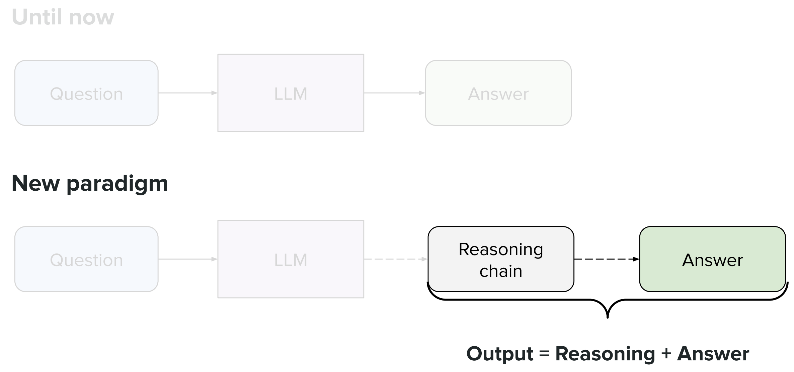

图1 推理模型

### 2.1. 推理

（1）**推理定义**：**Reasoning = Ability to solve a problem**（通过逻辑推导、计算、步骤拆解解决问题的能力）

（2）**形式化区分**：
- 非推理（Not reasoning）：输出仅依赖“预训练知识提取”，无中间推导过程，数学表示为 $Output = f(Input, Knowledge)$ ；
- 推理（Reasoning）：输出依赖“输入+知识+推导步骤”，数学表示为 $Output = f(Input, Knowledge, Reasoning\ Chain)$ ；

- 实例对比：

|非推理（Not reasoning）|推理（Reasoning）|
|---|---|
|问题：斯坦福Transformer&LLM课程的课程代码是什么？ 逻辑：直接从预训练知识中提取答案|问题：小熊2020年出生，现在几岁？ 逻辑：输入（2020年出生）→ 知识（当前年份2025）→ 推导（2025-2020=5）→ 答案（5岁）|

### 2.2. 提升推理能力的核心策略：思维链（Chain of Thought, CoT）

**核心思想**：让模型在输出答案前，先生成“**逐步推理的自然语言文本**”（思维链），将复杂问题拆解为可执行的子步骤。

#### 2.2.1. 输出范式的革命性变革

（1）传统LLM范式（黑箱输出）：$Question \rightarrow LLM \rightarrow Answer$
- 缺陷：无中间过程，错误无法追溯，复杂问题准确率低；

（2）**推理模型范式**（透明推导）：$Question \rightarrow LLM \rightarrow Reasoning\ Chain \rightarrow Answer$ 

- 优势：推理过程可解释、可验证，复杂问题拆解后难度降低；
- 形式化表示： $Output = [R_1, R_2, ..., R_k, A]$ ，其中 $R_i$ 是第 $i$ 步推理， $A$ 是最终答案。

#### 2.2.2. CoT的核心延伸：大规模应用（Scaling CoT）

- 推理模型的进阶方向：不仅在小样本提示中使用CoT，更**通过预训练、微调、强化学习让模型“主动生成高质量CoT”**，而非依赖人工设计的提示模板。

- 关键目标：让模型学会“**自主拆解问题**”，例如面对“复杂方程求解”，能自动生成“移项→化简→求解→验证”的推理链。

### 2.3. 识别特征与计费规则

#### 2.3.1. 识别特征（基于ChatGPT 5 Thinking实例）

推理模型与传统LLM的三大显著差异，可通过用户交互界面直接识别：

1. **思考阶段可视化**：
    - 显示“**Thinking**”状态及思考时长（如5s），对应模型内部生成推理链的过程；
    - 技术本质：推理链生成需要额外的计算步骤，模型会暂停答案输出，专注于推理链构建。

2. **推理链完整性**：
    - 答案包含“**条件分析→步骤推导→结论**”的完整逻辑，而非直接给出结果；
    - 实例：计算小熊年龄时，模型会考虑“生日是否已过”的边界条件（“若2025年生日已过则5岁，否则4岁”）。

3. **推理链默认隐藏**：
    - 用户看到的是“**思考后的总结答案**”，完整推理链（包含冗余推导、中间错误修正）不展示；
    - 技术原因：推理链token数远多于答案，展示会增加用户阅读负担，且可能暴露模型的推理缺陷。

#### 2.3.2. 计费规则

推理模型的计费核心是“**推理token计入输出成本**”，这是由其“**推理链+答案**”的输出结构决定的：

1. OpenAI/Anthropic计费规则：完整的推理token（包括隐藏部分）+ 答案token，而非仅用户看到的答案token；
2. Google Gemini 2.5 Pro计费规则：推理token不可见但占用上下文窗口（Context Window），上下文窗口大小直接影响推理链长度上限；

## 3. 评估体系

### 3.1. 基准测试（Benchmark）

评估推理模型的核心是“**可验证的推理任务**”，即任务结果有明确的“正确/错误”判定标准，课件分为两大核心类别：

#### 3.1.1. 代码推理基准（Code Reasoning）

（1）任务类型：解决编程问题、修复bug、代码优化；

（2）核心要求：模型生成的代码需通过所有测试用例（Test Cases），推理链需包含“**问题分析→算法选择→代码实现→测试验证**”步骤；

（3）代表数据集：
- HumanEval：包含164个Python函数生成任务，每个任务有详细的文档字符串和测试用例；
- CodeForces：编程竞赛平台数据集，包含不同难度的算法题（如动态规划、图论）；
- SWE-bench：软件工程基准，要求模型修复真实项目中的bug（如GitHub开源项目的issue）；

#### 3.1.2. 数学推理基准（Math Reasoning）

（1）任务类型：解决复杂数学问题（如奥数、竞赛题、代数方程）；

（2）核心要求：模型需生成“**逐步推导过程**”，最终答案需与标准答案一致；

（3）代表数据集：
- AIME（American Invitational Mathematics Examination）：美国高中数学竞赛，侧重多步代数、几何推理；
- GSM8K：包含8.5k个小学数学问题，需1-2步推理；

#### 3.1.3. 基准数据集的共性特征

- **数据结构**：每个样本包含“**问题（Problem）→ 推理链（Reasoning Chain）→ 答案（Answer）→ 验证用例（Test Cases）**”；

- **难度梯度**：从简单（1步推理）到复杂（10+步推理），覆盖不同推理能力层级；

- **评估方式**：客观自动评估（代码通过测试用例、数学答案匹配），无主观偏差。

### 3.2 核心评估指标：Pass@k

作为推理模型核心指标，**Pass@k定义**为在k次独立生成尝试中，至少有1次成功解决问题的概率。

#### 3.2.1. 数学推导

（1）前提假设：设总尝试次数为n，其中成功次数为c，失败次数为n-c；每次尝试独立，成功概率为p，失败概率为1-p。

（2）公式推导：
- “**k次尝试均失败**”的概率为 $\binom{n-c}{k} / \binom{n}{k}$ （从n次尝试中选k次，均为失败尝试）；
- “**至少1次成功**”的概率为总概率1减去“均失败”概率，即：$Pass @ k=1-\frac{\binom{n-c}{k}}{\binom{n}{k}}$ 

（3）特殊情况：Pass@1（单次生成成功的概率），公式简化为： $Pass@1 = \frac{c}{n}$ ，直接反映模型的“单次推理准确率”。

#### 3.2.2. 衍生指标：Cons@k（Consensus at k）

（1）定义：对k次生成结果进行“**多数投票**”，若投票结果与真值一致，则判定为成功；

（2）数学表示： $Cons@k = P(majority({A_1, A_2, ..., A_k}) = Ground\ Truth)$ ；

（3）优势：降低单次生成的随机性影响，更适合评估“高风险推理任务”（如医疗诊断、金融分析）。

#### 3.2.3. 指标的影响因素与适用场景

（1）影响因素：
- **采样数k**：k越大，Pass@k越高（尝试次数越多，成功概率越高）；
- **温度系数Temperature（T）**：T越高，生成越随机，Pass@k提升幅度越明显（适合探索多种推理路径）；T越低，生成越确定，Pass@k提升幅度平缓（适合聚焦最优推理路径）；

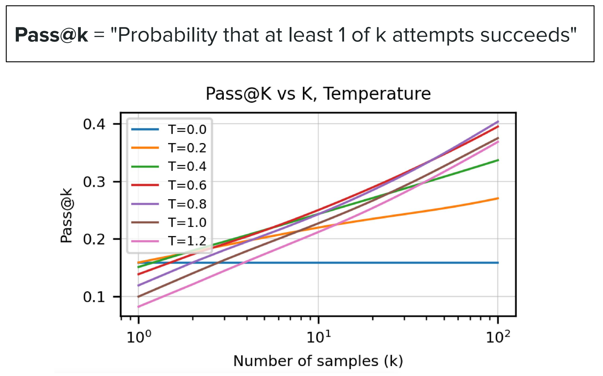

图2 Pass@K与K，T的关系

> 如图所示，当k从1增至100时，Pass@k从0.1提升至0.4（T=1.0），而T=0.0时仅提升至0.2。

（2）适用场景：
- **Pass@k**：适用于“检查成本低、可接受高延迟”的场景（如离线代码生成、批量数学计算），可通过增加k提升成功率；
- **Pass@1**：适用于“要求单次生成准确、低延迟”的场景（如实时问答、在线编程辅助），需优先优化模型的单次推理能力；
- **Cons@k**：适用于“错误成本高、需多人共识”的场景（如法律文书推理、学术论文审核）。

## 4. 用强化学习提升推理能力

### 4.1. 核心思路

（1）**测试时扩展（Test-time scaling）** 核心思路：**在模型推理阶段（而非仅训练阶段），通过强化学习激励模型主动生成高质量推理链**，让模型从“被动响应CoT提示”变为“**主动构建CoT**”。

（2）技术本质：将推理链生成视为“强化学习的动作序列”，通过**奖励函数**引导模型学习“有效推理步骤”；

（3）创新点：**无需大规模人工标注推理链（SFT数据）**，仅通过“**问题+答案**”的监督信号，让模型自主学习推理过程。

### 4.2. 关键考量

（1）**推理链标注成本极高**：
- 约束：手工编写高质量推理链（如复杂数学题、算法题的推导步骤）耗时耗力，**大规模SFT数据构建不现实**；
- 应对：避免依赖人工标注的推理链，仅使用“问题+答案正确性”作为监督信号。

（2）**避免限制模型的推理创造力**：
- 约束：人类编写的推理链可能**存在“思维局限”**，模型应能探索更优的推理路径；
- 应对：奖励函数不限制推理链的具体形式，仅关注“推理链是否存在”和“答案是否正确”。

（3）**奖励信号必须自然可验证**：
- 约束：**推理正确性需客观判定**，不能依赖主观评分；
- 应对：奖励信号来自“答案是否通过测试用例”（代码推理）或“答案是否匹配地面真值”（数学推理），为二元奖励（0/1）或连续奖励（0-1，基于匹配度）。

### 4.3. 奖励函数设计（双维度验证机制）

为了激励模型生成“**有效推理链+正确答案**”，设计**双维度奖励函数**（缺一不可），最终奖励为两者的加权和： $Reward = w_1 \cdot R_{CoT} + w_2 \cdot R_{Accuracy}$ （ $w_1, w_2$ 为权重，通常取0.3和0.7）。

#### 4.3.1. 奖励1：验证推理链存在（$R_{CoT}$）

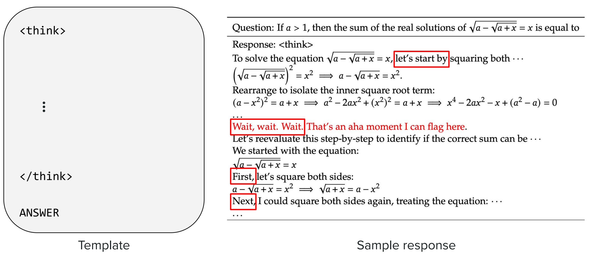

图3 验证推理链存在的实例

（1）目标：激励模型生成完整的推理链，而非直接输出答案；

（2）验证逻辑：
- 文本长度校验：推理链长度需超过阈值（如问题长度的2倍）；
- 关键词校验：推理链需包含“因为”“所以”“首先”“其次”“计算”“推导”等逻辑连接词；
- 结构校验：推理链需包含“**问题分析→步骤拆解→结论推导**”的完整结构；

（3）数学表示： $R_{CoT} = 1$ （满足所有校验）或 $0$ （不满足）。

#### 4.3.2. 奖励2：验证答案正确性（$R_{Accuracy}$）

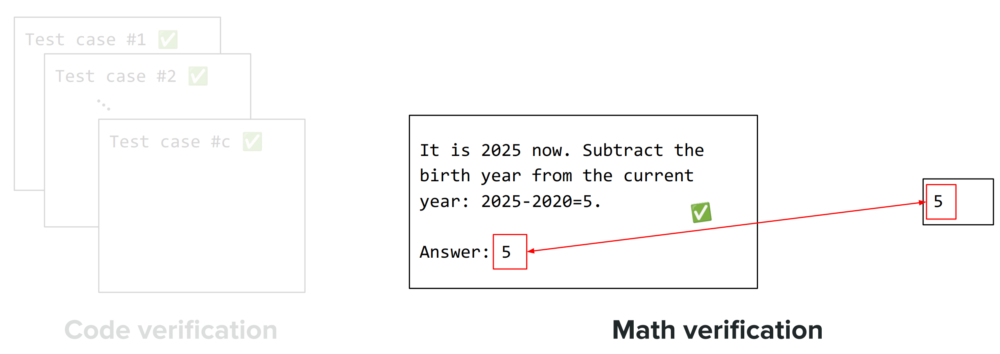

图4 验证答案正确性的实例

（1）目标：激励模型生成正确的答案，推理链需服务于“正确答案”；

（2）验证逻辑：
- 代码推理：生成的代码通过所有测试用例（如函数返回值与预期一致）；
- 数学推理：答案与地面真值完全匹配（如方程的实根和为1）；

（3）数学表示： $R_{Accuracy} = 1$ （正确）或 $0$ （错误）。

### 4.4. 思维控制策略（动态调整推理深度）

（1）**动态预算（Dynamic budget）**：
- 核心逻辑：**为不同问题分配不同的推理token预算**（Token Budget），预算大小由**问题复杂度**决定；
- 实现方式：通过模型预测问题复杂度（如文本长度、关键词密度），动态调整最大推理链长度（如简单问题预算100 tokens，复杂问题预算1000 tokens）；

（2）**上下文感知（Context awareness）**：
- 核心逻辑：模型根据问题的**上下文信息**（如历史对话、领域类型）自动判断**推理深度**；
- 实例：在数学对话中，模型会生成更详细的推理链；在闲聊对话中，模型会简化推理过程。

（3）**预算强制（Budget forcing）**：
- 核心逻辑：**强制模型在指定的token预算内完成推理**，避免推理链过长导致的效率低下；
- 实现方式：通过API参数设置`max_reasoning_tokens`，超出预算则截断推理链并输出答案；

（4）**连续思维（Continuous thoughts）**：
- 核心逻辑：让模型在**连续的隐空间**（而非离散的token空间）中完成推理，提升推理效率；
- 技术本质：将推理过程建模为“**隐向量序列**”，仅在最终步骤将隐向量映射为自然语言推理链和答案；
- 优势：减少离散token生成的冗余，提升推理速度；

## 5. 核心算法：$GRPO$（$G$roup $R$elative $P$olicy $O$ptimization）

### 5.1. 算法概述

（1）核心目标：**在“群体比较”中优化模型的推理策略**，解决PPO在推理任务中“单样本更新导致的推理路径单一”问题，GRPO是**专为推理模型设计的PPO改进算法**。

（2）核心公式框架（与PPO一致，但变量定义不同）：$ \mathscr{L}(\theta) = Maximize\ advantages + {Don't\ deviate\ too\ much from\ old/base\ model} $

（3）关键创新：**将“单样本优势值”改为“群体相对优势值”**，适配推理任务“多推理路径并行优化”的需求。

### 5.2. 核心创新：群体相对优势值

GRPO与PPO的本质区别在于**优势值的计算方式**，这是其适配推理任务的核心

#### 5.2.1. PPO的单样本优势值

（1）定义： $A_t = Q(S_t, a_t) - V(S_t)$ ，其中 $Q(S_t, a_t)$ 是状态 $S_t$ 下选择动作 $a_t$ 的动作价值， $V(S_t)$ 是状态 $S_t$ 的价值函数；

（2）缺陷：**仅考虑单个样本的“绝对优势”**，容易导致模型过度聚焦于**局部最优推理路径**，缺乏全局探索。

#### 5.2.2. GRPO的群体相对优势值

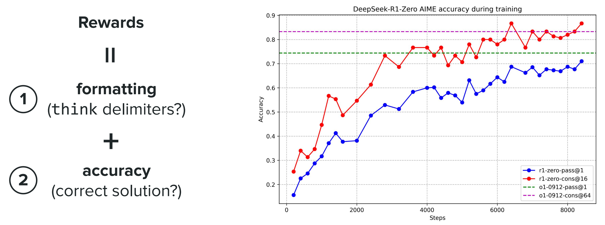

图5 GRPO的Reward计算公式

（1）定义：对于包含G个样本的群体 ${o_1, o_2, ..., o_G}$ （每个样本 $o_i$ 是一个完整的“**问题→推理链→答案**”序列），样本 $o_i$ 的优势值为：$\hat{A}_{i,t}=\frac{r_{i}-mean\left(\{r_1,r_2,\cdots,r_G\}\right)}{std\left(\{r_1,r_2,\cdots,r_G\}\right)}$ 

> 变量定义：
> -  $r_i$ ：样本 $o_i$ 的总奖励（ $r_i = R_{CoT}(o_i) + R_{Accuracy}(o_i)$ ）；
> -  $mean({r_1,...,r_G})$ ：群体的平均奖励；
> -  $std({r_1,...,r_G})$ ：群体奖励的标准差。

（2）物理意义：优势值是样本奖励在群体中的“标准化Z分数”，反映样本的“**相对优势**”（比群体平均水平好多少）；

（3）优势：**减少个体奖励波动的影响**，提升训练稳定性；鼓励模型探索“比群体平均更好的推理路径”，而非仅优化单个样本的绝对优势。

### 5.3. GRPO与PPO对比

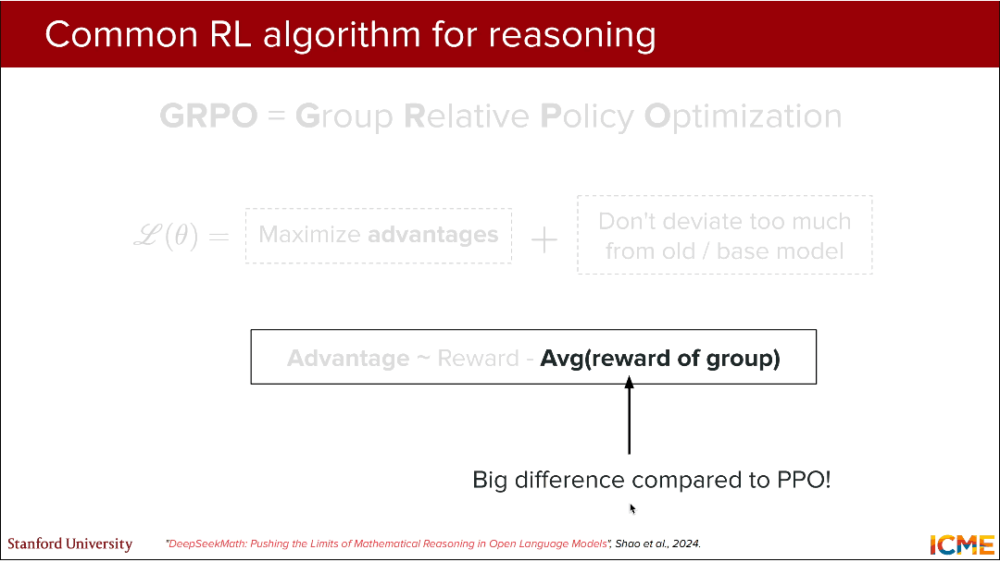

图6 GRPO与PPO详细对比图

#### 5.3.1. GRPO损失函数

\[
\begin{aligned}
\mathcal{J}_{\text{GRPO}}(\theta) = \mathbb{E}_{[q \sim P(Q), \{o_i\}_{i=1}^G \sim \pi_{\theta_{\text{old}}}(O|q)]} \Bigg[ 
& \frac{1}{G} \sum_{i=1}^G \frac{1}{|o_i|} \sum_{t=1}^{|o_i|} \Bigg\{ 
\min 
\Bigg( \frac{\pi_\theta(o_{i,t}|q,o_{i,<t})}{\pi_{\theta_{\text{old}}}(o_{i,t}|q,o_{i,<t})} \hat{A}_{i,t}, \quad \text{clip}
\Bigg( \frac{\pi_\theta(o_{i,t}|q,o_{i,<t})}{\pi_{\theta_{\text{old}}}(o_{i,t}|q,o_{i,<t})}, 1-\varepsilon, 1+\varepsilon 
\Bigg) 
\hat{A}_{i,t} 
\Bigg) 
\Bigg\} 
& - \beta \, \mathbb{D}_{\text{KL}}\big[ \pi_\theta \| \pi_{\text{ref}} \big]
\Bigg]
\end{aligned}
\]
> 参数解释：
> - 期望项 $\mathbb{E}[q\sim P(Q), {o_i}_{i=1}^G \sim \pi_{\theta_{old}}(O|q)]$ ：对“问题分布 $P(Q)$ ”和“旧策略生成的群体样本分布 $\pi_{\theta_{old}}(O|q)$ ”取期望，保证训练覆盖多样的问题和推理路径；
    >   - \( q \sim P(Q) \)：从问题分布中采样一个问题 \(q\)。
    >   - \( \{o_i\}_{i=1}^G \sim \pi_{\theta_{\text{old}}}(O|q) \)：从旧策略 \(\pi_{\theta_{\text{old}}}\) 中采样 \(G\) 个回答（输出序列），针对同一个问题 \(q\)。
> - 群体平均 $\frac{1}{G}\sum_{i=1}^G$ ：对群体中的G个样本取平均，利用群体相对优势值优化；
> - 序列平均 $\frac{1}{|o_i|}\sum_{t=1}^{|o_i|}$ ：对每个样本的 $|o_i|$ 个token取平均，平衡不同长度推理链的贡献；
> - 裁剪项 $min[..., clip(...)]$ ：与PPO一致，限制策略比的波动范围；
    >   - \(\pi_\theta\)：当前要优化的策略。
    >   - \(\pi_{\theta_{\text{old}}}\)：旧策略，用于重要性采样。
    >   - \(o_{i,t}\)：第 \(i\) 个回答的第 \(t\) 个 token。
    >   - \(q, o_{i,<t}\)：问题 + 该回答的前 \(t-1\) 个 token 作为上下文。
    >   - \(\hat{A}_{i,t}\)：优势函数估计，对于第 \(i\) 个回答的第 \(t\) 个 token。
    >   - \(\varepsilon\)：PPO 的 clip 范围超参数。
> - KL惩罚项 $-\beta \mathbb{D}_{KL}[\pi_\theta || \pi_{ref}]$ ：新增项，通过KL散度限制新策略与参考模型的偏差，避免模型忘记基础推理能力。
    >   - \(\beta\)：KL 惩罚系数。
    >   - \(\pi_{\text{ref}}\)：参考策略（通常为预训练模型或SFT模型，不变）。
    >   -   \(\mathbb{D}_{\text{KL}}\)：KL 散度，用于约束 \(\pi_\theta\) 不要偏离 \(\pi_{\text{ref}}\) 太远。

#### 5.3.2. PPO损失函数

$$ \mathcal{J}_{\text{PPO}}(\theta) = \mathbb{E}_{[q \sim P(Q), o \sim \pi_{\theta_{old}}(O|q)]} \frac{1}{|o|} \sum_{t=1}^{|o|} \min \left[ \frac{\pi_{\theta}(o_t|q, o_{<t})}{\pi_{\theta_{old}}(o_t|q, o_{<t})} A_t, \text{clip} \left( \frac{\pi_{\theta}(o_t|q, o_{<t})}{\pi_{\theta_{old}}(o_t|q, o_{<t})}, 1 - \epsilon, 1 + \epsilon \right) A_t \right] $$

与GRPO的相似之处：
- Ratio比率：$\frac{\pi_\theta(o_{i,t}|q,o_{i,<t})}{\pi_{\theta_{\text{old}}}(o_{i,t}|q,o_{i,<t})} \hat{A}_{i,t}$ 与 $ \frac{\pi_{\theta}(o_t|q, o_{<t})}{\pi_{\theta_{old}}(o_t|q, o_{<t})} A_t $
- Clipping裁剪函数：$min[..., clip(...，1-\varepsilon, 1+\varepsilon )]$

与GRPO的核心差异：
- 无**群体平均项**：PPO仅处理单个样本，GRPO则处理群体样本；
- 无**KL惩罚项**：PPO仅通过裁剪限制策略偏差，对推理任务的稳定性支持不足；
- **优势值**：PPO为单样本绝对优势 $A_t$ ，GRPO为**群体相对优势** $\hat{A}_{i,t}$ 。

#### 5.3.3. GRPO与PPO流程对比

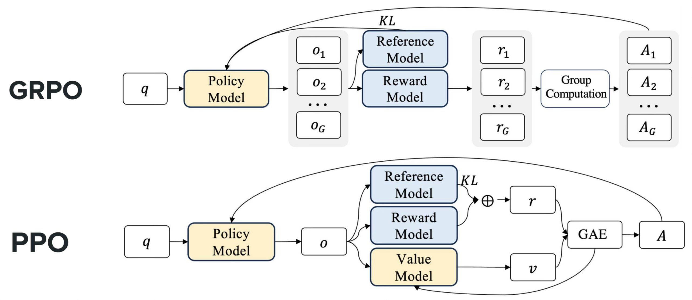

图7 GRPO与PPO流程对比图

（1）**GRPO 流程（上半部分）**——GRPO 是专为推理任务设计的 PPO 改进算法，核心是**群体化优化**：
1.  **输入**：问题 \(q\) 输入到策略模型（Policy Model）。
2.  **群体采样**：策略模型针对同一问题 \(q\)，生成一组（共 \(G\) 条）不同的输出序列 \(\{o_1, o_2, ..., o_G\}\)，覆盖多种推理路径。
3.  **双模型评估**：
    -   **Reward Model**：对每条输出 \(o_i\) 计算奖励 \(r_i\)，衡量其正确性与质量。
    -   **Reference Model**：计算策略模型与参考模型之间的 KL 散度，用于约束策略更新幅度，防止偏离过远。
4.  **群体计算**：在整个群体 \(\{r_1, ..., r_G\}\) 内，通过标准化（Z-score）计算每条输出的**群体相对优势值** \(A_i\)，即 \(\hat{A}_{i} = \frac{r_i - \text{mean}(r)}{\text{std}(r)}\)。
5.  **策略更新**：使用 GRPO 损失函数，结合群体优势值 \(A_i\) 和 KL 约束，更新策略模型。

（2）**PPO 流程（下半部分）**——PPO 是传统的强化学习算法，核心是**单样本迭代优化**：
1.  **输入**：问题 \(q\) 输入到策略模型（Policy Model）。
2.  **单次采样**：策略模型生成一条输出 \(o\)。
3.  **三模型评估**：
    -   **Reward Model**：对输出 \(o\) 计算奖励 \(r\)。
    -   **Reference Model**：计算 KL 散度，用于约束策略更新。
    -   **Value Model**：估计当前状态的价值 \(v\)。
4.  **优势估计**：使用 GAE（Generalized Advantage Estimation），结合奖励 \(r\) 和价值 \(v\)，计算单条输出的**绝对优势值** \(A\)。
5.  **策略更新**：使用 PPO 损失函数，结合绝对优势值 \(A\) 和 KL 约束，更新策略模型与价值模型。

（3）核心差异总结
| 维度 | GRPO | PPO |
| :--- | :--- | :--- |
| **采样方式** | 群体采样（\(G\) 条输出） | 单次采样（1 条输出） |
| **优势值计算** | **群体相对优势值**（Z-score，群体内对比） | 单样本绝对优势值（GAE，自身对比） |
| **模型依赖** | 仅需**策略模型、奖励模型、参考模型** | 需策略模型、奖励模型、参考模型、价值模型 |
| **核心优势** | 适配推理任务“多路径求解”的特性，训练更稳定，鼓励探索更优路径 | 算法成熟，实现简单，适用于广泛的强化学习场景 |
| **训练复杂度** | 较高，需处理群体数据 | 较低，单样本迭代 |

### 5.4. 训练问题：输出长度持续增加

#### 5.4.1. 问题现象

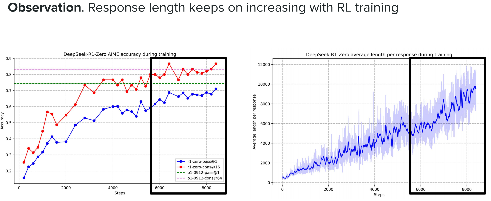

图8 训练问题现象图

随GRPO训练步数增加，模型的**平均输出token数（推理链+答案）** 持续上升（如DeepSeek R1-Zero从0增至12000+ tokens），但**推理准确率**（Pass@1）提升趋于平缓——**模型生成大量冗余推理步骤（如重复计算、无关推导）**，导致推理效率低下。

#### 5.4.2. 问题成因：序列平均项的不良激励

**GRPO损失函数中的 $\frac{1}{|o_i|}$ 序列平均项是核心原因**：

- 对于短输出（ $|o_i|$ 小）： $\frac{1}{|o_i|}$ 值大，单个token的奖励/惩罚被放大；若优势值 $\hat{A}_{i,t} < 0$ （样本奖励低于群体平均），短输出的惩罚更重；
- 对于长输出（ $|o_i|$ 大）： $\frac{1}{|o_i|}$ 值小，单个token的奖励/惩罚被缩小；若优势值 $\hat{A}_{i,t} < 0$ ，长输出的惩罚更轻；
- 模型的最优策略：主动生成更长的输出以规避惩罚，形成“**长度膨胀**”的不良激励。

#### 5.4.3. 解决方案：均衡token级贡献

**核心思路：移除** $\frac{1}{|o_i|}$  **的序列平均项，让每个token的贡献相等，避免长度依赖的奖励偏差**：

（1）**$DAPO$（Distributed Advantage Policy Optimization）**：
- 改进方案：**将“样本内token平均”改为“群体内总token平均”**，公式调整为：$\frac{1}{\sum_{i=1}^{G}\left|o_{i}\right|} \sum_{i=1}^{G} \sum_{t=1}^{\left|o_{i}\right|}$ 
- 物理意义：每个token的贡献权重为“**1/群体总token数**”，与样本长度无关，均衡短输出和长输出的token贡献。

（2）**$Dr. GRPO$（Doctor GRPO）**：
- 改进方案：**直接移除样本内token平均项，仅保留群体平均项**，公式调整为：$\frac{1}{G} \sum_{i=1}^{G} \sum_{t=1}^{\left|o_{i}\right|}$ 
- 物理意义：每个样本的贡献权重为“**1/G**”，样本内每个token的贡献权重为“1”，避免长度归一化导致的偏差。

#### 5.4.4. 改进效果
通过DeepSeek R1-Zero的训练曲线验证两种方案的有效性：
- **Token效率**：随着强化学习的进行，Dr.GRPO的Reward在输出长度为500 tokens左右急剧上升，token效率极高，而普通GRPO的Reward随着输出长度平缓增加（输出长度在800～1000 tokens，Reward增加缓慢几乎保持不变），token效率太低；
- **输出长度**：正确答案的输出长度趋于稳定（约400 tokens），错误答案的输出长度被显著压缩（从高于2.0k tokens降至1.0k tokens以下）；
- **输出长度控制**：Dr. GRPO/DAPO训练的模型，平均输出长度从12000+ tokens降至4000 tokens以下；
- **准确率保持**：Pass@1准确率从0.6提升至0.8，与原始GRPO持平，甚至略有提升。

### 5.5. 其他改进方向

（1）**难度偏置调整**：
- 问题：不同难度的问题奖励分布差异大，群体平均奖励无法反映真实优势；
- 解决方案：**按问题难度分组，在每组内计算群体相对优势值**，公式调整为：$\hat{A}_{i,t}=\frac{R\left(q, o_{i}\right)-mean\left(\left\{R\left(q, o_{1}\right), ..., R\left(q, o_{G}\right)\right\}_{difficulty=q.difficulty}\right)}{std\left(\left\{R\left(q, o_{1}\right), ..., R\left(q, o_{G}\right)\right\}_{difficulty=q.difficulty}\right)}$ 
- 优势：避免简单问题的高奖励掩盖复杂问题的真实推理能力。

（2）**鼓励推理多样性**：
- 问题：原始GRPO的对称clip区间 $[1-\varepsilon, 1+\varepsilon]$ 限制了推理路径的多样性；
- 解决方案：**采用非对称clip区间** $[1-\varepsilon_{low}, 1+\varepsilon_{high}]$ （如 $\varepsilon_{low}=0.2$ ， $\varepsilon_{high}=0.5$ ），公式由$clip\left(r_{i,t}(\theta), 1-\varepsilon, 1+\varepsilon \right)$ 调整为 $clip\left(r_{i,t}(\theta), 1-\varepsilon_{low }, 1+\varepsilon_{high }\right)$ 
- 优势：对“优于旧策略的推理路径”给予更大的更新幅度，鼓励模型探索多样的有效推理链。

## 6. 训练实例：DeepSeek R1/R1-Zero

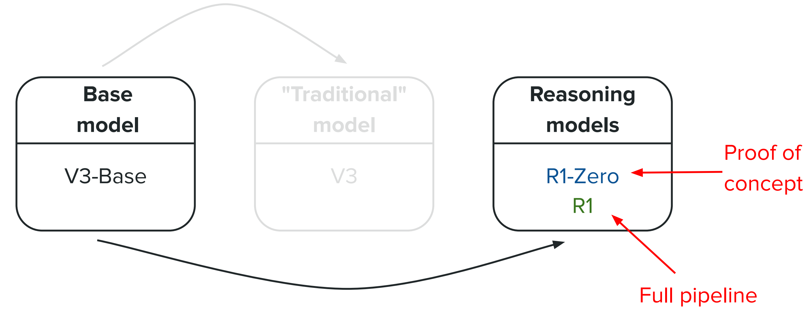

图9 DeepSeek基础模型与推理模型

### 6.1. DeepSeek V3-Base底座模型

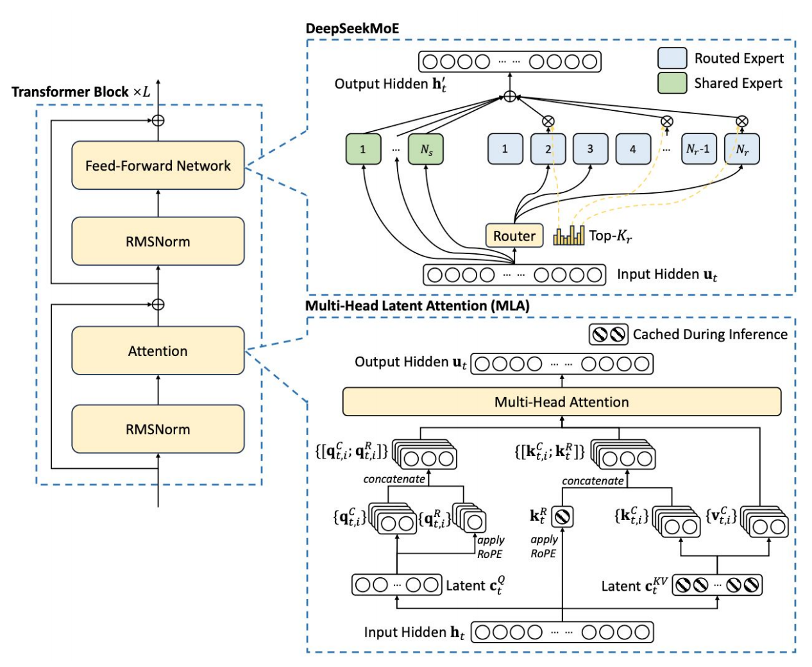

图10 DeepSeek V3-Base底座模型细节图

（1）架构类型：**混合专家模型**（Mixture of Experts, MoE）；

（2）参数量：总参671B，激活参37B（仅部分专家参与每次推理，平衡性能与效率）；

（3）核心组件：
- **路由层（Router）**：基于输入token的隐向量，选择**Top-K个专家**（通常K=8）参与计算，位于前馈网络FFN中；
- **专家层（Expert）**：包含Transformer Block、Multi-Head Attention、Feed-Forward Network，每个专家专注于特定推理任务（如数学计算、代码逻辑），位于前馈网络FFN中；
- **多头部潜在注意力（Multi-Head Latent Attention, MLA）**：缓存推理过程中的中间状态，提升长推理链的生成效率；
- **RMSNorm**：$\bar{a}_i = \frac{a_i}{\text{RMS}(a)} \cdot \gamma_i$，其中：$\text{RMS}(a) = \sqrt{\frac{1}{n} \sum_{i=1}^{n} a_i^2 + \epsilon}$，只使用均方根RMS进行归一化，学习一个 $\gamma_i$ 参数即可，相较于层归一化计算量更小而效果相近；
- **预训练数据**：包含文本、代码、数学公式等多类型数据，覆盖推理任务的基础需求。

### 6.2. DeepSeek R1-Zero：概念验证版（无SFT的推理模型）

**核心目标：验证“仅通过GRPO强化学习，无需有监督微调（SFT），即可让基础模型具备推理能力”，训练流程仅2步**

（1）**步骤1：预训练基础模型V3-Base**
- 技术：传统预训练技术（自回归语言建模），目标函数为交叉熵损失： $L = -\sum_{t=1}^T \log \pi_\theta(x_t | x_{<t})$ ；
- 输出：具备基础语言、代码、数学知识的底座模型，无专门的推理能力。

（2）**步骤2：GRPO强化学习训练（推理数据）**

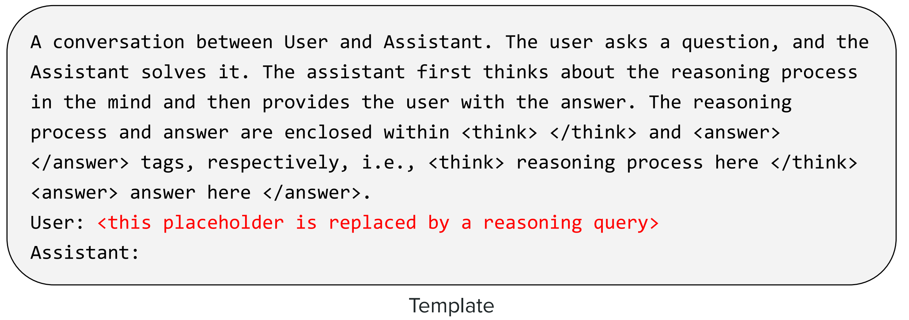

图11 训练数据模版

- 训练数据：推理任务数据集（数学题、代码题），仅包含“**问题+答案+测试用例**”，无人工标注的推理链；
- 奖励函数： $Reward = 0.3 \cdot R_{CoT} + 0.7 \cdot R_{Accuracy}$ ；
- GRPO参数：群体大小 $G=32$，裁剪系数 $\varepsilon=0.2$ ，KL惩罚系数 $\beta=0.1$ ；
- **具体实现**：

    1. **群体采样**：对每个问题  $q$ ，旧策略  $\pi_{\theta_{old}}$  生成  $G=32$  条不同的推理链-答案序列  ${o_1, o_2, ..., o_{32}}$ ，形成一个优化群体。

    2. **奖励计算**：

        -  $R_{Accuracy}$ ：通过单元测试（代码）或符号计算（数学）自动验证答案正确性，正确为1，错误为0。

        -  $R_{CoT}$ ：通过规则校验推理链的完整性（如长度>50 tokens，包含逻辑连接词），完整为1，否则为0。

    3. **优势值归一化**：在群体内计算Z-score，得到相对优势值  $\hat{A}_{i,t}$ 。

    4. **梯度更新**：使用GRPO损失函数计算梯度，更新模型参数  $\theta$ ，并固定参考模型  $\pi_{ref}$  为初始的V3-Base。

（3）R1-Zero 实验结果与分析：仅用GRPO可以“从无到有”地赋予模型推理能力（无需SFT模型），但生成的推理链**缺乏人类可读性，且存在严重的效率问题**。

### 6.3. DeepSeek R1：全流程优化版（SFT + 多阶段GRPO）

为了解决R1-Zero的缺陷，DeepSeek团队设计**多阶段混合训练流程**，核心思想是**用SFT学习“怎么说（格式）”，用GRPO学习“怎么想（正确性）”**。

（1）**步骤1：预训练底座**
- 同R1-Zero，得到预训练基础模型 **DeepSeek V3-Base**。

（2）**步骤2：小规模有监督微调（SFT-1）**
- **数据来源**：**R1-Zero**生成的**高奖励长推理链** + **人类专家重写**的高质量短推理链（约10万对）。
- 目标：让模型学习**规范的推理链格式**（如“首先...其次...最后...”的步骤化表达）和**自然语言风格**。
- 损失函数：标准的自回归交叉熵损失。
- 输出：具备基础推理格式的模型 **V3-SFT1**。

（3）**步骤3：第一阶段GRPO训练（GRPO-1）**
- 数据：推理专用数据（数学、代码）。
- **奖励函数**： $Reward = 0.2 \cdot R_{CoT} + 0.6 \cdot R_{Accuracy} + 0.2 \cdot R_{Fluency}$ 
    > 新增 $R_{Fluency}$ （流畅度Language Consistency）：通过一个小型评估模型打分，确保推理链语言自然。
- 改进：使用 **Dr. GRPO** 算法，解决长度膨胀问题。
- 输出：推理准确率高、长度可控的模型 **V3-GRPO1**。

（4）**步骤4：大规模有监督微调（SFT-2）**
- **数据来源**：融合两类数据（共80万对）：
  - **推理数据**（60万对）：涵盖数学、代码、逻辑推理，通过**规则 + V3 裁判模型**，对"当前 R1 模型"的回答进行**拒绝采样（Rejection Sampling）**
  - **通用数据**（20万对）：主要是**复用V3的通用SFT数据**（对话、创作等）。
- 目标：**提升泛化能力**，防止模型在GRPO训练后“偏科”，确保在非推理任务上依然表现良好。
- 输出：均衡能力的模型 **V3-SFT2**。

（5）**步骤5：第二阶段GRPO训练（GRPO-2）**
- **策略**：分两路并行训练，最后合并权重。
  - **推理分支**：使用推理数据，涵盖数学、代码、逻辑推理，奖励侧重准确率（$Reward = Formatting + Accuracy$）。
  - **通用分支**：使用通用数据，奖励侧重有用性与无害性（$Reward = Helpfulness + Harmlessness$ ——复用V3的RLHF配置）。
- 最终输出：**DeepSeek R1**。

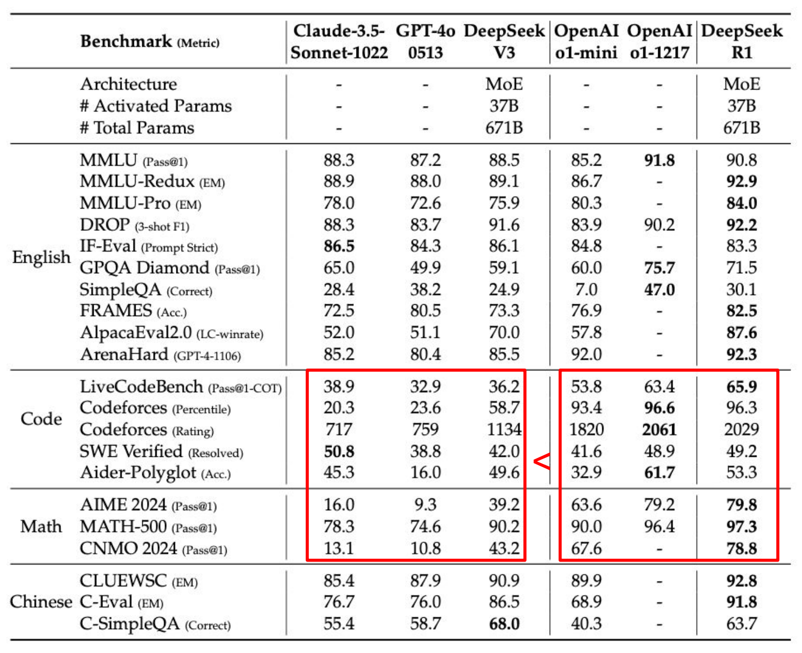

图12 DeepSeek R1与其他模型的对比图

> 核心结论：通过 **SFT规范格式 + GRPO优化正确性 + 多阶段融合**，R1在专业推理任务上超越了传统大模型，证明了该训练范式的优越性。

## 7. 推理模型的蒸馏

### 7.1. 蒸馏范式的变革：从“结果模仿”到“过程模仿”

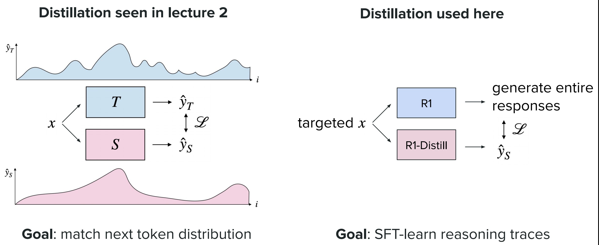

图13 蒸馏模型的变革

|蒸馏类型|传统LLM蒸馏|**推理模型蒸馏 (Reasoning Distillation)**|
|---|---|---|
|**教师模型**|大模型|推理大模型（如DeepSeek R1）|
|**学习目标**|匹配教书的 **下一个Token概率分布**|匹配教师的 **推理链 (Reasoning Chain) + 答案**|
|**核心思想**|“抄答案”|“抄解题过程”|

### 7.2. 蒸馏流程（以 R1-Distill 为例）

（1）**数据生成（Teacher Side）**：使用 **DeepSeek R1** 对大规模推理数据集进行推理，生成包含**完整详细推理链**的高质量样本。
  
（2）**学生训练（Student Side）**：
- **学生模型**：选择小参数量模型（如 Qwen-32B, Llama-3-70B）。
- **训练方式**：标准的**有监督微调（SFT）**。
- **输入输出**：将老师的完整输出（推理链+答案）作为学生的训练目标。

（3）**输出**：**R1-Distill-Qwen-32B** 等轻量级推理模型。

### 7.3. 蒸馏效果与工程价值

- **性能保留**：R1-Distill-Qwen-32B 在 AIME 上的 Pass@1 达到 **72.6%，远超同规模的原生模型**，甚至超过了 GPT-4o（9.3%）。

- **成本降低**：推理速度比671B MoE 快几倍；部署成本低，可在单张消费级GPU（如RTX 4090）上运行，而R1需要多卡集群。

- **工程启示**：推理链蒸馏是**平衡性能与成本**的最佳实践，是推理模型从实验室走向工业界的关键一步。

> 核心结论
> 1. **思维链（CoT）** 作为推理模型的核心表达范式，通过**显式的步骤化推导**弥补了这一缺陷；而**强化学习**则是推动模型从“被动响应CoT提示”向“主动生成高质量CoT”转变的关键手段，为推理能力的自主习得提供了技术框架。
> 2. **GRPO算法**作为PPO在推理任务中的针对性改进，核心创新在于采用**群体相对优势值**替代传统的单样本绝对优势值。这一设计完美适配了推理任务“**多路径求解**”的特性，通过群体内的横向对比优化策略，既提升了训练稳定性，又有效鼓励了模型对更优推理路径的探索，成为推理模型训练的核心RL算法。
> 3. GRPO训练中出现的**输出长度膨胀**问题，其数学根源是**序列长度归一化项带来的不良激励**。通过**均衡token级贡献**的改进方案（**DAPO/Dr. GRPO**），移除或重构长度相关的归一化逻辑，可在不损失推理准确率的前提下，实现推理链长度的有效控制。
> 4. DeepSeek R1的工业化训练流程，验证了**GRPO+多阶段SFT**混合范式的有效性。其中，SFT负责规范推理链的格式与可读性，解决R1-Zero的逻辑混乱问题；多阶段GRPO则聚焦准确率与场景适配性的精准优化。二者协同，让模型同时具备**推理链规范性**与**任务高准确率**，成为推理模型从技术验证走向商用落地的标杆路径。
> 5. 推理链蒸馏突破了传统“结果模仿”的局限，通过**让小模型学习大模型的完整推理过程**，实现了“轻量化”与“高性能”的平衡。