# CME 295 Lecture7

## 1. 检索增强生成 $RAG$（$R$etrieval-$A$ugmented $G$eneration）

### 1.1. 核心动机：LLMs的应用限制

（1）**知识截止（Knowledge cutoff）**
- 核心问题：LLMs的知识仅来自**预训练数据**，无法获取训练后的新信息；
- 影响：实际应用中**知识时效性差**，无法处理实时信息需求；
- 案例：GPT-5知识截止至2024年9月30日，无法回答此后的新事件/新数据。

（2）**上下文窗口有限（Limited context size）**
- 影响：**长文本处理时会丢失关键信息**，无法做全局理解；
- 案例：GPT-5作为旗舰模型，仅支持400,000上下文token、128,000最大输出token，无法处理超大规模文本（如整本书、海量文档）。

（3）**易被无关信息干扰**

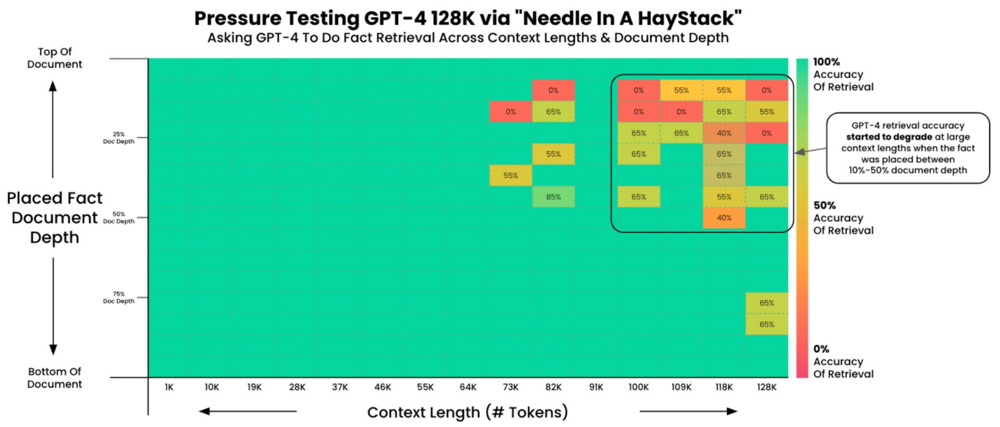
<p align="center">图1 Needle In A HayStack（针堆找针）测试结果图

- 案例：**Needle In A HayStack**（针堆找针）——在128K token的长文本中，将关键事实分别放在文本顶部/底部，测试GPT-4的事实检索准确率；
- 实验结果：如图1所示，**关键事实在文本底部时，准确率随上下文长度增加大幅下降**，说明LLMs易被长文本中的无关信息干扰，对远端信息的捕捉能力弱。

（4）**按Token计费的成本问题**
- 核心规则：LLMs使用成本按**输入/输出token**单独计费，长文本处理会导致token量剧增，成本飙升；
- 案例：GPT-5输入 $1.25/1M token$、输出$ 10/1M token$，**无冗余的信息处理**是降低成本的关键。

### 1.2. 核心思想

- 定义：$RAG = Retrieval{-}Augmented \ Generation$（检索增强生成）；

- 核心思想：在生成回答前，**从外部知识库检索与用户问题相关的信息，将其补充到提示词中，再让LLMs生成回答**；

- 核心目标：**让LLMs“带着相关素材生成回答”**，减少幻觉、提升知识准确性、突破上下文窗口限制。

### 1.3. 核心步骤

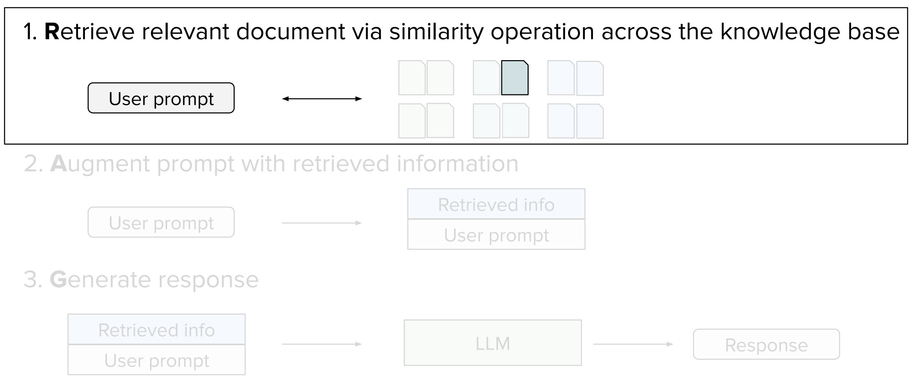
<p align="center">图2 RAG核心步骤图

**$Retrieve$（检索）→ $Augment$（增强）→ $Generate$（生成）**，三步形成闭环:

1. **$R$etrieve（核心阶段）**：以**用户prompt**为查询，通过**相似度计算**从外部知识库中**检索相关文档片段**；

2. **$A$ugment**：将检索到的相关信息与用户原始prompt**拼接**，形成**增强型prompt**；

3. **$G$enerate**：LLMs基于**增强型prompt**生成回答，而非仅基于原始prompt。

### 1.4. 前置工作：构建外部知识库

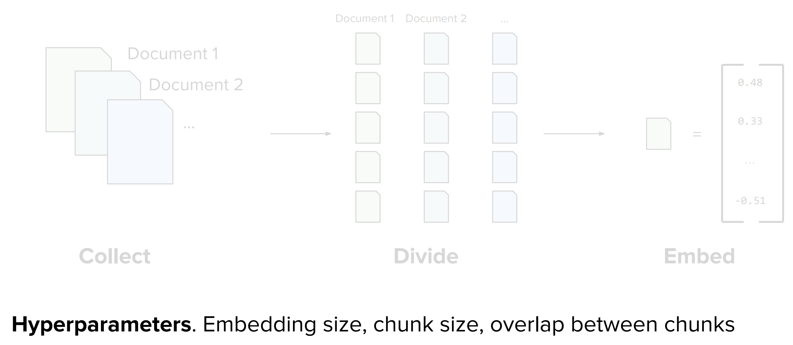
<p align="center">图3 构建外部知识库流程

检索的基础是结构化知识库，构建流程为 $Collect → Divide → Embed$，并标注关键超参数：

1. **Collect（收集）**：整合**非结构化原始文档**（文本、PDF、网页等）；

2. **Divide（切分）**：将原始文档切分为**固定长度的Chunk（片段）**，避免单一片段过长/过短；

3. **Embed（向量化）**：通过嵌入模型将文本Chunk转化为**数值向量**，实现语义的量化表示；

**关键超参数（PPT标注）**：**Embedding size**（嵌入维度）、**Chunk size**（片段长度）、**overlap between chunks**（片段重叠度）——重叠度用于解决“**关键信息被切分在两个Chunk中**”的问题。

### 1.5. 检索阶段

检索分为**候选检索（Candidate retrieval）和重排序（Ranking）**，分别追求**召回率（Recall）最大化**和**精确率（Precision）最大化**，层层筛选提升检索效果。

#### 1.5.1. 第一步：候选检索——最大化召回率

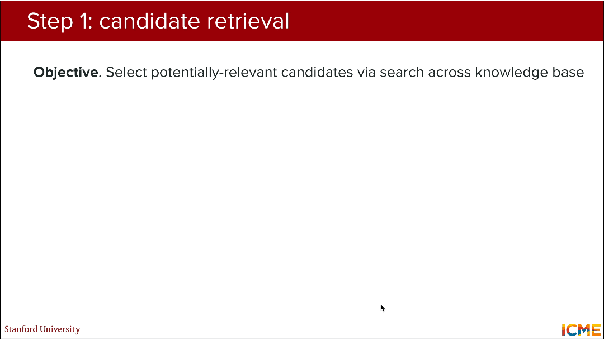
<p align="center">图4 候选检索方法流程

（1）**目标**：从海量知识库中快速筛选出**所有潜在相关的Chunk**，确保“不漏掉相关信息”；

（2）**核心方法**：

1. **语义检索（Embeddings-based similarity）**

    - 核心原理：通过**双编码器（bi-encoder）** 分别将**查询Query和文档Chunk**向量化，计算向量间的相似度（如余弦相似度），匹配**语义相关**的内容；

    - 公式化表示：$Query = \begin{bmatrix}0.48 \\ ... \\ -0.51 \end{bmatrix}, Chunk = \begin{bmatrix}-0.82 \\ ... \\ -0.43 \end{bmatrix}$ 
        经相似度操作得到**similarity score**，分数越高则相关性越强；

    - 示例：查询“Where is Cuddly?”可匹配到“Cuddly spends most days surrounded by books”（语义相关，无关键词完全匹配）。

2. **关键词检索（BM25）**

    - 核心原理：基于**关键词匹配**的传统检索方法，统计查询关键词在Chunk中的**出现频率、位置等，计算相关性**；

    - 示例：查询“Where is Cuddly?”仅匹配包含“Cuddly”关键词的Chunk，速度快但易遗漏语义相关内容。

3. **混合检索（Semantics + BM25）**

    - 核心原理：结合**语义检索和BM25**的优势，先通过BM25快速筛选，再通过语义检索做精细化匹配，兼顾**速度和召回率**。

（3）**优化技巧**：
   1. **缓解嵌入差异（Mitigate Discrepancy in Nature of Embeddings）**：为查询构造**Fake document（伪文档）**（如查询“Where is Cuddly?”→伪文档“Cuddly is in…”），让查询嵌入与Chunk嵌入更匹配；
   2. **Chunk上下文化（Contextualize document chunks）**：**为每个Chunk补充全局上下文**，避免Chunk脱离原文导致的检索偏差。以下是专属提示词模板：
        ```Plain Text
        <document> 
        {WHOLE_DOCUMENT} 
        </document>
        Here is the chunk we want to situate within the whole document: 
        {CHUNK_CONTENT}

        Please give a short succinct context to situate this chunk within the overall document for the purposes of improving search retrieval of the chunk. Answer only with the succinct context and nothing else.
        ```
1. **提示词缓存（Prompt caching）**：缓存重复使用的Prompt嵌入结果，降低计算成本，核心优势是缓存输入成本仅为原始输入的**1/10**，大幅降低重复检索的成本。

#### 1.5.2. 第二步：重排序——最大化精确率

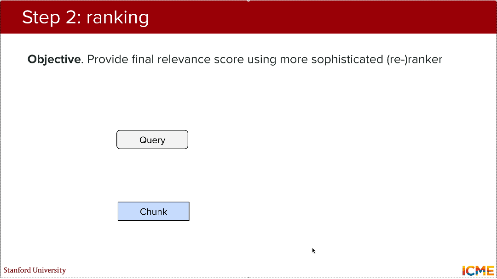
<p align="center">图5 重排序方法流程

（1）**目标**：对候选检索得到的少量Chunk做**精细化相似度计算**，给出最终相关性得分并排序，确保“**最相关的Chunk排在前面**”；

（2）**核心原理**：使用**交叉编码器（cross-encoder）**，将**Query+Chunk**作为一个整体输入编码器，直接计算相关性得分，相比双编码器更精细；

（3）**流程图**：将候选Chunk（a/b/c/d）输入重排序器，结合用户prompt给出排序结果（如b=2、a=3、c=4、d=最后），**取前k个作为最终检索结果**。

### 1.6. 检索性能量化评估

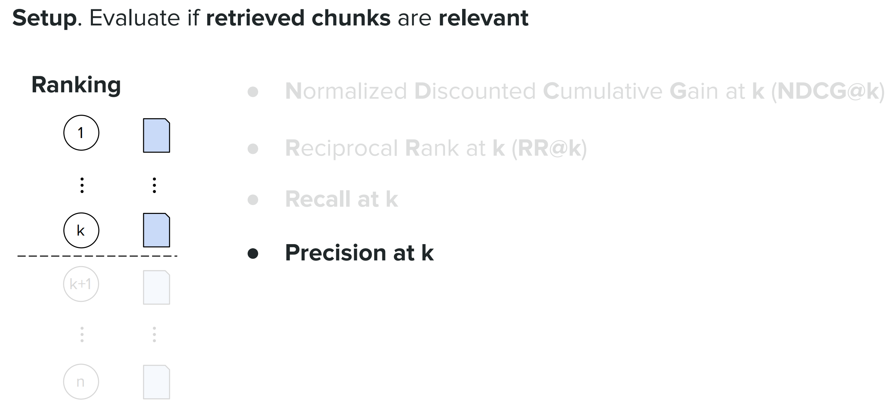
<p align="center">图6 四大量化检索性能指标

检索效果的评估标准：**判断前k个检索Chunk的相关性**，包括四个核心量化指标，是评估RAG效果的关键。

#### 1.6.1. $NDCG@k$（$N$ormalized $D$iscounted $C$umulative $G$ain $at$ $K$，归一化折损累积增益）

（1）**核心思想**：综合考虑Chunk的**相关性**和**排序位置**，位置越靠前、相关性越高，得分越高；

（2）**数学公式**：
- $DCG @ k=\sum_{i=1}^{k} \frac{rel_{i}}{log _{2}(i+1)}$ 
    > 其中：
    > - $rel_i \in {0,1}$ ： $rel_i=1$ 表示第 $i$ 个Chunk相关， $rel_i=0$ 表示无关；
    > - $log_2(i+1)$ ：对排序位置做“折损”，**惩罚靠后的相关Chunk**。

- $NDCG @ k=\frac{ DCG @ k}{ IDCG @ k}$ 
    > 其中： 
    > - $IDCG@k$ ：**理想DCG**，即所有相关Chunk都排在最前面时的DCG值；
    > - $NDCG@k \in [0,1]$ ：归一化折损累积增益，**越接近1表示检索效果越好**。

#### 1.6.2. $RR@k$（$R$eciprocal $R$ank $at$ $K$，倒数排名）

（1）**核心思想**：衡量“**最快找到第一个相关Chunk**”的能力；

（2）**数学公式**：$RR=\frac{1}{rank}$ 
> 其中：$rank$ ：**第一个相关Chunk的排名**；

#### 1.6.3. $Recall \ at \ k$（召回率）

（1）**核心思想**：衡量“**找全所有相关Chunk**”的能力；

（2）**数学公式**：$Recall @ k=\frac{| relevant\ in\ top\ k |}{| relevant |}$ 
> 说明：
> - 分子：前k个检索结果中**相关Chunk的数量**；
> - 分母：知识库中**所有相关Chunk的总数**；
> - 结果：越接近1表示越能找全相关信息。

#### 1.6.4. $Precision \ at \ k$（精确率）

（1）**核心思想**：衡量“找对相关Chunk”的能力；

（2）**数学公式**：$Precision @ k=\frac{| relevant\ in\ top\ k |}{k}$ 
> 说明：
> - 分子：前k个检索结果中**相关Chunk的数量**；
> - 分母：检索结果的**总数量k**；
> - 结果：越接近1表示检索结果的精准度越高。

## 2. 工具调用 $Tool \ calling$

### 2.1. 概述

（1）动机：承接RAG，解决LLMs**无法执行实际操作、处理结构化数据**的问题。

（2）定义：**Tool calling** allows autonomous systems to **complete complex tasks** by dynamically accessing and [may act] upon **external resources**.——**工具调用**让自治系统通过动态访问和操作**外部资源**完成**复杂任务**。

（3）本质：让LLMs“学会使用工具”，将**文本生成能力**转化为**实际任务执行能力**。

### 2.2. RAG与Tool calling的分工

（1）$RAG$：解决**非结构化文本知识**的补充问题（如文档、网页）；

（2）$Tool \ calling$：解决**结构化数据（数据库/表格）、计算/API调用、实际操作**的问题（如查天气、调用GPS、执行代码）。

### 2.3. 传统LLM vs 带工具的LLM

|传统LLM|带工具的LLM|
|---|---|
|输入：Find a bear near me!|输入：Find a bear near me!|
|输出：Sorry, I don't know which bears are near you.|输出：调用find_teddy_bear()工具，返回小熊位置/距离/心情|
|仅生成文本，无实际能力|**对接外部工具，执行实际操作**|

### 2.4. 代码示例与特征

以 **find\_teddy\_bear.py** 为例，展示工具的标准设计：包含**数示例据类定义、函数参数、API调用、异常处理、结果返回**，是LLM可调用的工具标准格式。

```Python

from dataclasses import dataclass
from geopy.distance import geodesic
import requests

@dataclass
class TeddyBearInfo:
    name: str
    distance_meters: float
    mood: str
    message: str

def find_teddy_bear(location: tuple[float, float]) -> TeddyBearInfo:
    # Has a descriptive, well-documented API
    """
    Finds the nearest teddy bear to the given GPS coordinates.
        
    Parameters:
        location: A (latitude, longitude) pair representing the user's current location.

    Returns:
        TeddyBearInfo: Information about the nearest teddy bear found.
    """
    # (optional) Has some backend call
    user_lat, user_lon = location
    api_url = "https://api.to.teddy.bears.com/v1/closest"
    try:
        response = requests.get(
            api_url,
            params={"latitude": user_lat, "longitude": user_lon},
            timeout=5
        )
        response.raise_for_status()
        closest_teddy_bear = response.json()
    except requests.RequestException as e:
        raise RuntimeError(f"Failed to fetch teddy bear data from API: {e}")

    # Extract coordinates from API response
    bear_lat, bear_lon = closest_teddy_bear["coords"]
    
    # Compute distance to the bear using geopy (returns distance in meters)
    distance = geodesic((user_lat, user_lon), (bear_lat, bear_lon)).meters
 
    # returns some info
    return TeddyBearInfo(
        name=closest_teddy_bear["name"],
        distance_meters=round(distance, 2),
        mood=closest_teddy_bear["mood"],
        message=f"{closest_teddy_bear['name']} is {closest_teddy_bear['mood']} "
        f"and only {round(distance, 2)} meters away!"
    )
```
> 核心特征：**有描述性的API文档、可选后端调用、返回结构化信息**。

### 2.5. 核心步骤

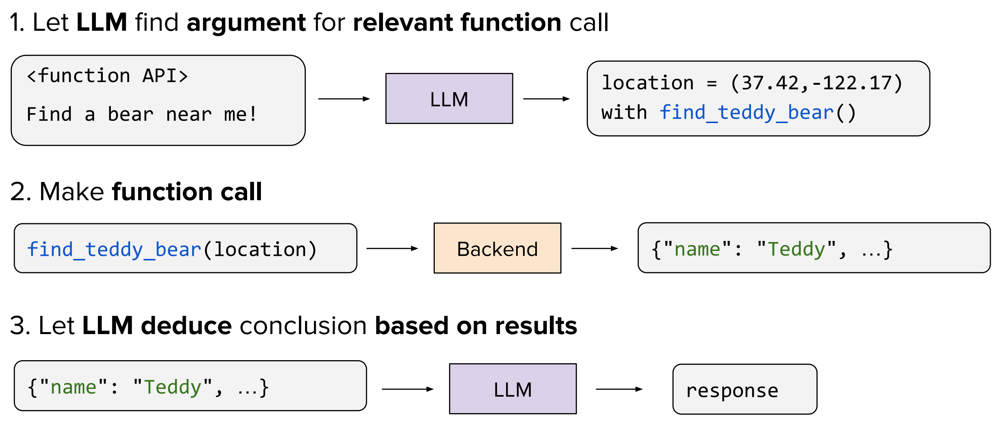
<p align="center">图7 工具调用执行流程图

核心是**LLM做大脑（解析参数），工具做手脚（执行操作）**：

（1）**解析参数**：LLM结合用户prompt和**工具API文档**，**确定工具调用的参数**，公式化表示：$<function\ API> Find \ a \ bear \ near \ me \to LLM \to location = (x , y) \ with \ find\_teddy\_bear() $ 

（2）**执行调用**：将参数传入工具函数，调用**后端/API**完成实际操作，得到结构化结果：$find\_teddy\_bear(location) \to Backend \to \{"name": "Teddy", …\}$ 

（3）**生成回答**：LLM**基于工具返回的结构化结果**，生成自然语言回答：$\{"name": "Teddy", ...\} \to LLM \to response$ 

### 2.6. LLM使用工具的方法

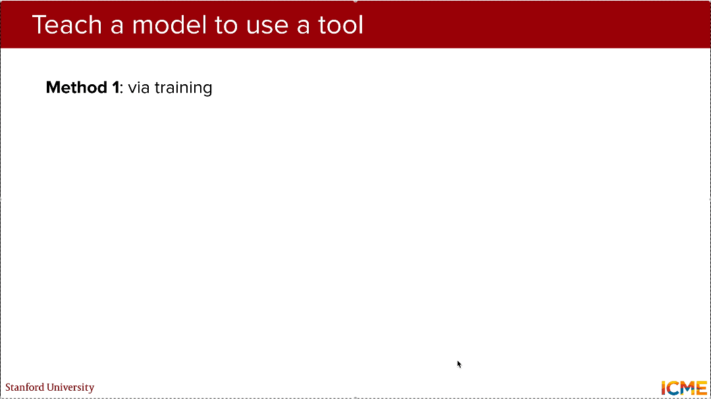
<p align="center">图8 LLM使用工具流程图

#### 2.6.1. 训练法（via training）

（1）核心思想：准备“**prompt + 工具API + 参数 + 结果 + 回答**”的标注数据集，对LLM做**微调**，让模型学会**解析参数、匹配工具**；

（2）流程：**Tool prediction**（工具参数预测）→ **LLM + Backend** 执行调用 → **Response generation**（回答生成）；

（3）特点：优点是效果稳定，工具调用准确率高；缺点是需要大量标注数据，成本高、周期长。

#### 2.6.2. 提示词法（via prompting）

（1）核心：将**工具API文档+详细使用说明**直接写入prompt，让LLM通过提示词理解工具用法，无需训练；

（2）格式： $< function\ API> + <detailed\ explanation\ on\ how\ to\ use\ it>$ ；

（3）优化技巧：用**SFT（监督微调） Pair** 做评估 + 让**强推理能力的LLM辅助生成工具**使用说明，解决“如何写好描述”的问题；

（4）特点：优点是灵活高效，适配快速迭代；缺点是对prompt撰写要求高，复杂工具易出错。

### 2.7. 应用与特点

#### 2.7.1. 常见应用场景

（1）**Information（信息查询）**：网页/数据库搜索、天气/股票跟踪、代码库检索；

（2）**Computation（计算执行）**：计算器、Python代码执行、复杂公式计算；

（3）**Action（实际操作）**：发送邮件/消息、智能设备控制、系统命令执行。

#### 2.7.2. 优势与挑战

|优势|挑战|
|---|---|
|让LLMs的**实用性**大幅提升|**工具数量与模型性能成反比**|
|实现LLMs与真实世界的**交互**|**上下文窗口**有限，可扩展性差|
|**克服知识截止限制**，获取实时信息|**工具定义/维护成本高**|

#### 2.7.3. 多工具场景

（1）核心挑战：工具数量越多，**模型匹配正确工具的性能越低**；工具API文档占用大量**上下文窗口**，模型可扩展性差；定义、维护、更新工具的**工作量大**。

（2）**解决方法：工具选择（Tool Selection）**

- 核心思想：引入**Router**（路由器）模块，先对**用户prompt**做语义解析，**筛选出少量高度相关的工具**，再让LLM调用；
- 目标：**降低模型延迟 + 提升工具调用准确率**；
- 流程：Find a bear near me! → **Router** → List of selected tools → **\<selected function APIs>** + Find a bear near me! → **LLM**调用工具。

### 2.8. 工具调用标准化：$MCP$（$M$odel $C$ontext $P$rotocol）

（1）提出动机：针对“**不同LLM与工具对接方式不统一，重复开发**”的问题，Anthropic提出的**MCP协议**是工具调用的行业标准。

（2）**核心思想**：制定**LLM与工具/数据对接的标准协议**，让所有LLM和工具基于MCP互联互通，避免重复实现；

（3）基础架构：MCP host（主机）+ **MCP client**（客户端）→ **MCP server**（服务器）→ **Tools、Prompts、Resources**，实现**用户提示词、资源、工具**的标准化流转；

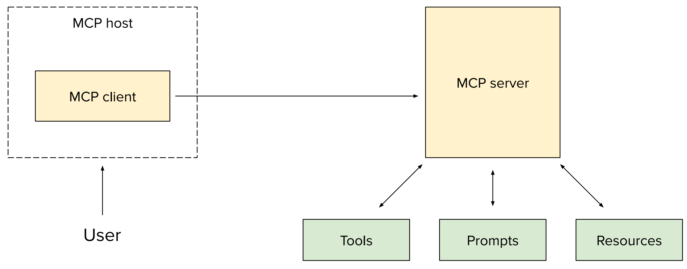
<p align="center">图9 MCP基础架构图

（4）实例：Claude Desktop（MCP cilent）通过MCP调用“书籍推荐工具”（MCP server），为用户的泰迪熊推荐诗集，实现LLM与第三方工具的标准化对接。

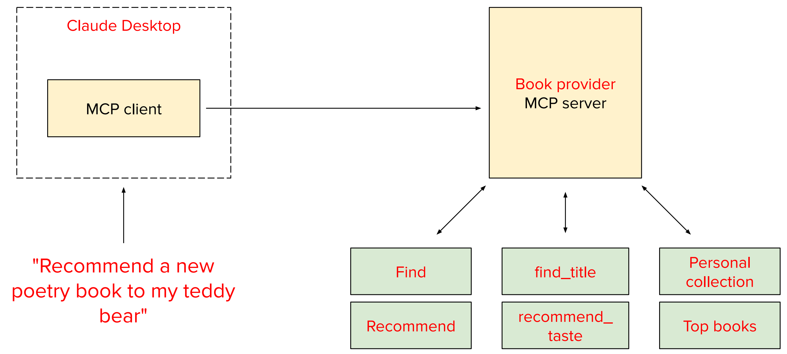
<p align="center">图10 MCP实际案例图

## 3.智能体 $Agents$

Agent**RAG和工具调用的融合升级**，让LLMs具备**自主决策、多步推理、多工具协同、多智能体协作**能力，从“被动调用工具”变为“主动完成任务”。

### 3.1. 概述

（1）定义：An **agent** is a system that **autonomously pursues goals** and **completes tasks** on a user's behalf.——**智能体**是**能自主追求目标**、代表用户**完成端到端复杂任务**的系统，核心是“**自主决策**”。

（2）功能：Agent是**RAG和工具调用的融合升级**，让LLMs具备**自主决策、多步推理、多工具协同、多智能体协作**能力，从“被动调用工具”变为“**主动完成任务**”。

（3）核心对比：传统LLM → 推理LLM → 智能体

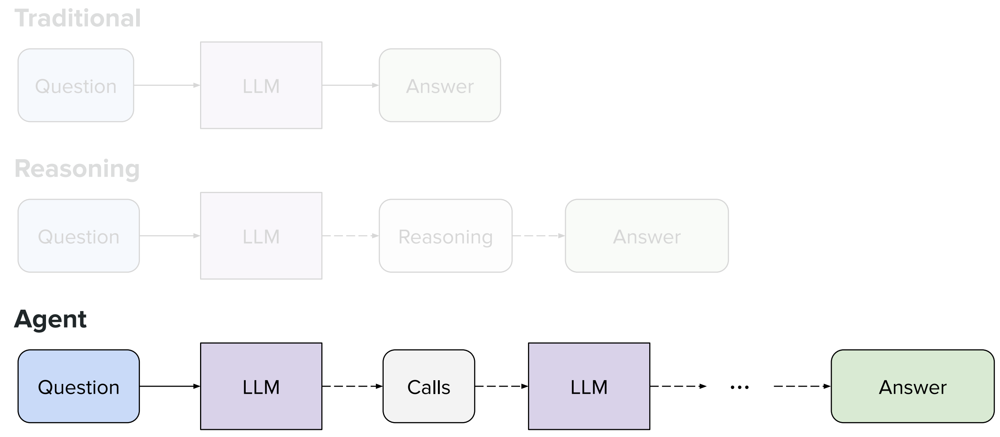
<p align="center">图11 核心对比图

|传统LLM|推理LLM|智能体|
|---|---|---|
|Question → LLM → Answer|Question → LLM → **Reasoning** → Answer|Question → LLM → **Calls（工具/其他智能体）** → LLM → ... → Answer|
|无推理、无操作|有推理、无操作|**有推理、有自主操作**|

### 3.2. 智能体核心框架：$ReAct$（$Re$ason + $Act$）

（1）核心原理：智能体的所有操作均基于ReAct框架

（2）核心思想：**先推理（Reason），再行动（Act）**，流程为 $Input → ( Observe → Plan → Act )_{loops} → Output$

（3）ReAct框架实例：

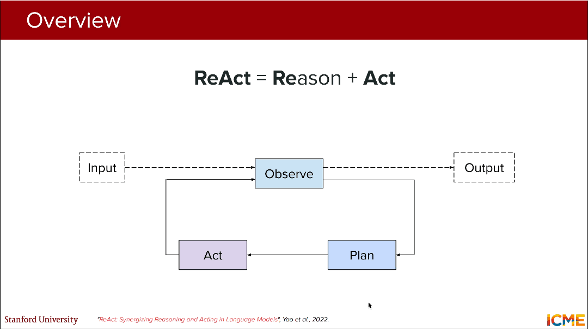
<p align="center">图12 ReAct框架实例流程图

**Input**：My teddy bear is cold. Please do something.

- 输入实例：可来自**手动输入**（如用户提问），也可来自**外部事件**（如指标阈值触发）

**Observe**：The user's teddy bear is cold, which may be due to the current temperature of the room, which is currently unknown.

- 原理解释：**综合先前行动**（自身知识和任务背景） + **明确陈述当前已知内容**（包括自身知识）；需要**大量推理的步骤**来确定所需内容，推理问题的核心矛盾（室温未知是关键）；

**Plan**：Determine the temperature of the room.

- 原理解释：制定需要完成的**任务步骤细节**，确定需要调用的**工具**

**Act**：调用get_current_room_temperature()

- 原理解释：通过**API**执行工具调用 + 在文档**数据库**中查找信息，获取新信息，**重新推理任务方向**；

**循环Observe -> Plan → Act**：
- **新Observe**：得到结果：The temperature in the room is currently 65F. This is about 5F less than an average temperature. We need to increase the room temperature.
- **新Plan**：Increase the temperature by 5F.
- **新Act**：调用increase_temperature(value=5).
- **新observe**：得到结果：The thermostat is now set to 70F. This should be warm enough.

**Output**：The thermostat is now set to 70F. Your teddy bear soon feel warmer.

- 原理解释：基于最终结果，生成自然语言回答，完成任务。

### 3.3. 多智能体协作协议：$A2A$（$A$gent$2A$gent）

（1）提出动机：针对“**单一智能体仅能完成单一领域任务**”的问题，提出的**A2A协议**，实现多智能体的标准化通信与协作。

（2）协作需求：实际场景需要**多智能体协同工作**，如：Occupancy agent（人员存在智能体）、Energy management agent（能耗管理智能体）、Air quality agent（空气质量智能体）三者分别与Thermostat agent（温控智能体）的通信与协作，需统一的通信标准。

（3）核心组件：

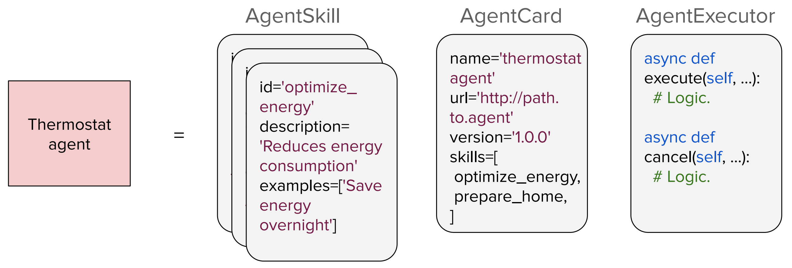
<p align="center">图13 A2A核心组件图

- **AgentSkill**：智能体的**核心能力**，包含ID、描述、示例
- **AgentCard**：智能体的**身份卡片**，包含名称、地址、版本、技能列表
- **AgentExecutor**：智能体的**执行逻辑**，包含async execute()（执行任务）、async cancel()（取消任务）等逻辑，实现任务的实际执行。

（4）核心价值：让不同领域、不同架构的智能体基于统一协议**互联互通、协同工作**，实现复杂任务的分工与合作。

### 3.4. 智能体的安全问题

（1）核心风险：

- **数据泄露（Data exfiltration）**：模型通过工具将敏感数据发送到外部，造成信息泄露；
- **AI策划的网络攻击**：Disrupting the first reported AI-orchestrated cyber espionage campaign（首次发现AI策划的网络间谍活动）。

（2）解决措施：

- **Training steps**：在训练阶段加入**工具使用对齐训练**，让模型学会“**安全调用工具**”；
- **Inference safeguards**：在推理阶段增加**安全防护机制**，过滤危险的工具调用请求；
- **Benchmarks**：基于**Agent-SafetyBench**等基准，量化评估智能体的安全性能；
- **Industry regulation**：建立AI智能体的**安全监管规范**，防范恶意使用。

## 4. LLMs应用的核心问题、工程实践原则及智能体的落地场景

### 4.1. LLMs应用的核心挑战

（1）**幻觉（Hallucination）**：仍是**最大问题**，RAG/工具调用能缓解，但无法彻底解决；

（2）**推理能力（Reasoning）瓶颈**：**微调**能提升推理能力，但**难度大、成本高**，新的推理优化方法是研究热点；

（3）**评估难题**：RAG/工具调用/智能体的效果**难以量化评估**，缺乏统一的基准体系；

（4）**可扩展性**：工具/智能体数量越多，模型性能和效率越低，**标准化MCP/A2A**是核心解决方向。

### 4.2. 工程实践的核心原则

（1）**由简入繁，迭代升级**：先实现**简单**的RAG/单一工具调用，**验证效果后再逐步扩展**为多工具、智能体；

（2）**先选强模型，再做轻量化**：先基于GPT-5、DeepSeek-R1等**强能力**模型验证方案，再对模型做**轻量化优化，平衡性能和成本**；

（3）**提升透明度/可观测性**：让模型的**推理、工具调用、决策过程可追溯**，提升用户信任，便于调试。

> 核心总结
> 1. LLMs核心劣势：**知识静态、无法操作**——这是本讲RAG、工具调用、智能体三大技术的核心解决目标。其中**知识静态**体现为GPT-5有知识截止日期，无法回答该时间点后的新事件、新数据；无法操作指模型仅能生成文本，无对接外部系统、执行实际动作的能力。
> 2. **RAG**核心：以**Collect → Divide → Embed**三步完成外部知识库构建，通过**候选检索（保召回） + 重排序（保精确）**的两步法实现高效检索，最终结合检索结果增强提示词并生成回答；检索性能需通过**NDCG@k / RR@k / Recall@k / Precision@k**四大指标量化评估。
> 3. **工具调用Tool Calling**核心：遵循**解析参数 → 执行调用 → 生成回答**三大核心步骤，实现LLMs从“文本生成”到“实际任务执行”的跨越，解决RAG无法处理的**结构化数据查询、API调用、实际操作**等需求；实现方式分**训练法**（微调适配，效果稳定）/ **提示词法**（零训练，灵活高效）两种，行业标准化依托Anthropic提出的**MCP协议**，解决不同LLM与工具对接不统一、重复开发的问题。
> 4. **智能体Agent**核心：作为RAG与工具调用的高阶融合，以**ReAct框架（Input → Observe → Plan → Act → Output）**为核心执行逻辑，让LLMs具备**自主决策、多步推理、多工具协同**的能力，可自主完成端到端复杂任务；多智能体跨领域协作依托**A2A（Agent2Agent）标准化协议**，实现不同智能体的互联互通；而**安全风险**是智能体落地的核心挑战，需通过训练对齐、推理防护、基准测试等方式规避。
> 5. LLMs应用的核心挑战包括**幻觉（Hallucination）——最大问题，推理能力（Reasoning）瓶颈、评估难题与可扩展性**；工程实践原则：落地LLMs相关技术需遵循**由简入繁，迭代升级 + 先选强模型，再做轻量化 + 提升透明度/可观测性**三大核心原则。
