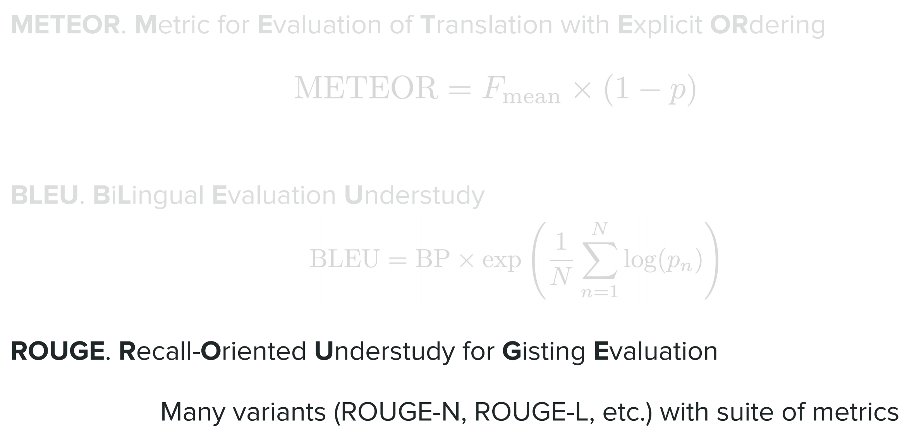
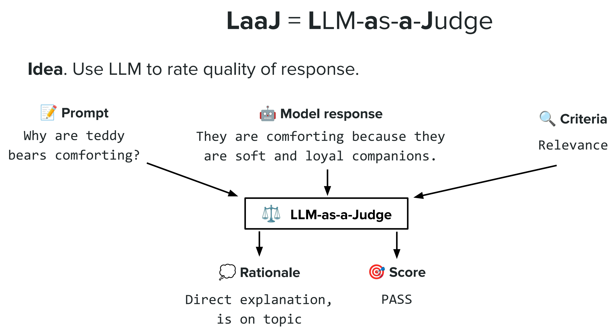
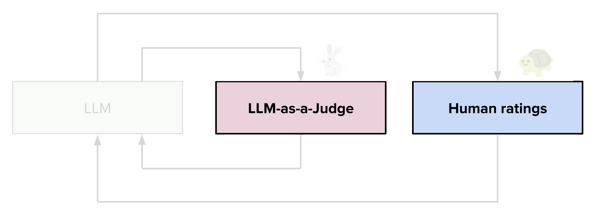
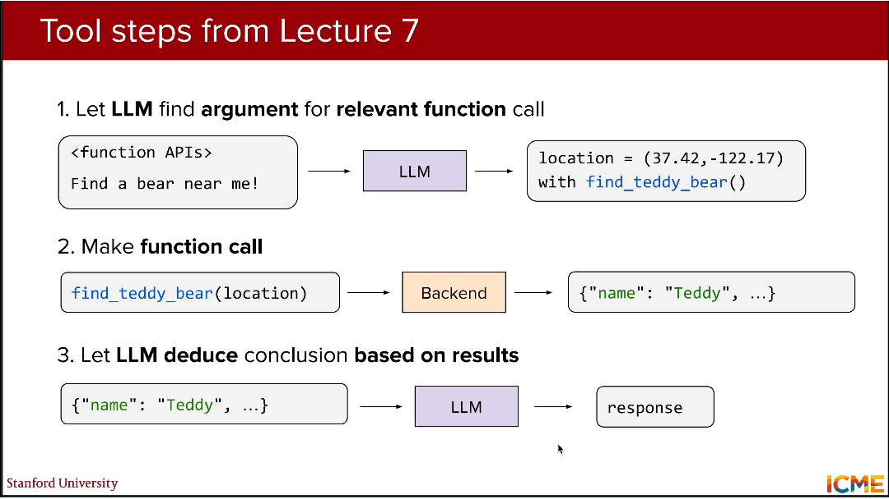
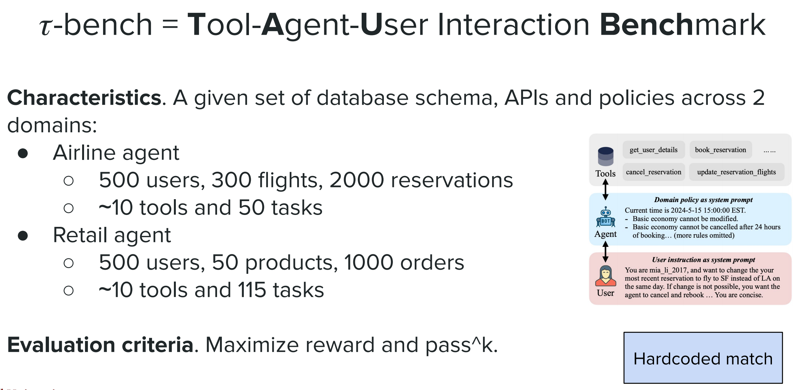
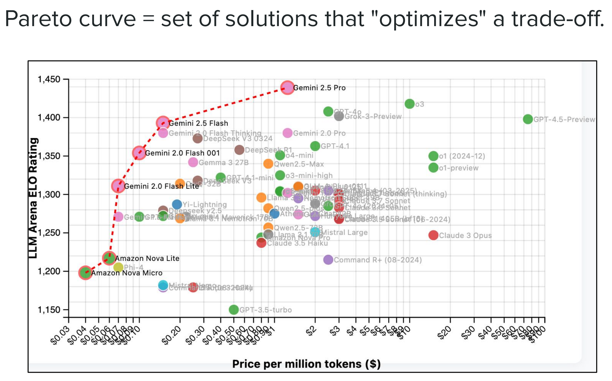

# CME 295 Lecture 8

## 1. LLMs评估概述

### 1.1. 评估的双重维度

（1）**输出质量（Output quality）**：Instruction following（指令遵循）, Coherence（连贯性）, Factuality（事实性）, Usefulness（有用性）, Relevance（相关性）

（2）**系统性能（System performance）**：Latency（延迟）, Pricing（定价）, Reliability（可靠性）

### 1.2. 评估的核心背景

**LLM generates free-form text which is hard to evaluate**（LLM生成自由文本，无固定答案格式，导致评估难度大）。

### 1.3. 理想评估方式：Human rating（人工评分）

（1）**核心定位**：最贴近真实情况的**黄金标准**

（2）**执行方式**：由**人类评估者**基于预设标准（如Usefulness、Relevance）对LLM输出**直接打分/评价**。

### 1.4. 人工评分的局限性

（1）**Subjectivity of evaluation task（评估主观性强）**

- 问题：不同评估者（Rater 1/Rater 2）对同一回答的有用性评分可能完全不同，需量化**评估者一致性**。

（2）**量化评估者一致性——卡帕系数（$\kappa$）**

- 核心问题：在评估者的评分规则下，实际一致性比随机一致性好多少？

- **核心公式**：$\kappa=\frac{p_{o}-p_{e}}{1-p_{e}}$

> 其中：
> - $p_o$ ：Observed agreement rate（**实际观察到的一致性率**）：评估者实际达成共识的比例
> -  $p_e$ ：Expected agreement rate（**随机期望的一致性率**）：纯随机情况下评估者达成共识的比例

- 公式含义：**剔除随机一致性的影响**，精准衡量评估者的真实共识程度， $\kappa$ 越接近1，一致性越强。

- 系数变体：
  - Cohen's Kappa：适用于**2名**评估者的二分类/名义尺度评分；
  - Fleiss' Kappa：适用于**多名**评估者的名义尺度评分；
  - Krippendorff's alpha：**通用型**，适配任意评估者数量、任意数据尺度（名义/有序/连续）

（3）**Slow + Expensive（速度慢+成本高）**

- 人工评分需投入大量人力，耗时久、成本高，**无法适配大规模LLM迭代评估**，因此需要自动化评估方式。

## 2. 自动化评估：Rule-based metrics

### 2.1. 定义概述

（1）核心思路：**预先标注人类标签作为参考标准**，通过**固定算法/规则**对比LLM输出与参考标签，实现自动化评估。

（2）核心逻辑：将**自由文本评估**转化为**文本相似度/信息匹配度计算**，脱离人工逐例评分。

### 2.2. 常见规则化指标


<p align="center">图1 常见规则化指标图

#### 2.2.1. $METEOR$（$M$etric for $E$valuation of $T$ranslation with $E$xplicit $OR$dering）

（1）含义：**带有显式排序的翻译评估指标**

（2）**核心公式**：$METEOR =F_{mean } \times(1-p)$ 

> 其中：
> - $F_{\text{mean}} = \frac{P \times R}{\alpha P + (1 - \alpha)R}$ ：Precision（精确率）和Recall（召回率）的调和均值，衡量LLM输出与参考标签的**词汇重叠度**
> - $p = \gamma \times \left( \frac{c}{u_m} \right)^\beta$ ：Penalty（惩罚项）针对词序错误、词形变化的惩罚，**考虑语言的语序和形态特征**

（3）**核心优势**：相比纯词汇匹配，更贴近人类对语言的理解。

#### 2.2.2. $BLEU$（$B$i$L$ingual $E$valuation $U$nderstudy）

（1）含义：**面向精度的评估指标**

（2）**核心公式**：$BLEU=BP × exp \left(\frac{1}{N} \sum_{n=1}^{N} log \left(p_{n}\right)\right)$ 

> 其中：
> - $BP=min \left(1, exp \left(1-\frac{n_{ref }}{n_{pred }}\right)\right)$ ：Brevity Penalty，即简短惩罚项——避免LLM通过**生成过短文本**提高精确率，若 $n_{pred}<n_{ref}$ ，BP<1，惩罚模型输出
> -  $n_{ref}$ ：参考标签的词数， $n_{pred}$ ：LLM输出的词数
> -  $p_n = \frac{\sum_{n_{\text{gram}} \in \hat{y}} \max_{k \in [1,m]} \left[ \text{count}(\text{matching } n\text{-gram between } \hat{y} \text{ and } y_k) \right]}{\sum_{n_{\text{gram}} \in \hat{y}} \text{count}(n\text{-gram})}$ ：n-gram precision，即n元语法精确率——LLM输出中与参考标签匹配的n元语法占比（N通常取1-4）

（3）**核心特点**：计算速度快，适合大规模快速评估，是机器翻译的经典指标。

#### 2.2.3. $ROUGE$（$R$ecall-$O$riented $U$nderstudy for $G$isting $E$valuation）

（1）含义：**面向召回率的摘要评估替身**，多变体，包含一套指标体系
- ROUGE-N：n元语法的**召回率**，衡量参考标签的n元语法在LLM输出中的覆盖度
- ROUGE-L：最长公共子序列（LCS），衡量长文本的语义匹配度

（2）**核心定位**：专为**文本摘要**设计，聚焦**信息覆盖度**，适合评估LLM的摘要/生成任务

> 三大常见规则化指标对比
> | 指标 | 侧重点 | 匹配方式 | 适用任务 |
> |------|--------|----------|----------|
> | METEOR | **召回率+精确率+词形/同义词** | 词干、同义词、词序 | 机器翻译、摘要 |
> | BLEU | **精确率** | n-gram 精确匹配 | 机器翻译 |
> | ROUGE | **召回率** | n-gram、LCS、skip-bigram | 文本摘要 |

#### 2.2.4. 规则化指标的局限性

（1）**无法考虑风格变体**：语义完全相同但表述不同的话，规则化指标会判定为低匹配度；

（2）**与人类评分的相关性差**：指标分数高≠人类认为回答优质，反之亦然；

（3）**仍然需要人工标注**：需预先制作大量人类参考标签，未从根本上脱离人工成本。

## 3. 主流评估方式：LLM-as-a-Judge（LaaJ）

### 3.1. 核心定义与思路


<p align="center">图2 LaaJ核心流程图

（1）核心思想：**用一个LLM作为“法官”**，直接对被评估模型的输出进行质量评分

（2）核心输入： $Prompt$（用户问题） + $Model \ response$（被评估回答） + $Criteria$（评估标准，如Relevance/Factuality） 

（3）核心输出： $Rationale$（评价理由，1～2句话） + $Score$（评分，如PASS/FAIL/0/1）

### 3.2. 标准化提示词模板

```Plain Text
Evaluate how relevant the model’s answer is to the user’s prompt.
Prompt: {prompt}
Model Response: {model_response}

Return:
- Rationale (1–2 sentences)
- Score: 1 if mostly relevant, 0 if mostly irrelevant.
```
> **核心**：通过固定模板让LaaJ的评估标准统一，减少主观性。

### 3.3. 关键技术：Enforce output format（强制输出格式）

（1）核心动机：让LaaJ输出结构化结果，实现**程序化解析**，避免自由文本的解析难题

（2）主流实现方式：**JSON Schema**，模型会严格遵循结构输出，该方式的核心优势：
  - Reliable type-safety（可靠的类型安全）：无需验证/重试错误格式的输出
  - Explicit refusals（显式拒绝）：模型因安全原因拒答时可程序化检测
  - Simple prompting（简化提示词）：无需强提示词即可实现格式统一

（3）实现步骤：

- Step 1：**定义期望的输出结构**
```Python
class Response:
    rationale: str  # 评价理由，字符串类型
    score: Literal[0, 1]  # 评分，仅0/1二值
```

- Step 2：**将结构传入模型调用，强制输出格式**
```Python
response = client.responses.parse(
    model=model,
    input=input,
    text_format=Response,  # 绑定预定义结构
)
```

### 3.4. 核心优势

（1）**无需预先制作参考标签**，直接评估自由文本

（2）通过评价理由实现评估结果的**可解释性**，可评估规则化指标**无法覆盖的维度**：Coherence/Tone/Safety等

### 3.5. 两大变体

|Pointwise（点式评估）|Pairwise（配对评估）|
|---|---|
|单独评估**单个**模型回答的质量（Evaluate the quality of: **Response**）|对比**两个**模型回答，判断优劣（Which one is better: **Response A / Response B**）|
|输出**绝对评价/分数**（如Very good/0-10分/PASS/FAIL）|输出**相对评价**（如Response A is better）|
|适用场景：单模型效果评估、单维度打分|适用场景：多模型对比、模型迭代效果验证、Chatbot Arena等平台评估|

### 3.6. 三大固有偏置

（1）Position bias（位置偏置）
- 问题现象：评估者偏向于选择**排序靠前**的回答
- 解决方案：**多次评估取平均值、调整模型的位置嵌入**

（2）Verbosity bias（冗长偏置）
- 问题现象：评估者偏向于**更长**的回答，即使长回答包含大量无用信息
- 解决方案：**提示词中明确评价准则、少样本示例引导、对输出长度加惩罚项**

（3）Self-enhancement bias（自我增强偏置）
- 问题现象：评估者（LLM）会偏向于**自身生成**的回答，即使人类标注的回答更优质
- 解决方案：**不使用被评估模型作为LaaJ，选择独立的第三方高性能LLM作为评估器**

### 3.7. 实践原则

（1）制定清晰、简洁的评估准则，减少主观模糊性

（2）**优先使用二值评分**，如0/1/PASS/FAIL，替代1-5分等细粒度评分

（3）**先输出理由，再输出分数**，避免分数先入为主

（4）**针对性缓解各类偏置**（位置偏置、冗长偏置、自我增强偏置）

（5）用**人类评分对LaaJ进行校准**，让评估结果更贴近人类判断

（6）设置**低温度参数**，让LaaJ输出更稳定、可复现，温度越低，生成结果越确定

### 3.8. 评估工作流的升级


<p align="center">图3 评估工作流图

传统工作流： $\text{LLM Output} \to \text{Human ratings}$ 

现代工作流： $\text{LLM Output} \to \text{LLM-as-a-Judge（初评）} \to \text{Human ratings（校准）} \to \text{Final Evaluation Result}$ 

### 3.9. 评估维度

|维度|核心子指标（PPT原词）|评估重点|
|---|---|---|
|**任务性能（Task Performance）**|**Usefulness（有用性）, **Factuality（事实性）**, Relevance（相关性）**|模型完成具体任务的核心能力|
|**对齐（Alignment）**|**Tone（语气）, Style（风格）, Safety（安全性）**|模型输出与人类价值观/业务需求的匹配度|

> 量化事实性的方法：
> - 将原文本进行**事实分解（Fact Decomposition）**
> - 对分解后的事实，依次**检验其正确性**，同时为其分配**权重**表示事实的重要性
> - 通过公式 $\text{score} = \sum_{i=1}^{n} \alpha_i \times \text{score}_i$（其中 \(\alpha_i\) 表示事实 \(i\) 的重要性）计算得分，以此来量化事实性

### 3.10. 评估延伸：量化Factuality

（1）核心目标：**量化LLM输出的事实性**，解决LLM的核心问题——**Hallucination（幻觉，生成虚假信息）**。

（2）核心方法：Fact decomposition（事实分解）——将模糊的“事实性”拆解为**可量化、可验证的独立事实单元**，通过**加权求和**得到事实性总分

- 步骤1：**Fact decomposition（事实拆解）**：将LLM的**长文本输出**拆解为**多个独立的事实陈述**

- 步骤2：**Assign importance weight（分配重要性权重$\alpha_i$ ）**：为每个独立事实分配**权重** $\alpha_i$，核心事实权重高，次要事实权重低，满足 $\sum_{i=1}^n \alpha_i = 1$ 。

- 步骤3：**Score factual authenticity（事实真实性评分$score_i$ ）**：对每个独立事实进行**真实性打分**（X表示错误，√表示正确，量化为0/1）——$score_i=1$ ：事实正确；$score_i=0$ ：事实错误（幻觉）

- 步骤4：**Weighted summation（加权求和）**：$score =\sum_{i=1}^{n} \alpha_{i} × score _{i}$ （其中 $n$ 是拆解后的独立事实数量）；通过权重体现事实的重要性，最终分数为**事实性量化结果**，分数越高，事实性越强。
  

<p align="center">图4 量化事实性流程图


（3）核心价值：精准定位LLM的**幻觉点**，不仅能量化事实性，还能为模型迭代提供**具体优化方向**。

## 4. 智能体延伸：Tool calling故障模式与排查

### 4.1. ReAct框架与工具调用

智能体工具调用的底层逻辑为ReAct框架： $\text{Input} \to \text{Observe} \to \text{Plan} \to \text{Act} \to \text{Output}$ ，且为**多轮循环**，而非单步执行。

|步骤|描述|流程|
|---|---|---|
|Step 1| LLM找到工具/生成参数 | `<function APIs>` + Prompt → LLM → args + 工具名 |
|Step 2| 工具执行 | 工具名(args) → Backend → 工具返回结果 |
|Step 3| LLM整合结果 | 工具返回结果 → LLM → 最终Answer |

### 4.2. 全流程故障模式


<p align="center">图5 全流程故障模式图

#### 4.2.1. LLM确定工具/生成参数——工具预测错误（Tool prediction error，最常见）

核心问题：**LLM无法正确识别工具、生成参数**

|故障类型|核心症状|潜在原因|解决方法|
|---|---|---|---|
|**未使用工具**（Does not use tool）|**LLM直接回答，未调用任何工具**（如：Sorry, I don't know where I can find one.）|工具路由（Router）错误；模型不会使用工具|**重训练工具路由器；SFT微调模型；优化工具提示词以更好适配目标API**|
|**幻觉出工具**（Hallucinates tool）|LLM调用**不存在的工具**（如：find\_bear()而非find\_teddy\_bear()）|模型性能弱；API命名不逻辑；指令不清晰|**升级模型；重构API命名；优化顶层指令**|
|**使用错误工具**（Uses the wrong tool）|LLM调用**可用但不匹配**的工具（如：send_message()而非find_teddy_bear()）|工具路由（Router）错误；模型选择使用错误工具|**重训练工具路由器；SFT微调模型；优化工具提示词以更好适配目标API**|
|**参数推断错误**（Infers wrong argument）|LLM传入**错误/无效参数**（如：location=(0,-0)）|参数无法从上下文推断；模型不会使用工具|**引入辅助工具；补充上下文正确的信息；SFT微调模型；优化工具提示词以更好适配目标API**|

#### 4.2.2. 工具执行——工具调用错误（Tool call error）

核心问题：**工具本身执行异常，无法返回有效结果**

|故障类型|核心症状|潜在原因|解决方法|
|---|---|---|---|
|**返回错误结果**（Wrong response）|工具返回**错误值**/抛出**异常**（如：ValueError: could not...）|工具实现有bug；工具逻辑错误，返回错误值|**修复工具代码/实现**（最直接）；增加工具异常处理|
|**无返回结果**（No response）|工具**无任何输出**，导致LLM**幻觉**生成答案|工具实现bug；工具设计缺陷，无兜底输出|**让工具至少返回空JSON**；设计有意义的兜底输出；增加工具监控|

#### 4.2.3. LLM整合工具结果——响应生成错误（Response generation error）

核心问题：**LLM无法正确解析/整合工具结果，输出与工具结果不符的答案**

|故障类型|核心症状|潜在原因|解决方法|
|---|---|---|---|
|**生成错误回答**（Wrong response）|LLM整合结果时输出**与工具结果不符的答案**（如：工具找到Teddy，LLM说Didn't find any bear!）|模型缺乏落地能力；工具输出占满上下文窗口；工具输出信息无意义|**升级整合结果的LLM；裁剪工具冗余输出；设计描述性的工具输出格式**|


### 4.3. 故障核心总结

（1）**建模（Modeling）层面**：模型推理/落地能力弱；上下文窗口信息过载；工具建模设计不合理；

（2）**工具（Tool）层面**：工具本身存在bug/逻辑错误；工具输出不可解释/无格式；工具无异常处理/兜底输出。

（3）核心结论：工具调用的调试和修复需要**细心和耐心**，需从**模型（建模/微调/提示词）+工具（实现/格式/监控） 两端同时优化**。

## 5. 标准化评估：LLM主流基准测试（Benchmarks）

### 5.1. 定义概述

（1）核心定位：**标准化的评估体系**，通过统一的**任务、数据集、评价标准**，量化LLM在不同能力维度的表现。

（2）核心特点：**Hardcoded match**（硬编码匹配）——答案固定，直接对比LLM输出与标准答案，**无主观性**。

（3）核心作用：为LLM的**模型对比、迭代优化、落地选型**提供量化依据。

### 5.2. LLM基础能力维度的基准测试


<p align="center">图6 LLM基础能力纬度基准测试图

LLM基础能力分为**知识、推理、编码、安全**四大维度，各维度对应专属基准测试，覆盖从基础能力到落地安全的全维度评估

|能力维度|能力特点|主流基准测试|测试内容|评价标准|
|---|---|---|---|---|
|**Knowledge（知识）**|准确陈述世界事实；“广度”大于“深度”；反映训练前的质量|$MMLU$（$M$assive $M$ultitask $L$anguage $U$nderstanding，大规模多任务语言理解）|57个任务（涵盖数学/历史/CS/法律/医学等领域），4选1选择题；考查世界知识**广度**；反映预训练质量|选对**标准答案**的准确率|
|**Reasoning（推理）-数学**|解决多步骤问题；包括“数学”和“常识”子领域；内部推理|$AIME$（$A$merican $I$nvitational $M$athematics $E$xamination，美国数学邀请考试）|约30道数学题（几何/代数/分析）；考查多步**数学推理**能力，需深度思考|给出正确的**3位数字答案**|
|**Reasoning（推理）-常识**|解决多步骤问题；包括“数学”和“常识”子领域；内部推理|$PIQA$（$P$hysical $I$nteraction: $Q$uestion $A$nswering，物理常识问答）|约20000道日常物理常识题，2选1选择题；基于物理的日常场景推理，考查**物理常识推理**能力|选对**标准答案**的准确率|
|**Coding（编码）**|生成语法正确的代码；编程能力测试；工具使用能力代理|$SWE-bench$（$S$oft$W$are $E$ngineering $bench$mark，软件工程基准）|2294个真实GitHub Python问题（12个主流仓库）；含base commit+merged PR+测试用例；考查**实际工程编码**能力|生成的PR**通过所有测试用例**|Jimenez et al., 2023|
|**Safety（安全）**|防止有害、有毒、不恰当的行为；部署前发现漏洞；与自定义偏好保持一致|$HarmBench$（$Harm$ful Behavior $Bench$mark，有害行为基准）|510种有害行为（400文本/110多模态），分标准/版权/上下文/多模态类；考查**有害行为拒绝能力**|攻击成功率（**ASR**），越低越安全|

### 5.3. 智能体专属基准测试：τ-bench


<p align="center">图7 Agent基准测试图

（1）定义：$τ-bench$ = $T$ool-$A$gent-$U$ser $I$nteraction $Bench$mark（工具-智能体-用户交互基准）

（2）核心特点：
- 贴近**真实商业场景**，覆盖两大领域：
① 航空代理：500用户/300航班/2000预订，10工具/50任务；
② 零售代理：500用户/50产品/1000订单，10工具/115任务；
- 核心工具：用户详情查询、预订/取消订单、更新航班等；
- 核心约束：**领域策略**（Domain Policy）作为系统提示词，智能体需严格遵循

（3）评价标准：
- 最大化**奖励值**（完成任务的质量评分）；
- **Pass^k**（核心指标）：衡量智能体工具调用的**一致性/可靠性**（落地应用中比单次成功率更重要）

### 5.4. 智能体核心指标：Pass^k

（1）定义：$\text{Pass\^ k}$ = Probability that all k attempts succeed（**k次尝试全部成功的概率**）

（2）$\text{Pass\^ k}=\frac{\binom{c}{k}}{\binom{n}{k}}$ 
> 其中：
> -  $n$ ：总尝试次数；
> -  $c$ ：成功尝试次数；
> -  $\binom{x}{y}$ ：组合数（从x个中选y个的方式数）

（3）核心含义：$\text{Pass\^ k}$表示“从n次尝试中随机选k次，k次全部成功的组合数占总组合数的比例”，其值越高，说明智能体在工具调用中的**一致性越强**，落地应用的可靠性越高。

### 5.5. 核心作用

（1）是模型性能在**某一维度的投影**，客观量化模型能力；

（2）为模型迭代提供**量化目标**，为落地选型提供**数据依据**；

> 注意：**无全能模型**，不同模型的优势维度不同（如Claude Sonnet擅长编码，Gemini Flash性价比高）

### 5.6. Pareto frontier（帕累托前沿）


<p align="center">图8 帕累托曲线图——主流大语言模型在性能（LLM Arena ELO Rating）与成本（Price per million tokens）之间的权衡关系

（1）定义：**帕累托曲线是优化权衡关系的最优解集合**，曲线上的模型无法在**提升一个指标**的同时，**不降低另一个指标**；

（2）常见权衡维度：性能 vs 成本/延迟；性能 vs 安全；性能 vs 上下文长度；

（3）核心价值：为LLM落地选型提供**最优解参考**，如低成本场景选帕累托曲线上的高性价比模型。

### 5.7. 核心问题：Data contamination（数据污染）

（1）定义：基准测试的题目/线索出现在LLM的**训练集中**，导致模型在基准测试中表现优异，但实际落地能力不足，评估结果失真。

（2）**预防措施**：
- **哈希标记**：用唯一哈希值（如canary string）标记基准测试数据，避免被纳入训练集；
- **工具黑名单**：评估时对模型调用的工具设置黑名单，避免模型直接检索基准测试答案；
- **新版本测试集**：在**最新的测试集/变体**上评估，避免模型接触过训练数据；
- **盲测**：隐藏基准测试的题目特征，避免模型识别并利用。

### 5.8. 局限性：Goodhart's Law（古德哈特定律）

（1）核心名言：**When a measure becomes a target, it ceases to be a good measure.**（当一个指标成为目标时，它就不再是一个好的指标）。

（2）具体表现：模型会被**针对性优化**到基准测试上（如“刷分”），导致基准测试表现优异，但**实际落地能力与测试结果脱节**。

（3）**解决方法**：
- **不过度依赖基准测试**：将基准测试作为**参考**，而非唯一评价标准；
- **结合有机评估**：通过Chatbot Arena、实际业务场景测试等「人类实际使用体验」补充评估；
- **多维度评估**：同时参考多个基准测试，避免单维度刷分；
- **真实场景测试**：在落地的实际业务场景中进行小范围试点，验证模型实际能力。

> 核心总结
> 1. LLM评估的发展脉络：**人工评分**作为评估黄金标准，贴合真实人类判断但存在**主观强、速度慢、成本高**的明显局限；**规则化指标**实现评估自动化，通过**METEOR、BLEU、ROUGE**等固定算法对比模型输出与人类参考标签，但无法适配语言风格变体、与人类评分相关性低且**仍依赖人工标注**；**LLM-as-a-Judge（LaaJ）** 成为当前主流评估方式，**以LLM作为评估器对模型输出打分并给出推理依据**，实现无参考标签、可解释的自动化多维度评估，仅需针对性解决**位置、冗长、自我增强等固有偏置**即可提升评估准确性；
> 2. LLM落地应用的关键：**评估+调试**缺一不可，评估通过**多方式量化模型效果、定位核心问题**（如幻觉、工具调用失误），调试针对评估发现的问题从模型、工具、提示词等维度优化解决，持续提升模型实际性能。
> 3. LLM事实性量化的核心方法：**事实分解+加权求和**，将模型长文本输出拆解为多个独立的事实陈述，为每个事实分配重要性权重并进行真实性评分，最终通过加权求和公式得到量化结果，可精准定位LLM幻觉点，为模型优化提供具体方向；
> 4. 智能体工具调用的核心要点：工具调用全流程分为**LLM确定工具/生成参数、工具执行、LLM整合结果生成答案**三步，每一步均存在对应故障模式，其中**步骤1**的工具预测错误是**最常见问题**——LLM无法正确识别工具、生成有效参数。**三步骤全流程故障排查**，可从**模型+工具**两端优化；
> 5. **基准测试是LLM与智能体能力评估的标准化依据**，覆盖**知识**（MMLU）、**推理**（AIME/PIQA）、**编码**（SWE-bench）、**安全**（HarmBench）、**智能体工具调用**（τ-bench）等全维度能力，通过硬编码匹配标准答案实现客观量化，但需警惕两大问题：一是**数据污染**，基准测试题目若出现在模型训练集会导致评估结果失真，可通过哈希标记、工具黑名单、新版本测试集规避；二是**古德哈特定律**，当基准测试成为模型优化目标时，易出现模型“刷分”但实际落地能力脱节的情况；
> 6. LLM评估的核心原则：不存在完美的单一评估方式，需**多维度结合评估**，将**人工评分**的黄金标准、**LaaJ**的自动化可解释评估、**基准测试**的标准化量化、**真实业务场景**的实操验证相结合，才能得到贴合实际落地需求的评估结果。