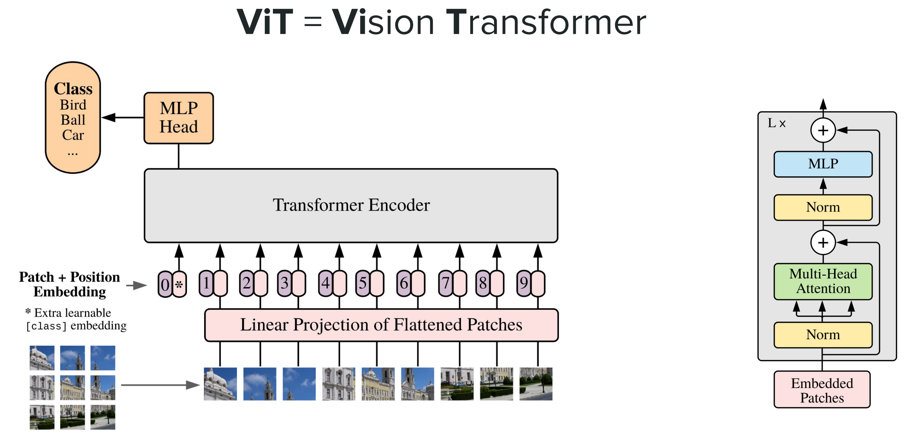
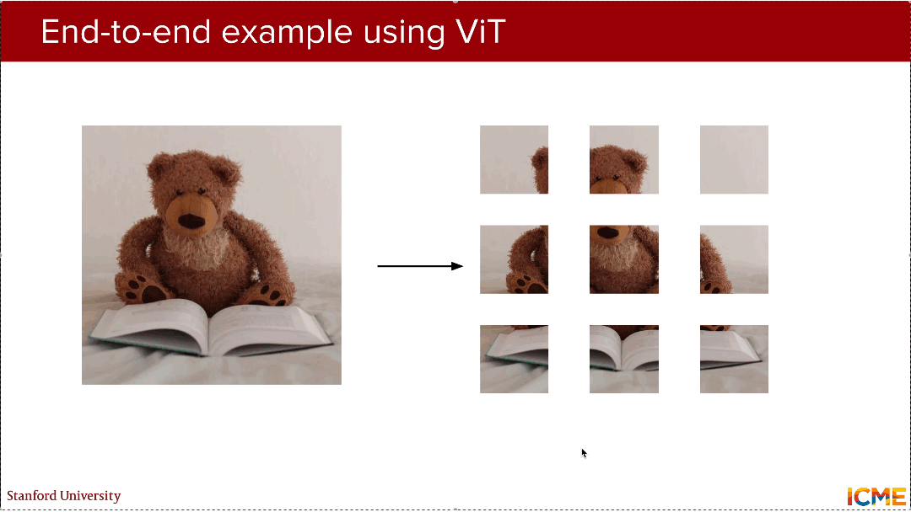
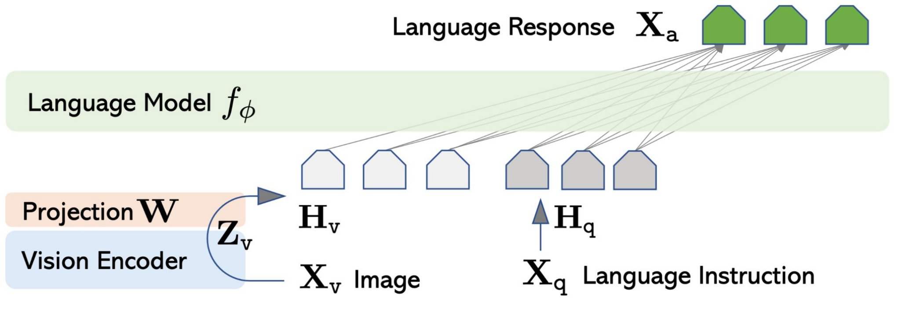
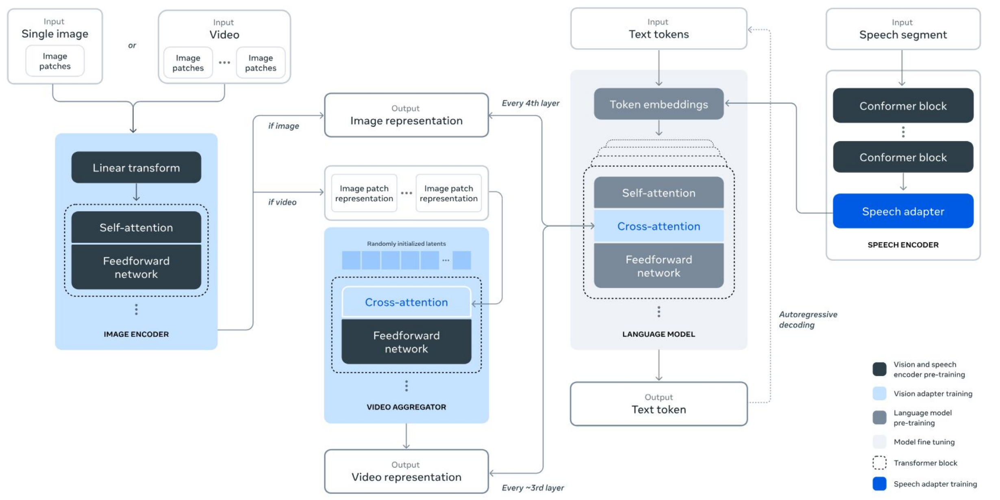
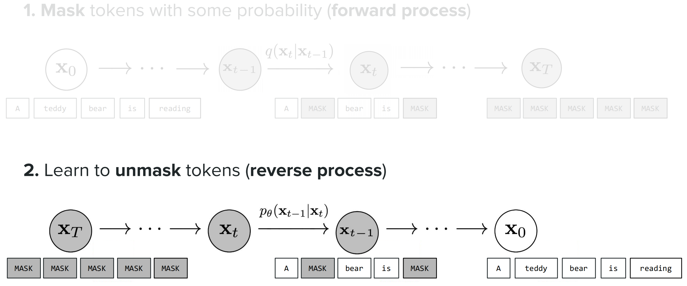
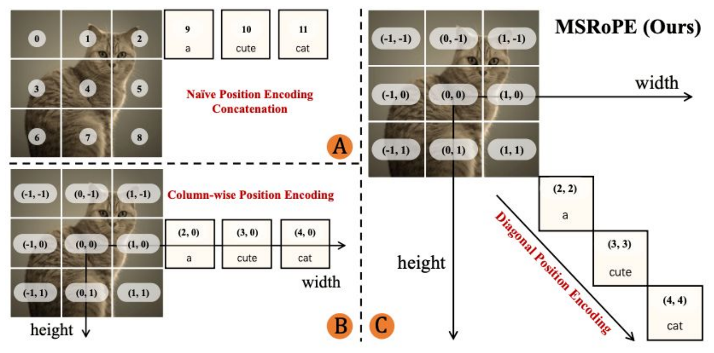
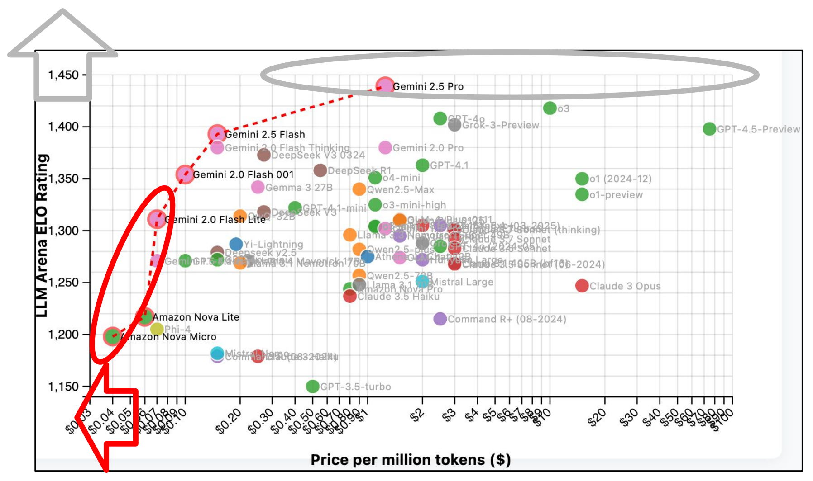
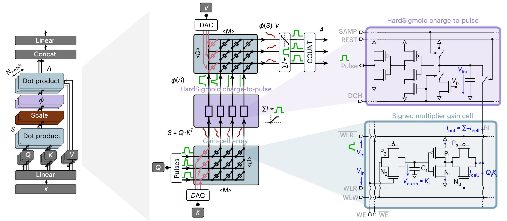

# CME 295 Lecture 9

## 1. Transformer的多模态泛化

### 1.1. 核心前提：Transformer的泛化本质

（1）**核心属性**：**弱归纳偏置** + QKV**自注意力机制**的强关联捕捉能力；

（2）**泛化逻辑**：任何模态数据，只要能转化为**离散Token/连续特征向量**并赋予**位置信息**，即可通过Transformer进行特征建模；

（3）行业现状：Transformer已从“文本专属架构”升级为**多模态统一基础架构**。

### 1.2. 视觉领域适配：$ViT$（$Vi$sion $T$ransformer，视觉Transformer）

#### 1.2.1. 核心改造：图像“文本化”建模

图1 ViT核心流程图

（1）**图像预处理**：将**H×W×C**的图像切割为N个**固定大小的Patch**（如16×16），其中**图像处理Patch ↔ 文本分词Token**

（2）**特征嵌入**：对每个Patch做**线性投影**（Linear Projection of Flattened Patches）；叠加**二维位置嵌入**（Positional Embedding）；增加**可学习的[CLS]嵌入**，其中**Patch投影 + 位置嵌入 + [CLS] ↔ 词嵌入 + 位置编码 + 文本分类标记**

（3）**特征编码**：送入**标准Transformer Encoder**（**编码器**——多层自注意力+前馈网络），其中**图像Encoder与文本Encoder完全一致**

（4）**任务输出**：提取[CLS]嵌入的输出，送入**全连接层**做分类，其中[CLS]输出 ↔ 文本分类的核心特征

#### 1.2.2. 核心案例：泰迪熊图像识别

图2 ViT核心案例流程图

（1）**输入**：泰迪熊彩色图像 → 切割为若干16×16 Patch；

（2）**编码**：Patch投影+位置嵌入+[CLS] → 进入6层Transformer Encoder；

（3）**输出**：[CLS]特征经过FFN，最终分类为“teddy bear”。

### 1.3. 跨模态核心：$VLM$（$V$ision $L$anguage $M$odel）

#### 1.3.1. 主流实现架构

（1）**LLM解码器复用型**：

图3 LLM解码器复用型流程图

- 流程：视觉编码器（ViT）→ **视觉特征投影层（映射到LLM词嵌入空间）** → 纯文本LLM解码器生成回答
- 优势：**复用成熟LLM权重，开发成本低**
- 应用：LLaMA 3 7B 多模态版（轻量型）

（2）**交叉注意力融合型**：

图4 交叉注意力融合型图

- 流程：视觉编码器（ViT）生成特征 → **LLM解码器新增交叉注意力层**（文本Query关注视觉Key/Value）→ 特征交互后生成回答
- 优势：**视觉-文本特征深度融合，效果更优**
- 应用：GPT-4V、Gemini Pro Vision

#### 1.3.2 核心关键：模态空间对齐

（1）核心难题：**视觉**特征的维度、分布与**文本**Token嵌入空间存在差异；

（2）解决方案：通过**可学习的投影矩阵**（Projection Matrix），将视觉特征向量**映射到与LLM一致的高维嵌入空间**。

### 1.4 Transformer的全模态适配

| 模态类型 | 核心处理方式 | 代表模型/架构 |
|-----|-----|-----|
| 视频 | **帧级切块 + 时空位置嵌入**（时间步+空间位置） | Video Transformer |
| 语音 | **Conformer块**（Transformer + CNN）做语音编码 → **跨注意力融合LLM** | Whisper、SpeechLLM |
| 推荐系统 | 用户/物品作为Token，**自注意力**捕捉用户-物品、物品-物品关联 | TransRec |
| 代码生成 | 代码语法结构转化为Token，**自注意力**捕捉上下文逻辑 | CodeLlama |

## 2. 扩散LLMs：Diffusion LLMs

### 2.1. 背景：传统自回归LLM的缺陷

（1）自回归生成范式：$ARM$，$A$uto$R$egressive $M$odeling

（2）生成逻辑：从[BOS]开始，基于前 t-1 个Token，逐一生成第 t 个Token，即 $p(x_t | x_1, x_2, ..., x_{t-1})$，直至生成[EOS]。

（3）核心瓶颈：**推理阶段完全无法并行**（下一个Token的生成依赖上一个Token的输出），导致长文本生成**延迟极高**。

（4）工业界痛点：即使采用Tensor Parallel、Pipeline Parallel等并行策略，ARM模型的推理速度仍**受限于“逐Token生成”的本质**；长文本生成、代码生成等场景，**等待时间**成为用户体验的核心障碍。

### 2.2. 扩散模型的核心原理（从图像到文本的迁移）

#### 2.2.1. 图像扩散模型

图5 图像扩散模型流程图

（1）**前向过程（加噪）**：对原始图像$x_0$，按固定步数T逐步添加**高斯噪声**，满足条件概率 $q(x_t | x_{t-1}) = \mathcal{N}(x_t; \sqrt{1-\beta_t}x_{t-1}, \beta_t \mathbf{I})$，最终得到**完全噪声图$x_T$**；

（2）**逆向过程（去噪）**：训练模型$p_\theta(x_{t-1} | x_t)$，学习从噪声图$x_T$逐步去噪，**还原原始图像$x_0$**；

（3）核心直觉：噪声采样简单，模型仅需学习“**去噪的条件分布**”。

#### 2.2.2 文本扩散模型：$MDM$（$M$asked $D$iffusion $M$odel）

由于文本是**离散型数据**，无法直接添加高斯噪声，预测采用“**掩码替代加噪**”的核心改造：

图6 文本扩散模型MDM流程图

（1）**前向过程（掩码）**：对原始文本序列$x_0$，按**步数T**逐步以**概率$\gamma_t$掩码Token**（替换为[MASK]），最终得到**全掩码序列$x_T$**；满足数学公式：$q(x_t | x_{t-1}) = \prod_{i=1}^N p(x_{t,i} | x_{t-1,i})$，其中$x_{t,i}$为第 t 步第 i 个Token

（2）**逆向过程（解掩码）**：训练模型$p_\theta(x_{t-1} | x_t, t)$，从全掩码序列$x_T$开始，**逐步预测并替换[MASK]**，最终**还原$x_0$**；满足数学公式：$p_\theta(x_{0:T}) = p(x_T) \prod_{t=T}^1 p_\theta(x_{t-1} | x_t)$ 

### 2.3. 扩散LLMs的优势与挑战

#### 2.3.1. 核心优势

（1）**并行推理**：解码过程仅需**T步前向传播**（T远小于序列长度N），所有Token可同步生成，彻底解决ARM的并行性问题；

（2）**全局上下文捕捉**：生成过程依赖**完整的掩码序列**，对长文本、代码等需要“**全局逻辑**”的任务更友好；

（3）**低延迟**：相较于ARM，Diffusion LLMs每秒可输出**10倍的Tokens数量**。

#### 2.3.2. 现存挑战

（1）**性能差距**：在常识问答、逻辑推理等任务上，效果仍比最优ARM模型**稍低**；

（2）**技巧迁移**：ARM模型的**成熟优化技巧**（RoPE、GQA、MoE）尚未完全适配到Diffusion LLMs；

（3）**超参数敏感**：步数T、掩码概率$\gamma_t$等超参数对效果影响极大，**缺乏统一的调优标准**。

## 3. 跨模态技术交叉融合

### 3.1. 核心定义

不同模态的AI技术（图像、文本、语音等）相互借鉴**架构设计、输入表示、工程技巧**，实现性能突破，即“技术交叉授粉”。

### 3.2. 核心交叉方向

（1）**架构层面的交叉**：
- **图像→文本**：扩散模型的“**加噪-去噪**”架构迁移到文本，诞生**Diffusion LLMs**；
- **文本→图像**：Transformer的**自注意力架构**迁移到图像扩散，诞生**DiT（Diffusion Transformer）**，即用**Transformer Block**替代传统U-Net的卷积层，结合**时序步长t和生成标签y**做条件生成，提升图像生成质量。

图7 DiT流程图

（2）**输入表示层面的交叉**
- **文本→视觉**：借鉴**文本“特征压缩”** 思路，优化视觉输入的表示效率；如DeepSeek-OCR提出**上下文光学压缩**，将复杂的视觉文本特征压缩为高效Token，提升VLM的推理速度。

（3）**工程技巧层面的交叉**
- **文本→多模态**：将文本的**位置编码技巧**适配到图像/视频的二维/三维空间；如Qwen-Image提出的**MSRoPE（多模态可扩展旋转位置编码）**：针对图像的二维结构，将RoPE从一维扩展为**二维（行+列）**；支持任意分辨率的图像输入，解决传统位置编码的分辨率限制问题。

图8 MSRoPE流程图

## 4. LLM基础研究与发展趋势

### 4.1. 基础研究：Transformer核心设计的“最优解探索”

Transformer的核心组件尚未有**统一最优解**，仍是研究的核心方向：

| 组件类型 | 主流方案 | 新型方案 | 研究焦点 |
|----------|----------|----------|----------|
| 优化器 | AdamW | MuonClip | 收敛速度、稳定性、显存占用 |
| 归一化层 | LayerNorm（Pre-LN） | RMSNorm | 训练稳定性、推理速度 |
| 注意力机制 | MHA | MQA、GQA | 计算效率与表达能力的平衡 |
| 激活函数 | RELU | GELU、SwiGLU、Mish | 非线性表达能力、计算成本 |
| 模型架构 | 稠密模型 | MoE（混合专家模型） | 参数量效率、任务适配性 |

**数据层面的核心挑战：递归诅咒**

- 核心结论：使用LLM生成的数据训练新模型，会导致**模型“遗忘”真实世界知识**，出现**性能退化、幻觉增多**等问题；
- 行业对策：优先采用**人类标注的高质量真实数据**，严格控制生成数据的使用比例。

### 4.2. 优化目标：从“极致性能”到“性能-成本帕累托前沿”

图9 LLMs性能-成本帕累托前沿曲线

- 2025年前：追求“更大参数量、更高算力、更好效果”；
- 2025年起：工业界与学术界共同追求“**效果最优、成本最低”的帕累托最优解**。

### 4.3. 硬件层面：Transformer定制化硬件优化

#### 4.3.1. 现有GPU的核心痛点

（1）GPU设计初衷：**为矩阵-矩阵、矩阵-向量运算优化**；

（2）Transformer瓶颈：**注意力机制的KV缓存读写成本远高于计算成本**，**内存移动**成为性能瓶颈。

#### 4.3.2. 类存内计算（Analog in-memory computing）

（1）核心设计：
- **专用KV缓存单元**：将注意力机制的**Key、Value缓存**存储在专用模拟存储单元，减少CPU-GPU之间的内存移动；
- **模拟信号计算**：用**模拟信号直接建模注意力的相似度计算**（$Q \cdot K^T$），替代传统数字计算；

图10 类存内计算流程图

（2）实测对比（与英伟达H100相比）：推理延迟降低100倍；能耗节省70000倍；

（3）应用前景：解决大模型推理的“**高成本、高能耗**”问题，推动LLM边缘端落地。

## 5. LLMs的应用场景与未来展望

### 5.1. 当下核心应用

（1）**代码开发**：代码生成、Bug调试、文本转SQL、API调用生成；

（2）**通用对话助手**：常识问答、信息检索、多轮对话；

（3）**创意内容生成**：营销文案、小说创作、绘画提示词、视频脚本；

（4）**教育与科研**：知识点讲解、论文润色、实验数据处理、文献综述生成。

### 5.2. 未来发展趋势

#### 5.2.1. 短期趋势（1-3年）

（1）**智能体民主化**：**AI智能体**集成到办公软件（如Google Workspace Studio），自然语言描述任务即可自动完成；

（2）**LLM与浏览器深度融合**：**内置到浏览器内核**（如ChatGPT Atlas），实现网页内容总结、智能搜索、自动填表、跨网站任务执行；

（3）**操作系统级LLM**：将LLM作为**操作系统的“核心交互层”**，自然语言替代鼠标/键盘，实现“语音/文字控制全系统”。

#### 5.2.2. 长期愿景（3-10年）

（1）**自治智能体规模化应用**：具备“**自主决策、责任承担**”能力的AI，独立完成复杂工业任务（如工厂调度、医疗诊断）；

（2）**全场景智能客服落地**：彻底替代传统人工客服，实现“7×24小时、个性化、高准确率”的客户服务。

### 5.3. 尚未解决的核心挑战

（1）**技术挑战**：限制工业级关键任务落地（如医疗、金融）
- 固定权重，无持续学习能力；
- **幻觉**问题（生成虚假信息）；
- **可解释性差**（黑箱模型）；
- 个性化适配不足。

（2）**伦理挑战**：需政策法规与技术手段双重约束
- **安全与对齐**（生成有害内容）；
- **数据隐私**（训练数据泄露）；
- 就业冲击（部分岗位替代）。

## 6. 前沿科研方法
### 6.1. 论文渠道（核心信息源）
1. **预印本平台**：arXiv（计算机科学→cs.CL方向），最快获取最新研究（提前顶会3-6个月）；
2. **顶会会议**：
   - 通用机器学习顶会：NeurIPS、ICML、ICLR（含LLM基础研究）；
   - 自然语言处理顶会：ACL、EMNLP、NAACL（含LLM核心应用）。

### 6.2. 代码渠道（工程实践必备）
1. **官方代码库**：论文作者的GitHub仓库（获取最权威的复现代码）；
2. **开源社区**：Hugging Face（Transformers库、Datasets库、Model Hub），实时更新最新模型与数据集。

### 6.3. 资讯与学习渠道（高效跟进）
| 渠道类型 | 推荐平台/博主 | 核心内容 |
|----------|---------------|----------|
| 社交平台 | Twitter（X） | 领域学者实时分享研究进展（如Andrej Karpathy、Yann LeCun） |
| 视频平台 | YouTube | Two Minute Papers（论文速览）、Yannic Kilcher（论文精读）、Google Developers（实战教程） |
| 技术博客 | Amazon Science、Google DeepMind、Meta AI、斯坦福NLP | 工业界最新落地成果与技术解读 |

> 核心总结
> 1. **Transformer多模态适配**核心：依托**弱归纳偏置+QKV自注意力**的核心特性，将任意模态数据转化为**离散Token/特征向量+位置信息**，即可实现文本、图像、语音、视频等**多模态的统一建模**，是其成为通用AI架构的关键；
> 2. **视觉与跨模态建模**的关键方法：**ViT**通过**图像切块+Patch线性投影+[CLS]嵌入**实现图像文本化建模，**VLM**则通过**视觉特征投影到LLM嵌入空间**或**解码器增加交叉注意力层**两种方式，完成视觉-文本的特征空间对齐，实现视觉问答等跨模态任务；
> 3. **Diffusion LLMs**的核心突破与实现：针对自回归LLM（ARM）**推理阶段无法并行**的核心瓶颈，将扩散模型的**加噪-去噪**逻辑适配到离散文本，以**掩码-解掩码**为核心构建MDM（掩码扩散模型），实现推理速度较ARM提升5-10倍；
> 4. **跨模态技术融合**的核心趋势：各模态间实现**架构、输入表示、工程技巧**的交叉迁移，如**扩散架构**从图像迁移到文本、**Transformer**从文本迁移到图像扩散（DiT），**RoPE位置编码**扩展为多模态MSRoPE，同时借鉴文本特征压缩思路提出DeepSeek-OCR优化视觉输入表示；
> 5. LLM研究与发展的核心转变：**Transformer基础组件**（优化器、注意力、激活函数等）仍无统一最优解，研究重心从单纯追求极致性能转向**性能-成本的帕累托最优平衡**，硬件层面则针对Transformer注意力的**KV缓存读**写需求，推出**类存内计算**方案，相比H100实现100倍延迟降低、7万倍能耗节省；
> 6. LLM落地应用与核心挑战：目前已深度渗透代码开发、通用对话、创意生成、教育学习等场景，短期将实现智能体民主化、浏览器/OS级LLM集成，长期向自治智能体发展，但仍面临**无持续学习能力、幻觉问题、可解释性差、个性化不足、安全对齐**等核心技术挑战；
> 7. LLM领域前沿跟进的核心方法：依托arXiv预印本+ML/NLP顶会掌握论文动态，通过作者GitHub+Hugging Face获取实战代码，结合社交平台、技术视频、企业/院校博客及时了解行业进展，同时可借助课程配套的速记手册、代码仓库深化学习。